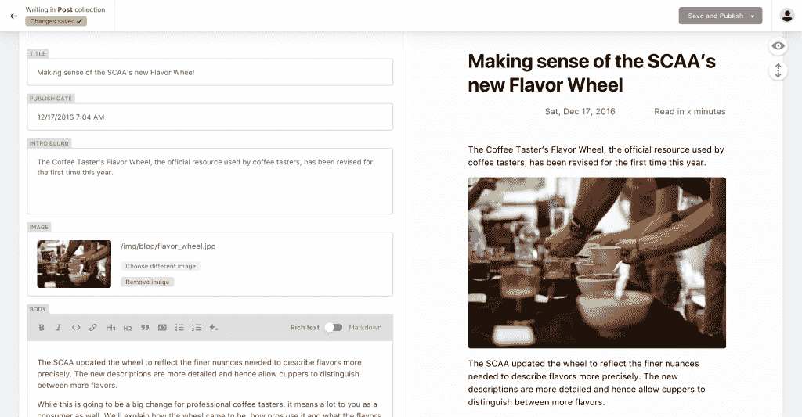
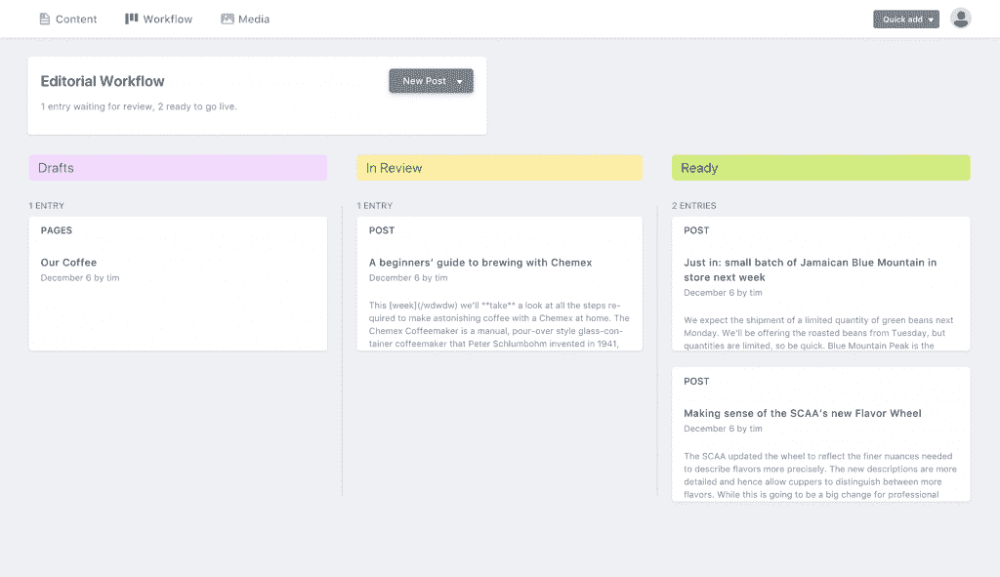

# Netlify 提供了一个基于 Git 的(但不是技术友好的)内容管理系统

> 原文：<https://thenewstack.io/netlify-cms-1-0-production-ready-git-based-non-techie-friendly-content-management-static-sites-single-page-apps/>

如果内容管理系统(CMS)只做好了一件事——比如管理内容——会怎么样？

这是 Netlify 联合创始人马蒂亚斯·比尔曼和克里斯·巴赫在稳固地将他们的公司确立为 T4 jam stack 发展革命的领导者时问自己的问题，更不用说业界领先的静态平台和托管解决方案了。这是一个正确的问题:Netlify 通过提供全球内容交付网络(CDN)、免费定制域和 SSL 证书，以及与 GitHub 的无缝集成，使开发人员能够直接从命令行进行原子部署，从而赋予静态网站超能力。

https://twitter.com/isalwaysblank/status/938171419329929216

然而，它没有给他们的一件事是以一种对非技术内容提供商友好的方式管理内容的能力。此外， [Git](https://git-scm.com/) 工作流——尽管被绝大多数开发人员使用——倾向于与传统的内容管理系统发生重大冲突，后者通常带有严格的工具和基础设施需求。

这个难题启发了 Netlify CMS 的建立，这是一个基于 Git 的内容管理系统，旨在使编辑和营销人员轻松直观地创建和发布新内容，同时开发人员仍然可以构建更快、更便宜、可扩展和更安全的网站，所有这些都在 Git 工作流中。

[12 月 7 日，](https://www.netlify.com/blog/2017/12/07/open-source-netlify-cms-hits-1.0-bringing-git-based-content-management-to-static-sites-everywhere/)在努力构建一个基于 Git 的 CMS(包括友好的 UI、易于使用的 markdown 编辑器和内置媒体库)一年后，该公司发布了生产就绪的 [Netlify CMS 1.0](https://github.com/netlify/netlify-cms) 。它为管理内容提供了一个直观的界面，内容以持久数据的形式存储在存储库中，所有这些都是为了在与开发人员相同的地方无缝工作而设计的 Git。

“是时候打破 CMS 必须处理整个过程的观念了，从构建到电子商务再到评论，”比尔曼说。“开发人员现在压倒性地分离前端和后端，并利用微服务来改善从加载时间到安全性的一切。”

简而言之，是时候摆脱遗留的臃肿，单一的 CMS 方法，并把它作为一个更多的组件，只是在那里做它的工作，只有它的工作。在这种情况下，管理内容。

### 可破解、可扩展、用户友好

Netlify CMS 1.0 是作为一个单独的页面 [React](https://reactjs.org/) 应用程序构建的，并且是完全可定制的。该服务允许定制风格的预览、UI 小部件和编辑器友好的插件，以及添加支持 Git 平台 API 的不同后端的能力。

【T2

对于将要编写和上传内容的人来说，更重要的是，markdown 中有一个非常用户友好的编辑器(JAMstack 中的“M”)。在其他前台友好的新功能中，包括用户在 CMS 中工作的能力，即使他们没有 GitHub 帐户。事实上，它可以与 Netlify 的[身份用户管理](https://www.netlify.com/docs/identity/)小部件(一种 [OAuth](https://oauth.net/) 服务)相结合，允许内容提供商只需使用电子邮件和密码即可登录。(就像其他 CMS 一样，只是用了 JavaScript，没有膨胀)。而且，很快就会有模板和教程来进一步简化入职流程。

### 填补开源、社区驱动的空白

不用说，在这一努力之前，headless CMS 已经作为一种开发理念得到了很好的确立，并且涌现出许多专有的内容管理选项来服务于它。然而，在构建他们自己的 CMS 时，[Shawn Erquhart](https://github.com/erquhart)——Netlify CMS 的核心维护者——说他在 Netlify 的团队试图填补一个重要的空白:JAMstack/static development 生态系统缺乏一个开源的、社区驱动的选项，用于 git 工作流中的静态内容管理。

“开源权力标准。Erquhart 说:“社区已经真正团结起来，帮助推动功能增长，并使这个项目成为希望改进 web 项目发布方式的开发人员和公司的可行选择。

他相信开源社区会到来，卷起袖子准备投入。“使用内容管理系统一直是许多开发人员的一个挫折点，所以很容易理解为什么他们很快就接受了一个 CMS，它允许他们在选择自己的工作流程和工具时保持静态，”他说。

Netlify 非常重视争取开源社区继续构建和改进 Netlify CMS。该公司每两周举办一次现场策划会议，并邀请感兴趣的投稿人加入。

“你可以帮助我们推动路线图，”比尔曼说。

<svg xmlns:xlink="http://www.w3.org/1999/xlink" viewBox="0 0 68 31" version="1.1"><title>Group</title> <desc>Created with Sketch.</desc></svg>