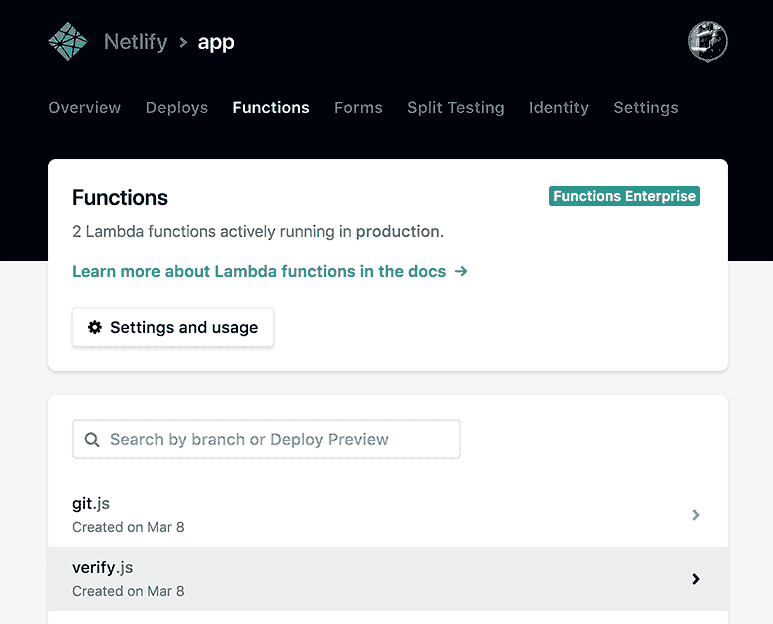

# Netlify 在其 Web 应用程序开发平台中嵌入了无服务器功能

> 原文：<https://thenewstack.io/netlify-embeds-serverless-functionality-web-app-development-platform/>

Netlify 是围绕以 git 为中心的工作流而建立的创业公司[，随着 Netlify Functions 的发布，Netlify 再一次挑战极限，这款工具使](https://thenewstack.io/netlify-cms-1-0-production-ready-git-based-non-techie-friendly-content-management-static-sites-single-page-apps/) [AWS Lambda](https://aws.amazon.com/lambda/) 功能的部署像向项目的 Git 存储库添加文件一样轻松。创建函数是为了以直观、前端友好的方式在后端将云原生微服务和 API 驱动的工具结合在一起。

“JAMstack 方法是一种静态前端与动态微服务后端对话的方法，非常强大和敏捷，但缺少的部分总是作为工作流有机组成部分的 Lambda 或功能集成，”[克里斯·巴赫](https://twitter.com/chr_bach?lang=en)、 [Netlify](https://www.netlify.com/) 联合创始人兼总裁说，他指的是使用 JavaScript、API 和标记(JAMstack 中的“JAM”)来构建动态 web 应用程序的方法。他解释说，创建功能的动力最初来自公司内部的工程师——供他们自己使用。

Netlify 决定专注于 AWS Lambda，因为他说，他们想支持现有的系统。

“对于许多开发人员来说，Lambda 是痛苦的——设置它很难，运行它也很难，”Bach 说。“在我们决定在内部使用它进行验证后，我们意识到这有多难，我们的前端团队要求我们提供这一点点服务。”

Bach 实现了一个供内部使用的 quick Functions 原型，并在这个过程中意识到，这实际上是市场上缺少的一个基本服务。“实际上，它并没有花很长时间就组合在一起，”巴赫说。“需要更长时间的是建立心智模型。如何让它融入我们的服务，如何让不可变的 Lambda 融入 API 网关。”到 2017 年 10 月，Netlify Functions 处于 beta 测试阶段，并在该公司以及一些 Netlify 客户的现实生活项目中工作。

据 Netlify 的首席执行官和其他联合创始人马特·比尔曼说，Smashing Magazine 是第一批尝试功能的杂志之一。“这是一个复杂的用例——他们依靠 [Stripe](https://stripe.com/) 的 API 进行订阅支付处理，Mail Chimp 的 API 进行营销和沟通，以及其他多个基于云的服务提供商——但他们也需要一点点胶水来将他们的微服务与我们的平台结合在一起，”比尔曼说。

“在函数之前，我们仍然需要一个服务器端的层来将它与自定义代码捆绑在一起，但现在 Smashing 的所有服务都使用三个不同的 Lambda 函数来统一——跨越所有三个，大约 600 行代码，”Biilmann 继续说道。“三个独立的小功能创造了一个定制的后端空间。就是这样。其他的都是现成的，直接从货架上拿下来的。”

比尔曼重新加入进来，显然对 Netlify 功能服务的公开发布感到兴奋。“无服务器事件驱动功能的实际工作生活应用是巨大的，功能的承诺像野火一样蔓延，”他说。“但所有这些潜力都是遥不可及的，直到我们找到一种方法，让功能集成成为开发人员工作流程中简单甚至有机的一部分。”

仪表板中的有效功能。没有太多要展示的了，TBH，因为这个特性是如此的固定和简单。

因此，在真正的网络时尚中，Functions 通过简单地将一个函数添加到一个项目的 Git 存储库中的一个文件夹中，改变了一个以前复杂甚至令人望而生畏的设置过程。Netlify 将自动识别该功能，并将其与网站的其余部分一起部署。只是您的项目的 git 存储库中的另一个文件夹，从命令行推送并立即激活(但是具有完整的回滚):显然，市场已经准备好了。

“我们发布了测试版，它一飞冲天，”巴赫说。“开发者的反馈是巨大的。”

### 连接连接，你的功能是什么？

Netlify 函数并不完全是开发人员的幻想，因为它并不提供实际的代码——我们开发人员仍然需要自己创建 AWS Lambda 函数，就像我们为 Netlify 提供客户端代码一样。有了函数，Netlify 现在提供动态站点功能就像通过他们的服务构建静态站点一样简单:构建它，然后从您选择的 git repo 推送。

这意味着没有很多后端经验的开发者现在也可以部署 Lambda 函数。不需要与 AWS 不太友好的 UI 交互，努力配置 API 网关或协调部署。(实际上，你甚至根本不需要建立一个 AWS 账户——Netlify 甚至也处理这一块)。

马里兰州巴尔的摩的前端开发人员 Asa Smith 之前已经用 Netlify 部署了项目，并准备投入使用。“我对 AWS 感到不知所措——如何设置它，如何访问它。用户界面令人生畏，”他说。最近，史密斯使用谷歌功能和 Firebase 建立了一个无服务器博客项目，因为“使用谷歌界面感觉简单多了。”

史密斯通常用斯派克·SSG 构建他的网络项目的客户端，他说他目前正试图将 Algolia 搜索整合到一个客户的网站中。他需要阅读 JSON 内容的后构建过程，然后将其写回给 Algolia。“我认为用 Spike 做到这一点的唯一方法是使用某种云功能，除非我想去学习 [Webpack](https://webpack.js.org/) 并编写自己的插件，”他说。“我已经请求访问 Netlify 的功能测试版有一段时间了，因为它看起来会完全满足项目的需要，而且我需要的易用性。”

随着 Functions beta 的公开发布，Netlify 也发布了它的[身份](https://www.netlify.com/docs/identity/)和 Forms service out of beta——另外两个旨在方便开发者进入 JAMstack 生态系统的产品。

*   Netlify 的[身份](https://www.netlify.com/docs/identity/)特性是基于 JSON web 令牌(JWT)的用户认证服务，管理注册、登录、密码恢复等。它可以与任何理解 JWTs 的服务集成，就像编写必要的 JavaScript 将东西连接到您的站点，然后打开 Netlify 的身份服务一样简单。或者你可以简单地采用预滚动的[登录窗口小部件](https://identity.netlify.com/)和 [CMS 模板](https://app.netlify.com/start/deploy?repository=https://github.com/netlify-templates/one-click-hugo-cms&stack=cms#_ga=2.109621189.1985692033.1520268158-1359106690.1505249588)，让事情真正交钥匙。
*   Netlify Forms 是一个用于管理表单和其他站点提交的工具，非常容易使用。只需在你的站点标记中的任何 HTML

访问所有这些功能是网络生活平台的一部分。注册 Netlify 不到一分钟，就可以瞬间链接你的 GitHub、GitLab 或者 BitBucket 身份。定价是分等级的，所有东西都是免费的。一旦一个项目的使用量超过了免费层的限制，就会有一个“计量”的[定价系统](https://www.netlify.com/pricing/)只对使用量收费。

“我们做我们真正喜欢的事情，我们想让 JAMstack 尽可能地为开发者所用，”Biilmann 说。他补充说，建立这些新的工作流程在一定程度上是必不可少的，因为前端开发人员的角色正在快速变化。

“前端开发人员现在正通过平易近人的功能和微服务等东西进入后端领域。另一方面，DevOps 正在构建 API，而不是传统的整体后端……从前相距甚远的两端，现在在中间相遇了。”

他总结说，Netlify 希望在那里与他们会面，提供“粘合层”将所有的碎片粘在一起。

<svg xmlns:xlink="http://www.w3.org/1999/xlink" viewBox="0 0 68 31" version="1.1"><title>Group</title> <desc>Created with Sketch.</desc></svg>