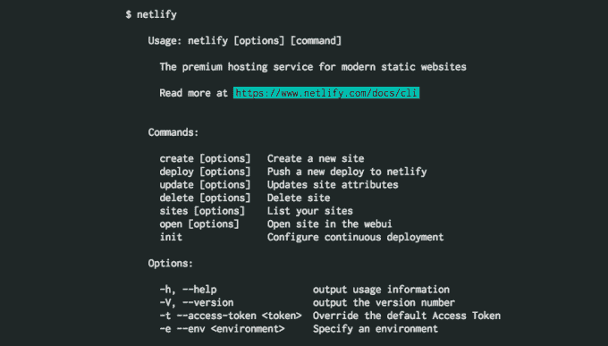
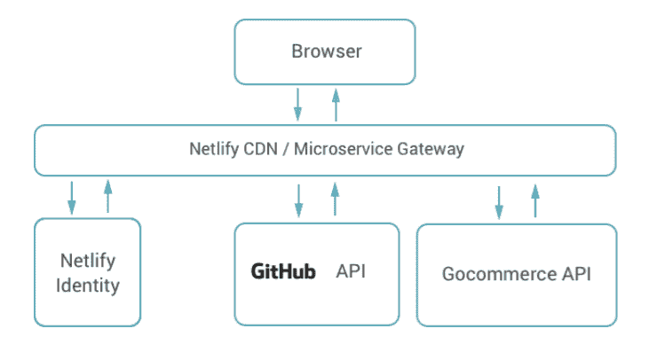

# Netlify 从 SSG 发展到 CMS，并推出了微服务网关

> 原文：<https://thenewstack.io/netlify-grows-ssg-cms-now-announces-microservices-gateway/>

我们采访了 [Netlify](https://www.netlify.com/) 联合创始人 [Mathias Biilmann](https://www.linkedin.com/in/mathias-biilmann-christensen-a5a3805) 和 [Chris Bach](https://www.linkedin.com/in/christianbachdk/) 关于他们的 web 开发平台从静态站点生成器到成熟的内容管理系统的历程，包括对身份和微服务集成的支持。

新的堆栈获得了 Netlify 最先进的 [JAM](https://jamstack.org/) (JavaScript、API、标记)堆栈架构和相关功能的第一手参观，旨在充分释放[微服务](/category/microservices/)的力量，并将网络从缓慢、臃肿和不安全的单一应用程序中解放出来。

**Netlify 最初是如何存在的？**

Mathias Biilmann :我在西班牙一家为中小型企业建立网站的公司担任了七年的首席技术官，我们每周建立大约 100 个网站，规模非常大，负责从简介到制作的整个工作流程。从那时起，我开始了 Webpop，一个云主机 CMS，将以前的经验应用到一个平台上，在这个平台上，开发人员可以在使用自己的代码进行构建的同时获得相同的效率，然后允许他们的客户端最终用户——他们通常不习惯使用代码——直接在他们自己的网站上轻松更新内容。

当我来到湾区时，我们正进入一个全新的网络开发时代。当我开始 Webpop 时，FTP 访问是第一要求，但现在不是了！浏览器突然变得更加强大，整个 API 经济正在兴起，前端构建工具以疯狂的速度发展。与此同时，整个开发工作流围绕着 git 和版本控制。因此，建立一个利用所有这些革命性的大趋势的网络开发平台的可能性是令人兴奋的。使用 [GitHub](https://github.com/) 作为工作流架构的中心，构建与浏览器交互的网站，而不是每次都在服务器端呈现。

**克里斯巴赫**:于是垫打我起来。我们从高中起就是最好的朋友。我们曾经认为我们会开一家爵士俱乐部，但后来意识到我们需要做一些不同的事情。这是我们一起做大事的机会，我们决定尝试围绕两个 web 开发大趋势画一个圆圈——前端革命，具有今天的高级标记、构建工具、编译——以及现在的微服务和 API 经济。只有把 git 放在它的中心才有意义。GitHub 是你的代码库，是你与其他开发者的合作，甚至是你的社交世界。是家。

因此，我们从现在通用的开发期望中构建了 Netlify，“你推 git，就会发生一些事情。”

**比尔曼**:这种以 git 为中心的工作流吸引了开发者，资助项目的人们也看到了 Netlify 背后的逻辑，它是多么强大。彭博贝塔和坦克山风险投资公司用 210 万美元的种子资金帮助我们起步和运行，我们上个月刚刚宣布了来自安德森·霍洛维茨的第二轮融资。另外 1200 万美元——感觉这个领域的一些主要实体看到了我们在这里所做工作的价值。

Netlify 起源于 SSG。它是如何从一开始就将自己与其他静态站点生成器区分开来的？

**比尔曼**:过去，你必须进入服务器，做出你的更改，等待半个小时才能看到它们，因为缓存验证。即使现在有了像 AWS 这样的东西，仍然存在这种滞后。Netlify 的想法不仅仅是在 git 和 go live 之间建立一条直线，而是预加载内容，然后从 Netlify 的地理分布服务器中最近的一个服务器提供页面。这大大减少了加载时间。

Bach :这个想法是，不用每次访问一个页面就加载，预加载已经完成了。我们基本上启动了我们自己专有的仓库，它可以同时推送至 GitHub 和我们自己的服务。当您更新内容时，这些更改会执行，然后作为预构建的静态页面在我们的内容交付网络中分发。

从多点出发:Netlify 上的任何网站在悉尼和旧金山的运行量一样多。因此，一种新的方法，任何预先构建的项目都可以在全球范围内分发，Netlify 将所有必要的组件捆绑到一个平台上，以构建和部署项目。开发人员可以在更大的服务器网络上直接从命令行推出更改——如果需要，这些更改可以很容易地回滚——并且您可以立即看到效果。

比尔曼:我们所说的“静态”页面并不是指 1994 年的静态页面。绝大多数网页都是动态的——它们只是与浏览器交互，而不需要构建在服务器端。

**那么，Netlify 的方法对每天在电子战壕中工作的开发人员有什么好处呢？**

Bach:15 年前，传统网络就是基于这一点，我们有了这个神奇的服务器端黑客技术，我们不用建立一个网站，而是建立一个应用程序，每当有访问者时它就会运行。现在，我们为此付出的代价是巨大的，而且一天比一天高。移动使得性能更加敏感。当今网络的庞大规模使得网站的扩展变得更加困难，因为访问者数量不断增加，恶意软件攻击的数量也呈爆炸式增长。从安全角度来看，30%的互联网流量是自动脚本，其中很大一部分是恶意软件。

在 Netlify，我们每个月都会收到 6000 万个以“wpadmin”开头的请求——显然我们没有托管 WordPress 网站。这很糟糕。疏忽测试显示有多糟糕。以最常见的一种网站为例，一个单一的应用程序，带有几个插件——你的普通商业网站。你不更新服务器环境，不更新围绕这个的任何东西，PHP 或者 Apache，然后坐以待毙。过去，你有 50%的风险会在不到六个月的时间里被黑客攻击。现在还不到 11 天。

所以一个单一的应用程序的表面积是巨大的，每次有访客时我们都会暴露出来。只有一个原点会使它变慢。Netlify 让这两个问题都不存在了。可扩展性也是如此。

代理机构平均超额配置 700 %,因为我们只是猜测流量，需要加入保险。例如，当地超市 QR 扫描仪的登录页面——你不会期待太多，但会感到惊讶——存在某种病毒元素，或者客户没有提醒你他们刚刚向 AdWords 投入了 400 万美元。有一个尖峰，你没有准备好处理它，你下去了。所以传统网络在这方面受到了影响。即使你有 [Cloudflare](https://www.cloudflare.com/) ，传统世界最著名的补丁之一，你仍然必须把它放在你的站点前面。

但是，如果您从一开始就构建东西，并利用我们现在拥有的所有技术，将这些技术结合在一起，您就不必猜测您的需求，您可以随着发展自动扩展，性能会好得多。那是 Netlify。

Netlify 接下来推出了 Netlify CMS——是什么推动了这一迭代？

比尔曼:Netlify CMS 的真正推动力是[粉碎杂志](https://www.smashingmagazine.com/)。前端设计领域非常重要的出版物。我写过一篇文章，关于静态站点生成器(SSG)是下一个大事件，它们提供的所有好处，有多快。当杂志的创始人看到草稿时，他回复了我，询问这与他们目前的设置相比如何的细节。为了好玩，我将他们的内容抓取到 Netlify 平台上，并以比现有平台快 7 倍的速度进行了基准测试。即使他们已经投资了所有的缓存插件。所以他们问如何将 Smashing 转移到 Netlify。

**巴赫**:有一本主要的杂志，加上一个 WordPress 博客，里面有 10 年的存档文章和 20 多万条评论，一个出售电子书和印刷书籍的商店，一个会议网站。每一个都在不同的平台上。 [Shopify](https://www.shopify.com/) ， [WP](https://www.wordpress.com) ，[导轨](http://rubyonrails.org/)，[柯比](https://getkirby.com/)。所有大的单块应用程序，你可以让它们的正面看起来都一样，但是没有办法引入任何可以在它们之间工作的东西。

**比尔曼**:在围绕 JAM stack 架构的开源生态系统中，还没有一套足够好的工具，我只能告诉他们，“去挑选这些工具，构建它，并把它放到 Netlify 上。”经过深思熟虑后，我们决定说我们可以将这个生态系统作为一个完全开源的项目来启动 Smashing 需要的服务与任何建立网站的人需要的所有东西都非常相似，所有的基础加上订阅、会员资格、表单处理、电子商务。

巴赫:我当时就想，“我们要建立一个电子商务服务，你疯了吗？”但我们所做的与构建一个 Shopify 风格的单一应用程序没有什么不同。如果我们开始构建 Shopify 的全部，我们还会继续工作。要使用它，你需要依赖里面的所有东西——模板引擎、根引擎、过滤功能，所有这些。

相反，就外围应用而言，我们的开源商业服务是一个非常小的 API。它归结为两个端点:创建订单和支付订单。所有的 UI 都是由谁来搭建前端，所以电商是完全不可知的。因此，这是一个完美的例子，说明如何构建小型、非常专注的微服务，可以在如此多的不同环境中重用

现在，如果你是 1200 个想买书的读者之一，直到你点击购买按钮，外面才会有任何形式的呼叫。这使得攻击的表面面积最小化，并且速度更快。我们真的相信这种架构，一个超级干净的体验，仍然是如此可定制。

至于 Smashing Magazine——它的网站现在快了十倍。

**所有这些自然而然地导致了 Netlify 微服务的下一步发展，也就是你们今天宣布的**？

**比尔曼**:这是我们从一开始就有的目标，当你从 JAMstack 方法发展到 web 开发时，这是一个逻辑和有机的发展。其中，Netlify 向遍布全球的 CDN 边缘节点分发预烘烤的前端，然后在浏览器中直接从客户端与许多不同的服务对话。

**巴赫**:我们受益于基础设施领域出现的许多服务发现的优秀解决方案。服务发现解决了如何让每个微服务知道系统的其他部分的问题——我如何到达授权服务，我的数据库在哪里，等等——并帮助使微服务架构可管理。

截至今天，我们允许公众测试访问其中两项服务，但这只是一个起点，旨在通过 Netlify 的微服务网关轻松集成成千上万的微服务。这两个初始服务中的第一个是 Netlify Identity——我们自己的开源 Gotrue 微服务的管理版本，它允许您为任何 Netlify 站点添加用户注册和管理。Identity 基于我们的开源认证 API GoTrue，是一种即插即用的服务，让您的网站处理注册、登录、密码恢复、用户元数据和角色。您可以从单页应用程序中使用它，而不是滚动您自己的页面，并与任何理解 JSON Web 令牌的服务集成。

我们今天推出的另一个服务是 Netlify CMS Gateway，它是您的站点和 GitHub 之间的一个门户，可以通过 Netlify Identity 或任何其他能够发布 jwt 的服务(比如 Auth0、Okta 等)轻松实施角色和权限。这极大地增强了我们现有的开源 Netlify CMS，提供无缝的用户和角色管理，而不需要个人用户拥有 GitHub 帐户。敬请关注 GitLab 和 Bitbucket 集成！

比尔曼:我们的计划是成为开发商的首选。我们永远不会向使用 Netlify 的开发者收取任何费用。相反，我们向从最终结果中获益的人收费。付钱给开发人员的人。

Bach :同时，在 Netlify 上，开发者不会被 PHP 或任何其他语言所束缚。你可以在 [go](https://thenewstack.io/the-new-stack-intros-go-programming-for-beginners/) 或 [CoffeeScript](http://coffeescript.org/) 中工作——用你想要的任何语言构建。

专题图片:Netlify 联合创始人马蒂亚斯·比尔曼(左)和克里斯·巴赫。

<svg xmlns:xlink="http://www.w3.org/1999/xlink" viewBox="0 0 68 31" version="1.1"><title>Group</title> <desc>Created with Sketch.</desc></svg>