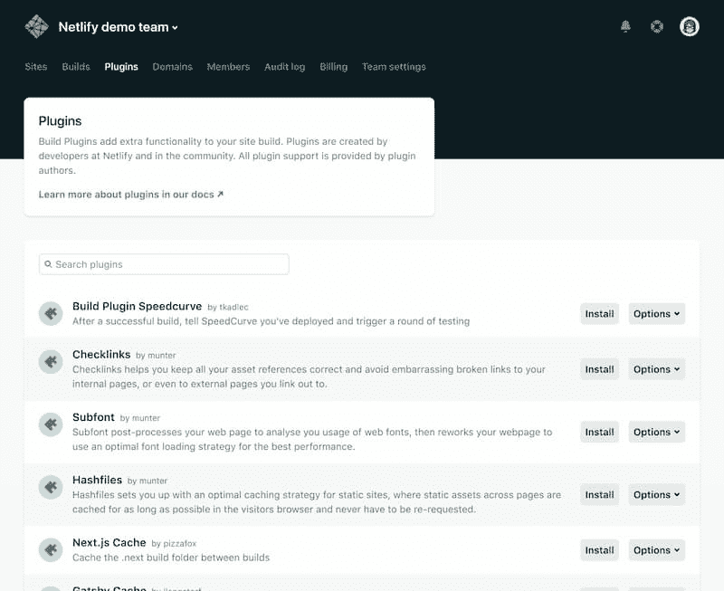

# Netlify 推出插件基础设施以扩展自动化构建能力

> 原文：<https://thenewstack.io/netlify-launches-plugin-infrastructure-to-extend-automated-build-capabilities/>

Netlify 的幕后人员正在通过使用第三方插件来扩展 T2 基于 git 的网络部署服务 T3 的功能。该公司在 5 月 27-28 日举行的 [Jamstack Conf Virtual](https://jamstackconf.com/) 上展示了这项新技术。

Netlify 为前端开发人员提供了一个平台，可以直接从一个 [git 库](/getting-legit-with-git-and-github-cloning-and-forking/)中推送应用程序中的变更。它基于 Jamstack 架构的思想，即通过使用 JavaScript、API 和标记来避开传统的 web 服务器。

现在，用户可以部署，甚至创建他们自己的定制构建步骤。据该公司称， [Netlify 构建插件](https://www.netlify.com/blog/2020/05/27/netlify-build-plugins-are-here/)将提供一个集成目录，以扩展软件构建链中的功能。插件是 npm 模块，可以通过 Netlify 用户界面轻松安装。开发人员也可以使用 Netlify API 构建自己的插件。

通常，Netlify 会从您的存储库中获取源代码，安装依赖项，然后运行 build 命令。Netlify 首席执行官 Mathias Biilmann Christensen 在接受新堆栈采访时表示，如果通过，Netlify 将部署结果。

然而，用户可能有他们自己的自定义步骤，例如检查可访问性合规性。

“你的可访问性测试可能与大多数其他人的可访问性测试没有什么不同，”Bach 说。“所以，如果你可以添加一个辅助功能插件。该插件知道它应该等到您的构建完成，然后它应该找到生成的 HTML 页面并扫描它们的可访问性问题。如果您有太多的可访问性问题，或者如果它不符合您定义的标准，它就会阻止构建。”

这种插件的另一个优点是，如果构建由于可访问性原因而失败，它可以提供详细的结果。

平台上可用的插件由 Netlify 审查和测试，以确保它们能在所有 Netlify 环境中工作。

一些示例插件包括:

*   [Cypress](https://www.cypress.io/) ，它提供端到端测试，在代码部署前对其进行验证。
*   [Ghost](https://ghost.org/) ，开源的 headless Node.js 内容管理系统。
*   [A11y](https://a11yproject.com/) ，如果发现可访问性失败，可访问性检查将使构建失败。
*   [哨兵](https://sentry.io/welcome/)，用于发现、分类和优先处理 bug
*   Gatsby 增量构建，因此 [Gatsby CMS](https://www.gatsbyjs.org/) 将只重建受更改数据影响的站点部分。

在最近的用户调查中，Netlify 发现顶级 Jamstack 用例包括消费者软件(45%)、内部工具(36%)和企业软件(35%)。

这些开发人员中约有 38%为科技公司工作，而其他人则在广告和营销(21%)、媒体和出版(14%)、教育(14%)、金融服务(13%)以及商业支持和物流(13%)领域工作。这些开发人员列举的 Jamstack 的主要优势是性能、正常运行时间、开发速度、安全性、合规性以及避免供应商锁定。

专题图片:Netlify 总裁克里斯蒂安·巴赫和马蒂亚斯·比尔曼·克里斯滕森在与新书库的虚拟访谈中。

<svg xmlns:xlink="http://www.w3.org/1999/xlink" viewBox="0 0 68 31" version="1.1"><title>Group</title> <desc>Created with Sketch.</desc></svg>