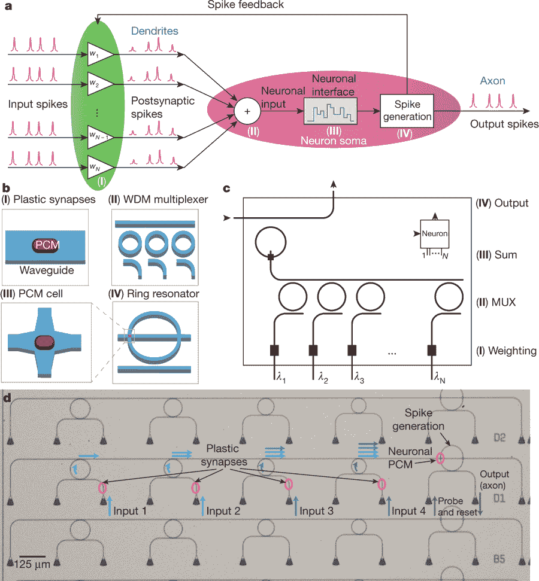

# 神经突触微芯片使用光和算法来模仿人脑

> 原文：<https://thenewstack.io/neurosynaptic-microchip-uses-light-and-algorithms-to-mimic-human-brain/>

人工智能在过去几年中以闪电般的速度发展，无论是在我们的智能手机上出现各种日常技术，如[智能个人助理](https://thenewstack.io/soundhound-expands-into-voice-driven-digital-assistance/)，还是更专业的应用，如[发现新药](https://thenewstack.io/new-machine-learning-algorithms-accelerate-drug-discovery-desktop-computers/)，破解蛋白质如何三维折叠的[之谜](https://thenewstack.io/deepmind-ai-makes-breakthrough-with-protein-folding-problem/)，或者[在人类自己的游戏中击败人类](https://thenewstack.io/new-google-ai-achieves-alien-superhuman-mastery-chess-shogi-go-mere-hours/)。但是这些无数的任务需要大量的计算能力——通常超过典型的硅基硬件所能提供的。这是因为它们的构建方式，因为传统的硅基计算机硬件架构的数据是在独立的内存和处理器单元之间发送的。相比之下，人类大脑的架构在同一个突触(大脑中两个神经元之间的连接)内存储和处理信息，导致相对更有效和低能量的操作。

我们当然可以从神经科学中转化经验教训，以帮助告知未来的人工智能系统将如何构建——毕竟，我们已经有了[神经形态系统](https://thenewstack.io/scientists-create-artificial-synapses-brain-like-computing/)，它们使用[电子组件](https://thenewstack.io/scientists-develop-light-based-memory-chip-can-store-data-permanently/)来模仿人类大脑的功能。现在，来自明斯特大学、牛津大学和埃克塞特大学的一个国际研究小组将这一方法向前推进了一步，最近推出了一种[神经突触微芯片](https://searchenterpriseai.techtarget.com/definition/neurosynaptic-chip-cognitive-chip)，它使用光子和算法来更有效地学习、存储和传输信息。

明斯特大学教授 Wolfram Pernice 说:“我们的系统使我们能够朝着创建计算机硬件的方向迈出了重要的一步，这些硬件的行为类似于大脑中的神经元和突触，并且能够处理现实世界的任务。”他是这项研究的主要作者之一，该研究发表在《自然》*上。“通过研究光子而不是电子，我们可以充分利用光学技术的已知潜力——不仅是为了传输数据，就像迄今为止的情况一样，而且是为了在一个地方处理和存储它们。”*

 *## 全光突触

正如论文所详述的那样，该团队的神经突触芯片包含人工神经元，以及用光波导管构建的“全光突触”——在光谱中引导电磁波的物理结构。这些波导由相变材料制成，这种材料可以改变其光传输特性，这取决于该材料是处于非晶态还是晶态。例如，当光源加热相变材料时，其原子从有序的晶体排列转变为更混乱、无定形的排列，导致突触波导让更多光子通过。

根据研究人员的说法，这种显著的状态变化使他们的人工神经突触网络非常像生物突触类似物一样发挥作用。在他们的实验中，研究小组设法构建了一个含有 4 个人工神经元和总共 60 个突触的微芯片，可以将它们分层，以便扩大规模，建立更复杂的神经突触系统。光子数据使用[波分复用技术](https://en.wikipedia.org/wiki/Wavelength-division_multiplexing)发送，其中多个光波长(或颜色)用于通过同一介质发送信息。

人工神经突触网络示意图。

现在事情变得有趣了:为了测试他们的系统，团队进行了监督学习测试，向其展示一系列数字或字母，然后询问它是否与另一系列数字或字母匹配。训练数据以一系列光脉冲的形式输入系统，该团队发现他们的全光学神经形态系统确实可以解决这些简单的图像识别任务。对于输出未知的情况，使用无监督学习测试，其中网络被设置为自行学习模式，使用波导反馈回路和简化的学习规则，该学习规则通过在输入脉冲被激发时将输出脉冲与输入脉冲重叠来表达。

正如该团队所指出的，由于系统架构直接处理光学数据，它有可能比生物神经网络快几个数量级。这样的系统可以很容易地扩大规模，以执行深度学习应用程序所需的更复杂、更一般化的任务。

“这个集成光子系统是一个实验里程碑，”Pernice 说。“这种方法以后可以用于许多不同的领域，以评估大量数据中的模式，例如在医疗诊断中。”

阅读更多关于 *[自然](https://www.nature.com/articles/s41586-019-1157-8)的内容。*

图片:明斯特大学、牛津大学和埃克塞特大学

<svg xmlns:xlink="http://www.w3.org/1999/xlink" viewBox="0 0 68 31" version="1.1"><title>Group</title> <desc>Created with Sketch.</desc></svg>*