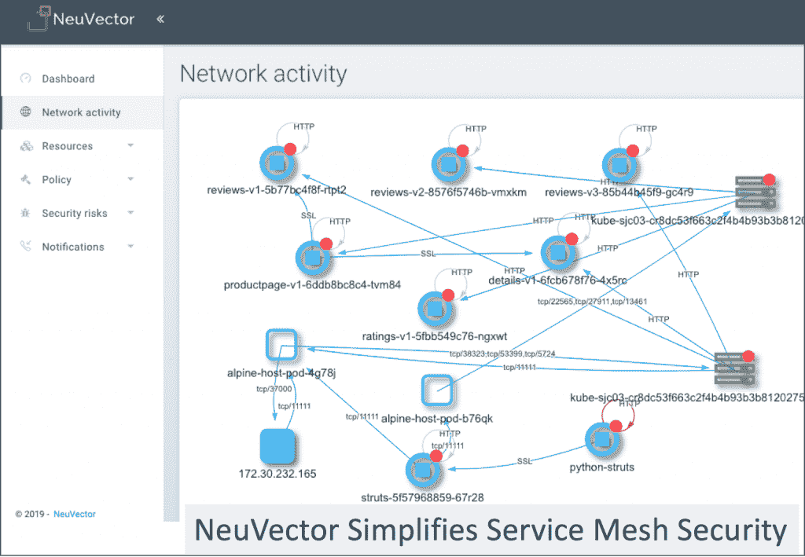
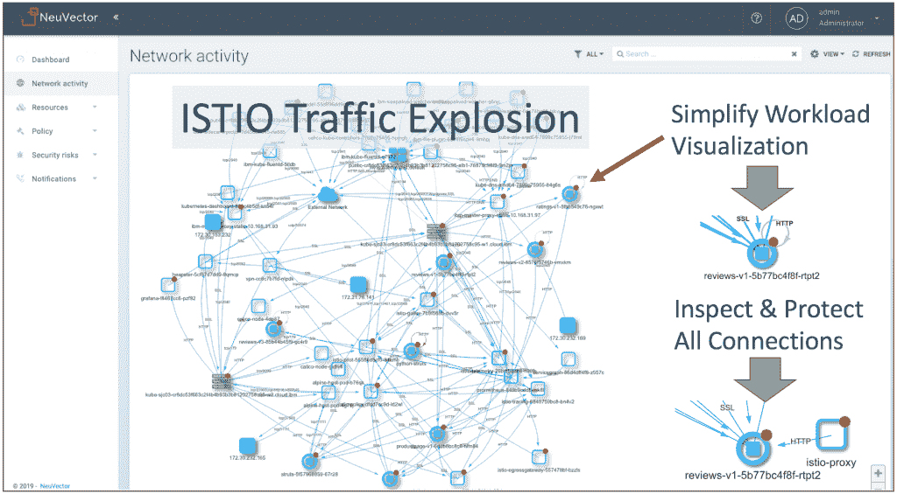

# NeuVector 增强了服务网格的安全性

> 原文：<https://thenewstack.io/neuvector-adds-enhanced-security-to-service-meshes/>

去年，Kubernetes 是公司正在部署的闪亮的新玩具。集装箱网络安全供应商[neuv 矢量](https://neuvector.com/)的联合创始人兼首席技术官加里·段称，现在服务网是闪亮的新玩具。

“人们会说，‘哇，我可以获得出色的路由功能、加密和某种程度的身份验证。’那都是好东西。但他们仍然不知道如何监控流量以及任何类型的传统安全措施，如威胁检测或检查豆荚以寻找可疑的过程，”他说。

为了补救这一点，NeuVector 开发了与 [Istio](https://istio.io/) 和 [Linkerd2](https://linkerd.io/2/overview/) 服务网格的集成，扩展了其针对生产 Kubernetes 部署的安全能力。

在[kube con+CloudNativeCon North America 2018](https://events.linuxfoundation.org/events/kubecon-cloudnativecon-north-america-2018/)上，Pere Monclus 告诉观众，服务网格在项目的早期阶段形成基础，赋予微服务身份并了解它们之间的交互，便于将策略、安全和其他控制附加到它们。

“每个人都想忽视安全但不能忽视安全，”IBM 的 [杰森·麦基](https://www.linkedin.com/in/jrmcgee/) 在活动期间的新栈[煎饼播客](https://thenewstack.io/kubecon-pancake-podcast-the-state-of-service-meshes-and-istio/)中补充道。

NeuVector 将集成称为“[安全网格](https://neuvector.com/container-security/secure-containers-istio-service-mesh/)”，在其中，它可以可视化、监控和保护服务网格系统连接和容器以及由服务网格管理的应用程序工作负载。

它可以提供深入的数据包检查，能够在应用层对服务进行分段，并定义服务之间的授权。第 7 层分段规则是根据网络流量基线和行为学习过程自动生成的。

它基于每个服务的网络基线创建白名单规则，还将监控服务网格外部的威胁，例如基于 [ICMP](http://www.networksorcery.com/enp/protocol/icmp.htm) (互联网控制消息协议)或 [UDP](http://www.networksorcery.com/enp/protocol/udp.htm) (用户数据报协议)流量的攻击。

它既可以看到 pod 内每个应用程序容器之间的未加密流量，也可以看到代理容器之间的加密 TLS 流量。

段是这样解释的:

“核心服务网格技术是一个容器。当您将它放在任何 Kubernetes worker 节点或 Docker 主机上时，我们可以检查该主机上的所有流量。Istio 和 Linkerd 将一个边车容器插入 pod。Istio 使用特使代理。容器通过代理发送它的连接，在发送到其他 pod 或外部之前，它在代理处被加密。我们的技术会在加密之前拦截这些连接。然后在另一端，接收方特使 sidecar 解密它，然后我们在它到达接收方应用程序容器之前查看它。我们必须把这两个放在一起:‘哦，A 和 B 是点连接的一部分。它包含任何攻击吗，比如 DDOS？应该允许这种连接吗？我们关注应用程序、嵌入式威胁，并在那里进行一些细分。"

当您部署服务网格时，您正在部署这些代理以及一个全新的控制平面。他说，这些也是潜在的脆弱性来源

“我们不仅监控您的应用流量和工作负载，还将帮助您可视化和监控 Istio 并控制飞机流量，”他说。

任何引入系统的新控制基础设施，虽然增加了新的安全层，但也为后门攻击提供了新的攻击面和新的机会，Michael Churchman 最近在一篇关于新堆栈的[客座博文](/service-meshes-mean-enterprise-security/)中写道。

因为这些平台管理流量和访问，并且受到应用程序和其他基础设施元素的信任，这使得它们成为诱人的攻击目标。

段预计服务网格安全将会像 Kubernetes 那样发展。起初，在点对点通信中缺乏可见性，但是一旦提供了可见性，就变成了如何保护它的问题。

“对于心脏虚弱的人来说，服务网不是一项技术。有很多事情正在发生，”他说。“运行服务网络除了基础架构管理之外，还有一个管理难题。

“客户对此感到困惑。这些服务网格具有安全特性。那么，如果我有 Kubernetes 的内置安全特性，如果我在此基础上有一个服务网格，我需要增加更多的安全性吗？我们必须委婉地向客户指出，服务网格不是安全产品。”

他说，他们应该将它视为一种更高级的路由类型的产品，具有强大的服务发现和路由功能。

“比方说负载平衡器……如果没有下一代防火墙，你永远不会投入生产，因为负载平衡器有不同的用途。

“你真的应该把它们看作是互补的。如果您有一个财务或业务关键的应用程序，服务网格是非常好的。这将有助于您进行扩展和应用性能管理，但您应该拥有出色的网络可见性。然后，您仍然需要进行所有的漏洞扫描，并监控容器的漏洞。这是服务网格之类的东西无法做到的。”

专题图片:[下午在威恩克岛](https://www.flickr.com/photos/mfoubister/40701641550/in/photolist-251Ey1w-RQcuyA-TB1ipC-gV4nBE-21bZ1vT-21LDzMs-bnpCzP-buymZG-Hro8bA-TNDChB-PbB1xW-28yqh6h-sLUcDq-XpL49F-WoSAmL-Br2Zgm-VueDyW-aeLPPD-21LDzSY-29boNXj-i5Dzxc-oJXW8K-RTgpCf-aePBou-aePEph-7yT2MP-oJ9w8b-7ydBZK-7zT7ih-aVoove-7yx2hN-7zAnpJ-7yWeyd-oJaoQb-7ySFBe-7A7NYY-7yT6Uc-7zS3BJ-7A7rZY-7ywekQ-7yTajM-7ydD88-7yaawP-7UuadH-7ySx9a-7ydRwP-7zS14f-7A7pHE-7yhd2s-7ydmxR)的洛克罗伊港 10 号登陆，[默里·富比斯特](https://www.flickr.com/photos/mfoubister/)。经 [CC BY-SA 2.0](https://creativecommons.org/licenses/by/2.0/) 许可。

<svg xmlns:xlink="http://www.w3.org/1999/xlink" viewBox="0 0 68 31" version="1.1"><title>Group</title> <desc>Created with Sketch.</desc></svg>