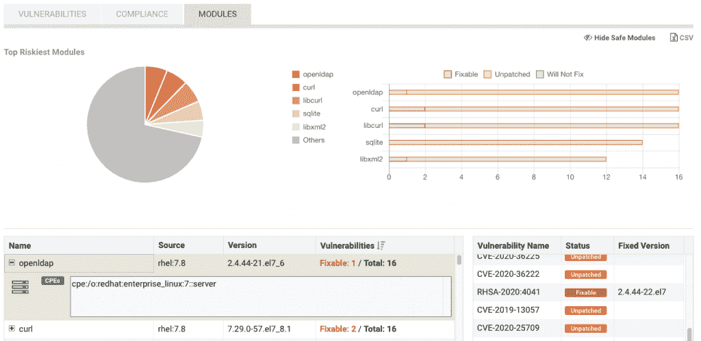
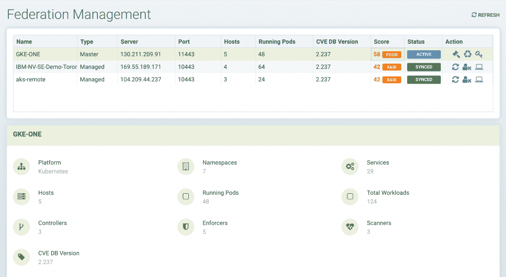

# NeuVector 将容器漏洞扫描扩展到开发者

> 原文：<https://thenewstack.io/neuvector-expands-container-vulnerability-scanning-to-developers/>

当 NeuVector [在 2017 年](https://thenewstack.io/container-security-vendor-neuvector-zeroes-network/)首次推出时，它主要专注于运行时漏洞扫描和威胁检测，但多年来它已经扩大了它的关注点，将“左”转移到开发者身上， [NeuVector](https://neuvector.com/) 产品管理副总裁 [Glen Kosaka](https://www.linkedin.com/in/gkosaka/) 解释道。

“这些年来，你可以认为我们在左移，因为我们发现我们的许多客户没有为生产或运行时安全做好准备。他们仍在开发他们的图像，他们希望扫描图像，他们希望在管道中进行合规性和漏洞扫描，”Kosaka 在接受采访时说。“因此，在过去的几年里，我们真的已经建立了所有类型的管道漏洞、合规性管理、使用 Jenkins 插件在构建管道早期进行扫描的能力，以及诸如此类的东西。”

随着这一转变，NeuVector 增加了对软件生命周期开发端的关注，这在此次发布中也有所体现。通过新功能，NeuVector 向用户显示了其软件中最危险的模块和库、相应的常见漏洞和暴露(CVE)，以及它们是否已被修补，或者是否可以被修补。

NeuVector 还计算每个 Kubernetes 集群的安全风险分数，无论它可能部署在哪里，并且类似地在单个位置显示该分数。从那里，用户不仅可以识别问题，还可以修复问题。该公司表示，这些新功能包括额外的信息，包括活跃的节点、pod、容器和工作负载的数量，包括 NeuVector 安全平台本身部署的容器。

与其他安全平台相比，NeuVector 作为一个容器部署在用户的 Kubernetes 集群上(或 Docker 部署)，这不同于其他公司采用的常见代理方法。Kosaka 表示，这样做有两个主要好处:首先，它允许客户保留他们的云原生工作流，像部署云原生应用程序的任何其他部分一样部署 NeuVector，其次，这意味着更新也是工作流的一部分。

“代理程序，尤其是网络代理程序，有一个坏名声，就是依赖内核，当你更新操作系统时会与内核驱动程序发生冲突，然后突然之间，各种不好的事情就会发生。因此，我们只是一个运行在 Kubernetes 之上的容器，这让他们感到安慰，因为当我们升级到新版本时，不会遇到所有这些特殊的东西，”Kosaka 说。“当您部署、集成、更新和监控您的安全解决方案时，它不应该与您用来为您的应用程序做同样事情的流程相分离。您的团队用于部署、更新和监控应用程序的相同工作流程，您也可以使用相同的步骤和流程来更新和监控 NeuVector 容器。”

NeuVector 还使用一个容器来更新 CVEs，Kosaka 说它每天都这样做，并且 NeuVector 本身完全在您的集群上运行，这意味着如果必要的话，它可以完全保持间隔。随着本周发布的功能，通过这些 CVE 进行的漏洞扫描还包括对所有模块的扫描，并为 PCI DSS、GDPR、HIPAA 和 NIST 等标准的应用程序提供合规性报告。

Kosaka 说，NeuVector 区别于竞争对手的另一个特点是该公司对自动化的专注。

小坂说:“我们真的走在了将安全策略自动化为代码的最前沿，当应用进入生产时，你可以在 Kubernetes YAML 文件中表达所有的防火墙规则和进程规则，以及所有安全允许的应用行为。”。“即使是开发人员，如果他们接受过这方面的培训，也可以编写这些代码。您可以在管道中构建安全性，并将其自动化，就像您对应用程序的任何其他部署 YAML 一样。”

Kosaka 解释说，除了 GUI，该公司还通过 REST API 提供对其工具的完全访问，并解释说，开发人员可以使用舵图、配置图和其他工具(如 Terraform)完全自动化部署。

Kosaka 解释说:“一旦投入生产，您就可以使用 NeuVector 的自定义资源定义(CRD) YAML 文件将这些安全策略推广到每个集群，并管理和维护它们。

这种部署模式的另一个好处是，用户能够将 NeuVector 部署到一个暂存环境中，在该环境中，它可以学习应用程序行为，为应用程序创建网络流程文件规则，然后可以在导出到 YAML 文件并投入生产之前对这些规则进行修改。

Kosaka 表示，NeuVector 计划继续关注企业用例，将多集群和多云用例扩展到能够在访问不同部署时处理用户角色的用例。

“当企业客户有不同的部门，不同的人需要不同的访问权限时，您如何更好地支持他们？还是有的集群需要这个政策，有的集群需要那个政策？”小坂说。“对我们来说，关注集群间网络也是有意义的。”

<svg xmlns:xlink="http://www.w3.org/1999/xlink" viewBox="0 0 68 31" version="1.1"><title>Group</title> <desc>Created with Sketch.</desc></svg>