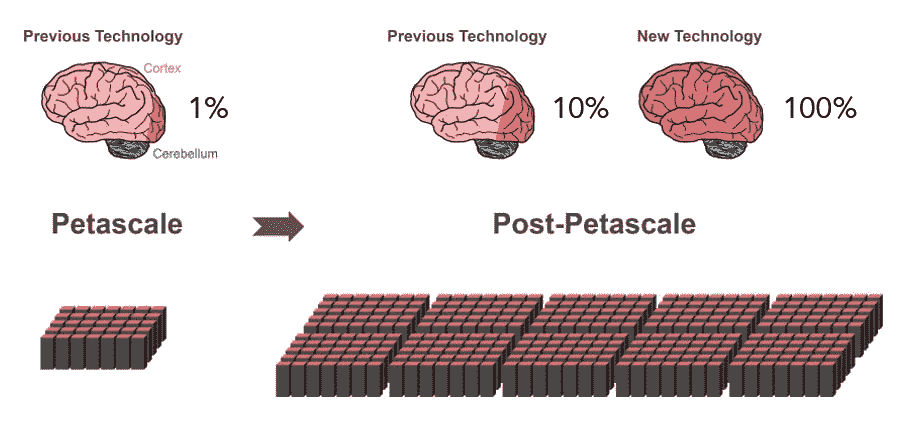

# 新算法将帮助超级计算机模拟全脑神经连接

> 原文：<https://thenewstack.io/new-algorithm-will-help-supercomputers-simulate-whole-brain-neural-connections/>

人工智能近年来取得了巨大的飞跃。我们正在看到这项技术被融入到[自动驾驶汽车](https://thenewstack.io/deep-learning-algorithm-helps-driverless-cars-recognize-pedestrians-better/)、[协作机器人](https://thenewstack.io/ai-algorithm-social-skills-cooperates-better-humans/)和[多价深度学习系统](https://thenewstack.io/new-google-ai-achieves-alien-superhuman-mastery-chess-shogi-go-mere-hours/)中，这些系统可以自己掌握各种棋盘游戏，或者[绕着地铁地图或家谱树推理](https://thenewstack.io/googles-deepmind-ai-now-capable-deep-neural-reasoning/)。然而，在人工智能从相对专业化过渡到能够像人类一样轻松地掌握各种任务之前，还有一些路要走。

开发这种[人工普通智能](https://en.wikipedia.org/wiki/Artificial_general_intelligence)的一个步骤是在计算机上模拟人脑的功能，以便为研究人员提供关于智能背后的内部工作的更深入的见解。问题是，人类大脑极其复杂，即使有今天可用的大型超级计算机的能力，也仍然不可能模拟其 1000 亿个神经元和数万亿个突触之间的所有交互。

但这一目标现在更近了一步，这要归功于一组国际研究人员，他们现在开发了一种算法，不仅可以加速现有超级计算机上的大脑模拟，还可以在未来的超级计算机(每秒钟能够执行十亿亿次计算的机器)上实现“全脑”模拟。

## 全脑模拟计算

这项研究发表在 *[神经信息学前沿](https://www.frontiersin.org/articles/10.3389/fninf.2018.00002/full?utm_source=G-BLO&utm_medium=WEXT&utm_campaign=ECO_FNINF_20180302_exascale-brain)*上，概述了研究人员如何在超级计算机上创建神经元网络的新方法。为了说明这项任务有多艰巨，现有的超级计算机，如日本神户高级计算科学研究所的 PETA scale K 计算机只能复制 10%大脑的活动。

这是因为它受到仿真模型设置方式的限制，这影响了超级计算机的节点如何相互通信。超级计算机可能有超过 10 万个这样的节点——每个节点都有自己的处理器来执行计算。在较大的模拟中，这些虚拟神经元分布在计算节点上，以有效地平衡处理工作负载，然而，这些较大模拟的挑战之一是神经元网络的高连通性，这需要大量的计算能力来复制。

“在神经元网络模拟发生之前，神经元及其连接需要被虚拟地创建，这意味着它们需要在节点的内存中被实例化，”论文的作者之一， [KTH 皇家理工学院的](https://www.kth.se/en) Susanne Kunkel 解释道。在模拟期间，神经元不知道它在哪个节点上有目标神经元，因此，它的短电脉冲需要被发送到所有节点。每个节点然后检查所有这些电脉冲中的哪些与该节点上存在的虚拟神经元相关。”

更简单地说，这就像给每个节点发送一个完整的干草堆，这样每个节点都需要从干草堆中找到与之相关的针。不用说，这个过程会消耗大量内存，尤其是当虚拟神经元网络的规模增长时。要扩大规模并使用当前技术模拟整个人类大脑，将需要比今天的超级计算机多 100 倍的处理内存。然而，新算法改变了游戏，因为它优化了这一过程，允许节点首先交换关于哪些节点将向谁发送和接收的信息，这样之后每个节点只需要发送和接收它需要的信息，而不必在整个干草堆中挑选。

“有了新技术，我们可以比以前更好地利用现代微处理器增加的并行性，这将在万亿次计算机中变得更加重要，”研究作者 Jülich 研究中心的 Jakob Jordan 说。

通过改进的算法，研究小组发现，在尤利希的超级计算机 JUQUEEN 上运行的由 5.2 亿个神经元通过 5.8 万亿个突触连接的虚拟网络能够在 5.2 分钟的计算中模拟一秒钟的生物时间，而不是以前使用传统方法需要的 28.5 分钟。

据预测，未来能够进行亿亿次计算的机器的性能将超过当前超级计算机的 10 到 100 倍。有了这个团队的算法——它将作为一个开源工具提供——这将意味着探索智能如何整体运作的更大能力。

毫无疑问，基于这一工具的未来发现不仅将有助于推动人工智能的进一步发展，还将有利于一系列科学学科，研究报告作者、 [Jülich 神经科学和医学研究所所长](http://www.fz-juelich.de/inm/EN/Home/home_node.html)Markus Diesmann 指出:“万亿级硬件和适当软件的结合带来了对大脑功能基本方面的研究，如可塑性和在几分钟生物时间内展开的学习，在我们的能力范围内。”

图片:Pixabay，神经信息学前沿。

<svg xmlns:xlink="http://www.w3.org/1999/xlink" viewBox="0 0 68 31" version="1.1"><title>Group</title> <desc>Created with Sketch.</desc></svg>