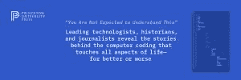

# 新书指出了改变世界的 26 行代码

> 原文：<https://thenewstack.io/new-book-identifies-26-lines-of-code-that-changed-the-world/>

“我不能把书名归功于我，”托里·博施告诉我她的新书的名字，“但我认为它很完美……它有这种厚脸皮。”

博世是新书 [*《不指望你懂这个》:26 行代码如何改变世界*](https://amzn.to/3UuREAF) 的主编。在序言中，博施将这本书的 29 位不同作者描述为“技术专家、历史学家、记者、学者，有时还有编码者自己”，解释“代码是如何工作的——或者有时是如何不工作的——在很大程度上归功于代码背后的人。”

每一章都有引人入胜的标题，如“穿上这套代码，去坐牢”和“推出了一百万个猫视频的代码”，每一章都为程序员提供了生动的欣赏，不仅收集了他们著名生活的故事，还收集了他们有时臭名昭著的作品。(在第 10 章——“意外的重罪犯”——记者[凯蒂·哈夫纳](https://en.wikipedia.org/wiki/Katie_Hafner)揭露了那个哈佛本科生后来在 1988 年无意中创建了第一个恶意软件程序的事情……)

这本书很快从提花织机和 COBOL 的发明等里程碑跳到比特币和我们发人深省的现在，承认了指导阿波罗 11 号登月的代码和 1962 年视频游戏太空战背后的代码。史密森学会发明和创新研究中心的主任在第四章中写道，这款游戏“象征着计算从牧师般的技术人员操作大型计算机到狂热的编程和黑客的转变，有时纯粹是为了乐趣。”

我自己撰写了第 9 章，讲述了 1975 年某个 Unix 代码中的一个评论，这个评论成为了“一个偶然的图标”，纪念“在一个无情的逻辑世界中人性的瞬间光辉”这一章为这本书提供了书名。(我还负责这本书的索引条目“Linux，源代码中的咒骂语”。)

所以博世称赞书名“符合这本书的精神，真正关于编码中的人类”

但更重要的是，这本书给了所有这些历史一些关于意外影响的相关现代背景——尤其是在纽约大学媒体/文化/传播教授查尔顿·麦克韦恩的一章中。

虽然注意到计算机革命与黑人民权革命不谋而合，但 McIlwain 指出，这最终导致了有缺陷的犯罪数据算法，为今天的[监控基础设施](https://thenewstack.io/predictive-policing-real-just-not-effective/)奠定了基础。

还有一个更大的问题，McIlwain 在他关于警察巡逻算法的章节中补充道(这也是[在网上发布的](https://slate.com/technology/2022/11/police-beat-algorithm-lbj-ibm.html))。“在技术供应商、执法人员、政府官员和政策影响者中，对数据的客观性和可靠性以及预测能力的信念继续蔓延。”

它被打包成一本 216 页的平装本(也有有声读物)，博世在我们的采访中将其描述为真正聪明的人分享了“惊人”数量的启发性轶事。程序员/作者 Ellen Ullman 在这本书的介绍中写道，程序“是想象力的作品，然后必须冒险进入结构化的代码世界”，然后将安全漏洞之类的危险与无处不在但看不见的太阳风相比较。

博世还编辑了[将来时](https://slate.com/technology/future-tense)，这是一本自称的“未来公民指南”，探索技术与社会和公共政策的交集(与亚利桑那州立大学和公共政策智库新美国合作出版于 Slate)。她将这种对更大的社会问题的兴趣带到了书中贯穿人类编程艺术历史的欢快嬉戏中。

在这本书的最后一章，数据新闻学教授 Meredith Broussard 警告说，代码不仅改变了世界，还“体现了文化”，并可能使社会变革更加困难。(“性别权利的下一个前沿是数据库。”)

但更乐观的是，Bosch 在一次采访中告诉我，“只是思考事情是如何发生的，它们是如何发生变化的，为什么会发生变化，真的可以帮助我们思考我们希望未来是什么样子的，以及如何实现这一点。”

以下是那次采访的更多内容。

这本书的最后一章提醒我们，计算机系统是社会技术的产物，“需要定期进行大规模更新”。就像人类一样。”这本书在某种程度上是对行动的呼吁吗？一旦你认识到计算机代码——人类的工作——不能避免错误，这难道不会让你大胆地采取下一步逻辑步骤吗？

哦，我希望如此。我真的希望有人会读这本书，这将促使他们花更多的时间思考计算机中的道德决策，思考他们所做工作的潜在影响，以及如何以有益于人们的方式完成他们的工作……如果你的老板要求你编写一些代码来帮助汽车逃避排放检查， 就像李·温塞尔写的——关于大众汽车排放丑闻的那一章……我希望思考这些事情将有助于人们思考什么时候他们可能想说不。 或者他们会如何看待他们正在与什么样的公司合作。

我的一个崇高想法是，如果人们在计算机科学课上使用这本书，我会很高兴。我认为在计算机科学教育中，给学生一个思考这些问题的机会是非常重要的。

**《技术错误:性别歧视应用、偏见算法和有毒技术的其他威胁》一书的作者萨拉·沃希特-博特彻称你的书是“挑衅性的”——不仅仅是对编码历史和文化的必要阅读，而且“充满了人性”将这本书的重点放在围绕代码的非常人性化的故事上，这是一个深思熟虑的决定吗？**

这本书的想法实际上源于 2019 年我为 Slate 工作的一个项目…[ [改变一切的代码行](https://slate.com/technology/2019/10/consequential-computer-code-software-history.html) ]在与来自普林斯顿大学出版社的哈利·史特本讨论这本书的想法时，我们很早就达成一致的一点是，人们必须成为这本书的重要组成部分……

有时候，感觉代码或者至少技术是不可避免的。作为一名消费者或者可能不在技术领域工作的人，感觉这些产品到达你面前时已经完全成型了——你知道，这就是 Roomba 的本来面目。但事实是，所有的代码都是人类决策的结果，而那些人类的决策是由可能某天早上还没有完全摄入咖啡因的人做出的。或者可能，你知道，有一个真正伟大的一天，或者可能有某些偏见，他们甚至没有意识到。因此，如果我们谈论代码，我们谈论的是做出创造代码的决定的人。

这些决定，这些人的决定，最终会以非常意想不到的方式影响我们所有人的生活。

这听起来像是一个警告和一个希望，都捆绑在一起。

完全正确。人们对这本书的最大希望之一是，它会有一种楼上/楼下的吸引力。我认为，对于那些日复一日从事代码工作的人来说，这里真的有一些东西，给他们提供了一个机会，让他们退一步，对他们的工作进行一点全面的思考……有时，如果你在战壕中，很难做到这一点。

但我也真的希望这对于那些不太想代码的人来说是可以理解的，他们可以利用这本书作为一个机会，更深入地思考技术以他们以前可能没有想过的方式影响他们生活的方式。

那么今天的程序员有多大的 T2 权力呢？他们说软件正在吞噬世界——但这不意味着程序员才是瓜分世界的人吗？

在过去的几年里，我对观察技术活动家和技术劳工运动的力量非常感兴趣。我认为他们展示了巨大的力量去影响变化，并且有力量说，“我不会去做那些和我对未来的期望不一致的事情。”那确实是令人钦佩的事情。

但是当然，人们面对的是真正强大的力量。在许多情况下，这些都是世界上最强大的公司——所以面对巨大的、全社会的障碍，我不想过度推销或夸大个人的负担。但是我非常钦佩那些致力于创造更好系统的人们。

**我在书中最喜欢的插图是尼尔·阿姆斯壮在月球上行走——图片的左边是让他登上月球的代码。这里面是否也有一个充满希望的信息——也许是一个曾经和未来的希望，如果我们创新了一次，我们就可以再次创新——现在有了一些关于什么可能出错的知识？**

绝对的。我认为这传达的信息是代码是人类的，人类总是在变化——并且可以说会想出绝妙的主意来使事情变得更好。所以我们可以继续这样做…

我们只需要认真思考我们想做什么不同，以及如何实现。记住所有这一切都归结于个人。

[https://www.youtube.com/embed/d9dlE0OHQ88?feature=oembed](https://www.youtube.com/embed/d9dlE0OHQ88?feature=oembed)

视频

<svg xmlns:xlink="http://www.w3.org/1999/xlink" viewBox="0 0 68 31" version="1.1"><title>Group</title> <desc>Created with Sketch.</desc></svg>