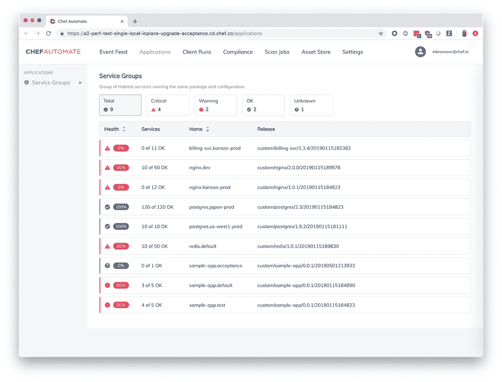
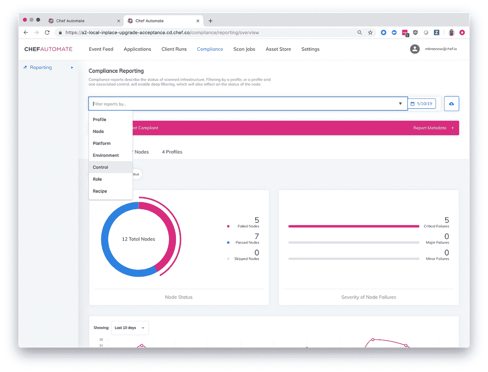

# Chef 的新功能侧重于“轻松的基础设施”

> 原文：<https://thenewstack.io/new-chef-features-focus-on-effortless-infrastructure/>

“那永远不会是我们，”通用动力公司的布拉德·谢尔顿说，他记得去年在切科夫时的想法。但他周二在西雅图 [ChefConf 2019](https://chefconf.chef.io/) 上告诉人群，即使在一个高度监管的以安全为重点的行业工作，他的商店也能够实现自动化，以实现生产时间的巨大收益。

通用动力信息技术部门是一家以政府为中心的 IT 组织，拥有约 300 个云帐户，运营着约 15，000 个节点。通用动力信息技术公司(General Dynamics Information Technology)的高级 Linux 云工程师谢尔顿(Shelton)说，该公司花了 9 到 18 个月的时间来获得“运营权”，这是一个为应用程序转向生产开绿灯的行话。使用 Chef，它已经能够将时间缩短到两个月。

除了 Chef 在 4 月份宣布将使[的所有软件开源](https://thenewstack.io/chef-opens-its-code-base-says-goodbye-to-open-core/)，依靠与合作社区的订阅业务模式，它还在大会上推出了新功能[使客户更容易](https://blog.chef.io/2019/05/21/chef-announcements-making-it-easier/)在任何环境中交付和保护基础设施和应用程序。

该订阅涉及其称为企业自动化堆栈的捆绑服务，包括其自动化可见性工具 [Automate](https://www.chef.io/products/automate/) ，应用构建器 [Habitat](https://www.chef.io/products/chef-habitat/) ，安全和合规性工具 [Inspec](https://www.chef.io/products/chef-inspec/) ，基础设施自动化工具 [Infra](https://docs.chef.io/chef_overview.html) 和开发人员工具 [Workstation](https://www.chef.sh/) 。

Infra 最初管理的食谱和菜谱覆盖作为底层的操作系统，但也包括库、页面、中间件和应用程序。Chef 的产品和工程高级副总裁 Corey Scobie 解释说，Infra 现在专注于操作系统，而 Habitat 则管理其余的，而 Inspec 则为所有这些系统自动化安全和合规规则。

新特性包括一种新的部署模式，它称之为“轻松的基础设施”。它将 Infra 和 InSpec 视为由 Habitat 的生命周期管理技术管理的应用程序，以简化任何环境中整个堆栈的部署、更新和管理。预配置的合规性配置文件和强化食谱简化了用户自定义和修改安全性和合规性控制的能力，使他们无需编写或修改代码即可打开和关闭控制。

该公司有超过 140 个不同的配置文件，并要求输入下一步的工作。

EAS 迁移加速器是出于对高度依赖其基础设施的应用程序的担忧而发展起来的，因为该技术正在被淘汰。最紧迫的案例是 Windows Server 2008，它将于 2020 年 1 月[结束支持](https://www.microsoft.com/en-us/cloud-platform/windows-server-2008)。另一个案例将是明年红帽的 RHEL 4.0。

它的第一个迁移加速器——它计划其他的——是针对 Windows 的。它扫描现有的。NET 应用程序来发现它们的配置和依赖性需求，然后将这些信息打包成代码，将应用程序从它们的基础结构平台中分离出来。然后他们可以在任何现代平台上运行，包括 AWS、微软 Azure 和谷歌云平台。

它可以在大约 10 分钟内捕获配置和依赖性需求，并在大约一个小时内打包它们，厨师的特雷弗·赫斯在演示期间解释道。通过与 Azure 和 GitHub 的深度原生集成，您可以使用整个 EAS 堆栈以及其中可用的管道和 repos。

“这不仅仅是提升和转移应用程序。您正在了解该应用程序，将该应用程序及其所需的所有依赖项和配置迁移到现代环境中，因此在这种情况下，您从微软获得了支持，并且如果需要，您已经开始了向这些应用程序添加云原生功能的过程，”Chef 的 [Brian Goldfarb](https://twitter.com/bgoldy?ref_src=twsrc%5Egoogle%7Ctwcamp%5Eserp%7Ctwgr%5Eauthor) 谈到加速器时说道。

它还增加了自动化仪表板，使运营团队能够全面了解组成应用程序的服务的运行状况。过滤和报告功能使用户能够了解各个安全和合规性控制在异构环境中的执行情况，并简化合规性报告。Chef 将其与 AWS 一起提供的可见性功能扩展到了微软 Azure 和谷歌云平台。

它们使团队能够扫描云节点和 API，以确保跨异构、多云环境的合规性。

该公司还引入了高可用性集群，为 Chef Automate 部署提供高可用性数据存储和 API 服务，甚至在 100k+节点上也是如此；和专业服务维护计划，帮助企业集成灾难恢复系统。

Scobie 强调其通过代码进行协作的口号，称其重点是在过程的早期进行协作，从想法构思到产品进化，并邀请参与其正在进行的所有工作。

专题图片:ChefConf 2019 上通用动力的布拉德·谢尔顿(Brad Shelton)和厨师的科里·斯科比(Corey Scobie)。

<svg xmlns:xlink="http://www.w3.org/1999/xlink" viewBox="0 0 68 31" version="1.1"><title>Group</title> <desc>Created with Sketch.</desc></svg>