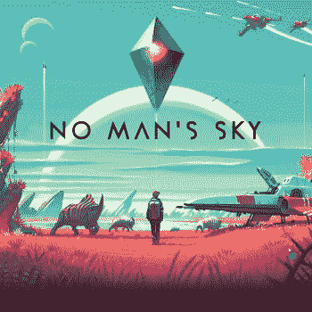

# 程序生成的宇宙的新游戏边界

> 原文：<https://thenewstack.io/new-crop-games-built-procedurally-generated-universes/>

乔治亚理工学院娱乐智能实验室主任 Mark Riedl 记得，20 世纪 80 年代的视频游戏[使用方程式在算法生成的内容](http://www.newyorker.com/magazine/2015/05/18/world-without-end-raffi-khatchadourian)上产生新的变化，而不是试图在个人电脑有限的内存中存储整个游戏空间。一个早期的例子是 20 世纪 80 年代的游戏“流氓”，它随机生成怪物出没的地下城的 ASCII 地图。这种技术在后来的游戏中演变成了随机地图，比如《XCOM》、《暗黑破坏神》和《文明》。

但是几十年后，随着今天更强大的计算机，这种技术作为一种产生程序生成的暴徒、地图，甚至整个*宇宙*的方式重新受到欢迎。在一篇名为“[游戏如何自我构建](http://www.rollingstone.com/culture/news/no-mans-sky-how-games-are-building-themselves-w433492)”的文章中，研究员迈克·库克向《滚石》杂志描述了这一点，称之为节省大量时间。“这有点像让你的游戏未完成，而在有人玩的时候教软件完成设计。”

“程序化世代给了一个想要超越自身实力的小团队一个很大的优势，”即将推出的恐怖游戏“[We Happy first](https://en.wikipedia.org/wiki/We_Happy_Few_(video_game))”的首席设计师补充道。文章指出，这种技术在其他游戏中被用于更有限的效果，“在《洞穴探险》中有无穷无尽的各种关卡，《边陲之地》中有无穷无尽的奇怪武器，《僵尸 4》中不知从哪里冒出来的成群僵尸。”"

当然，还有“《我的世界》”，它不断变换，每次播放都会提供一个新的世界。

现在一些游戏制造商正在测试他们能把这项技术推进到什么程度…

## 精英游戏

早在 1984 年，当大卫·布拉本和开发者伊恩·贝尔发布他们的太空探索游戏的第一个迭代时，他只有 20 岁。布拉本记得“精英”不仅是 3D 图形的先驱，也是“开放世界”游戏的先驱，在那里玩家可以无休止地探索外太空星星点点的边界的原始再现。Braben [在 2012 年](https://www.kickstarter.com/projects/1461411552/elite-dangerous)回忆说，当这款游戏首次发布时，整个游戏可以容纳 22K 的内存，或者说“不到今天一封典型的电子邮件”。但这仅仅是开始…

20 世纪 90 年代，这款游戏又开发了两个续集，现在都在 16 位计算机上运行。现在，这个游戏可以模拟整个银河系，超过 1000 亿个恒星系统，以及它们的行星和卫星，并且“尽我所能做到科学上的准确”，布拉本回忆道。“我们厌倦了有三条生命的游戏，然后每 10，000 分钟就有一条新生命；我们想要新的东西。”

Braben 也是 Raspberry Pi 基金会的联合创始人之一，所以他深深地意识到即使是当今最小的计算机内部所蕴藏的力量。因此，当 Braben 看到自 1984 年以来计算机处理能力的增长时，他想再一次将其应用到他的游戏系列中。2012 年，他发起了 Kickstarter 活动，承诺“有史以来最丰富、最大的游戏沙盒，背景是原始的无政府状态、银河动力游戏和阴谋。”它最终从 25681 名支持者那里筹集了近 200 万美元，游戏的下一次进化正在进行中。

> “如果每秒钟都有一颗新行星在‘无人天空’被发现，那么它们全部被发现需要 5840 亿年……”

2015 年的游戏《精英:危险》号称拥有 4000 亿个星系，以及实时运行的行星和卫星。即使游戏是实时进行的，尽管是 1286 年后的未来。在 3304 年，玩家从他们自己的飞船和 100 个“信用点”开始，然后试图赚更多的钱，要么合法——通过交易——要么*非法*，通过海盗、赏金猎人和偶尔进行星际暗杀。

他们能够以最现代视频游戏的一小部分成本生成整个游戏仍然是一个奇迹，这是由“艺术家指导的程序生成”实现的奇迹。(而众筹也让他们绕过了传统游戏发行商。)在 Kickstarter 上的一个视频中，布拉本将程序生成描述为“我认为没有得到充分利用的技术之一……一种可以创造大量丰富内容的魔法，否则需要很长时间才能制作出来。”

[https://www.youtube.com/embed/iTBvpd3_Vqk?feature=oembed](https://www.youtube.com/embed/iTBvpd3_Vqk?feature=oembed)

视频

当然，人们总是担心这样一个宇宙是否会让人感觉“千篇一律”，但布拉本认为这并不是必然的结论。“这取决于你如何使用它……艺术家正在做的是提供成分，如果成分足够多样，那么最终结果也是如此。”

这也是一个视频游戏形式的证据，证明了技术进步的程度，以及我们对太空游戏的迷恋持续了多久。Commodore 64 版本甚至有一个原始的乐谱，至今仍让人记忆犹新。《卫报》的一名评论员写道:“当我的飞船优雅地盘旋向空间站入口时，我会听着游戏简单而优美的蓝色多瑙河的演奏。”。

[https://www.youtube.com/embed/L-VJeVPeawk?feature=oembed](https://www.youtube.com/embed/L-VJeVPeawk?feature=oembed)

视频

在新游戏中，当你的飞船触发自动对接序列时，它会以同一首曲子的华丽交响乐演奏来纪念。

[https://www.youtube.com/embed/Uvum2N5pdAU?feature=oembed](https://www.youtube.com/embed/Uvum2N5pdAU?feature=oembed)

视频

游戏现在支持[虚拟现实耳机](http://www.gamerevolution.com/features/htc-vives-resolution-issue-in-elite-dangerous-is-damning)，带来身临其境的太空旅行体验。布拉本告诉一位采访者说:“我真的想表达的一件事——希望我们已经表达了——就是我们银河系的巨大规模。这款游戏甚至展示了太空先锋废弃的前哨站，这些人没能在漫长的旅程中幸存下来。

但这并不是唯一一个使用程序生成来创造巨大的新虚拟世界的游戏…

## 明星公民

很快 [Cloud Imperium Games](https://cloudimperiumgames.com/) 将发布《星际公民》，这是一款以 30 世纪为背景的太空战斗游戏，其特点是[有一个众星云集的演员阵容](http://www.pcgamer.com/star-citizen-features-gary-oldman-gillian-anderson-mark-hamill/)，由对极客友好的配音演员组成，包括加里·奥德曼、马克·哈米尔和吉莲·安德森。该游戏的导演克里斯·罗伯茨在 1990 年执导了热门游戏《中校》，并将《星际公民》描述为“跨越数百个太阳系的史诗级第一人称体验，玩家可以驾驶高度精细的飞船，在巨大的空间站中徒步战斗，探索真人大小的星球，并在不断扩张和变化的星系中探索冒险。”

游戏也是众筹的。截至上个月，它的总收入已经达到 1.45 亿美元，成为历史上第二大众筹活动。“这不仅仅是一个单人游戏或者你一周就能完成的东西，”罗伯特[告诉美国消费者新闻与商业频道](http://www.cnbc.com/2014/09/23/the-man-who-made-50-million-ditching-kickstarter.html)。“我们正在建造一个你可以在里面生活的宇宙。”

该公司为购买特殊会员资格的游戏玩家发布了一些游戏测试内容。在今年的 SXSW 上，游戏开发者[对他们社区](http://www.siliconhillsnews.com/2017/03/18/star-citizen-raises-145-million-from-crowdfunding/)的参与表示欢迎，他们已经在他们的论坛上为这款即将发布的游戏发表了 450 万条评论。

## “无人天空”的挑战

经过三年的开发，“无人天空”于今年 8 月发布，提供了 18 万亿(1.8 x 1019)个行星，这些行星分布在它自己的虚拟星系中，每个行星都有自己的生态系统，包括植物、动物，当然还有外星人。玩家在另一个广阔而详细的宇宙中挖掘资源并装饰他们的家园。

《滚石》杂志解释说，并不是每个程序生成的星球都会有外星人。“大多数离它们的太阳太近或太远，无法支持生命，但那些存在于最佳位置的生物群落将有自己独特的天气系统和景观——崎岖的山脉、郁郁葱葱的森林、干旱的沙漠和翻腾的海洋。”

但是它的规模是巨大的。《纽约客》去年五月开玩笑说:“宇宙正在吉尔福德镇的一栋两层楼的老建筑里建造，离伦敦乘火车半个小时。“大约有十几个人正在努力。他们坐在大楼一楼的三排计算机终端前，主要通过操纵代码行，制定数学规则，这些规则将决定虚拟恒星的年龄和排列、小行星带、卫星和行星的集群、引力物理学、轨道弧、大气密度和成分——下雨、晴空、多云。”

具有讽刺意味的是，两周后，一条泛滥的河流淹没了他们的地球工作室，齐腰高的水摧毁了“价值数万美元的设备”。

《纽约客》见证了这一神奇的公式，报道了“无人天空”的总建筑师肖恩·穆雷“指着一个突出的岩石，看起来像是由严酷的侵蚀塑造的沙漠地质。“这很自然，”他说。他在公式中加入了更多的噪声，旋转了公式中的形状，调整了它们的比例，将它们埋在了行星表面之下。这实际上是更多的动荡进入了数学领域……”

持久宇宙允许玩家命名他们发现的世界。一名玩家选择了“行星麦克普兰提脸 6 号”

显然有一些故事元素分散在整个探索中，在宇宙中心的某个地方隐藏着某种解决方案。

据 T4*Ars Technica*报道，并不是每个人都对这个结果感到兴奋。“这款游戏在几乎无限数量的模糊有趣(尽管美丽)的世界中重复、繁重的生存体验并没有受到社区的欢迎，他们预计这是他们需要的最后一款游戏。”

“它让你在宇宙飞船里探索宇宙，”美国消费者新闻与商业频道插话说“[差不多就是这样](http://www.cnbc.com/2016/08/10/no-mans-sky-release-would-you-play-a-game-that-takes-584-billion-years-to-explore.html)”

公平地说，这款游戏还在继续增加功能——3 月份发布了新的更新。它代表了一项令人印象深刻的技术成就。美国消费者新闻与商业频道指出，该公司只有 12 名开发人员，而通常为一款热门游戏工作的开发人员有数百名。默里告诉美国消费者新闻与商业频道，要探索这一切，需要数百万人的一生。

“如果每秒钟都有一颗新行星在‘无人天空’中被发现，那么将它们全部发现需要 5840 亿年……就击败游戏而言，这不是一个真正的选项，除非你打算一代一代地传承下去。”

它吸引了一群好奇的粉丝。在游戏的前 24 小时里，玩家发现了超过 1000 万种外星人——甚至在 PC 版本发布之前。

这将永远是关于程序生成的世界的可行性的讨论的一部分。

“我不知道这是否一定是游戏的未来，”默里告诉美国消费者新闻与商业频道，“但它肯定会是其中的一部分。”

## 终极问题

但是玩起来好玩吗？《卫报》的一个标题将《无人的天空》描述为“21 世纪的精英”,并补充道“毫无意义？也许— [但也崇高](https://www.theguardian.com/technology/2016/aug/19/no-mans-sky-elite)。"

网站 Thumbsticks 抱怨说“无人天空”只是一个程序生成的宇宙，附带一个游戏 :
 *“这就像一个儿童游戏，你可以将不同角色的脸、腿和躯干混在一起，产生一些滑稽的结果，但规模大得令人困惑……是的，还有很多变量，是的， 结果比我们习惯的任何东西都要奇怪得多——创造的宇宙仍然大得难以想象，甚至完全无法理解——但它仍然只是程序性的生成。”* 

对此，一位读者留言称赞《无人天空》是“本世纪的技术成就之一”，但也提出了一个终极问题。我们生活的宇宙本身，不就是一种数学和程序生成的结果吗？难道这不是唯一的区别吗，真的，创造它的超级计算机比我们目前拥有的任何东西都要先进得多……”

这种想法得到了《卫报》评论员的回应，他认为这款游戏对真实世界的逼真再现导致了一些负面反应，而游戏本身缺乏方向性。他得出了一个微妙的结论，即“作为一个产品，游戏在许多实际理解的方面有所欠缺。作为一种体验，它可以是完全超越的。”但他也问，今天的游戏玩家是否缺乏 80 年代游戏所需要的耐心。

“这是一种更广泛的社会文化现象吗——我们被教导从我们参与的每一件事情中期待某种令人信服的旅程，某种精心编写的满足感？”

“我想我老了，这是问题所在:我已经学会了时刻有多重要，以及当背景褪色时，快乐如何经常保持，就像最黑暗的天空中的一点光。”

* * *

## WebReduce

<svg xmlns:xlink="http://www.w3.org/1999/xlink" viewBox="0 0 68 31" version="1.1"><title>Group</title> <desc>Created with Sketch.</desc></svg>