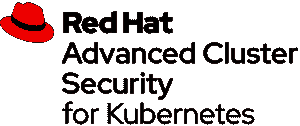

# 新电子书:供应链安全的蓝图

> 原文：<https://thenewstack.io/new-ebook-a-blueprint-for-supply-chain-security/>

管理当今的软件——由开放源代码、内部创建的代码和第三方代码的组合组成——已经提高了从设计和构建到生产的应用程序风险。现在，随着当今软件供应链中漏洞点的增多，攻击的数量呈指数级增长。

事实上，根据 Ponemon Institute 和 IBM 的一项研究，2021 年 3 月至 2022 年 3 月期间发生的五分之一的违规事件是由商业合作伙伴(如供应商)导致的供应链漏洞造成的。

据 [Gartner 称，随着不良行为者使用更复杂的方法来利用代码，预计到 2025 年，全球 45%的组织将经历对其软件供应链的攻击，比 2021 年增加三倍。](https://www.gartner.com/en/articles/7-top-trends-in-cybersecurity-for-2022?utm_source=thenewstack&utm_medium=ebook&utm_campaign=Series11Book2)

在这本电子书中， [B. Cameron Gain](https://thenewstack.io/author/bruce-gain/) ，这位新堆栈的长期贡献者，提供了对容器化应用的威胁前景的一瞥，并提供了软件供应链安全的蓝图。他概述了组织在构建、更改和部署应用程序时需要保护的领域，并提供了涵盖软件生命周期所有阶段的最佳实践清单。

[“供应链安全蓝图”](https://thenewstack.io/ebooks/security/a-blueprint-for-supply-chain-security)提供了对以下方面的宝贵见解:

*   什么是软件供应链安全。
*   为什么“修补”应用程序的传统方法不适用于容器化的应用程序。
*   防范人为错误如何减少对安全供应链的利用？
*   软件材料清单(SBOMs)，软件工件的供应链级别(SLSA)和其他最佳实践。
*   “左移”策略如何保护软件供应链，甚至在开发人员开始工作之前。

[**立即免费下载。**](https://thenewstack.io/ebooks/security/a-blueprint-for-supply-chain-security)

感谢我们的赞助商，[Red Hat Advanced Cluster Security for Kubernetes，](https://www.openshift.com/try?utm_content=inline-mention)使这本电子书成为可能。

<svg xmlns:xlink="http://www.w3.org/1999/xlink" viewBox="0 0 68 31" version="1.1"><title>Group</title> <desc>Created with Sketch.</desc></svg>