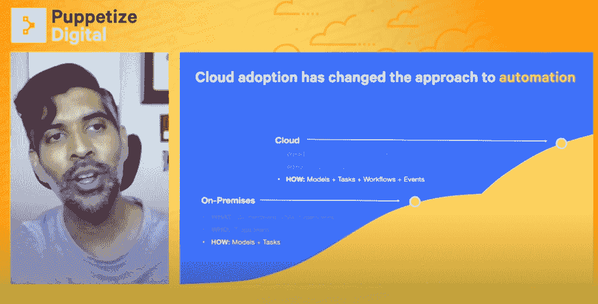
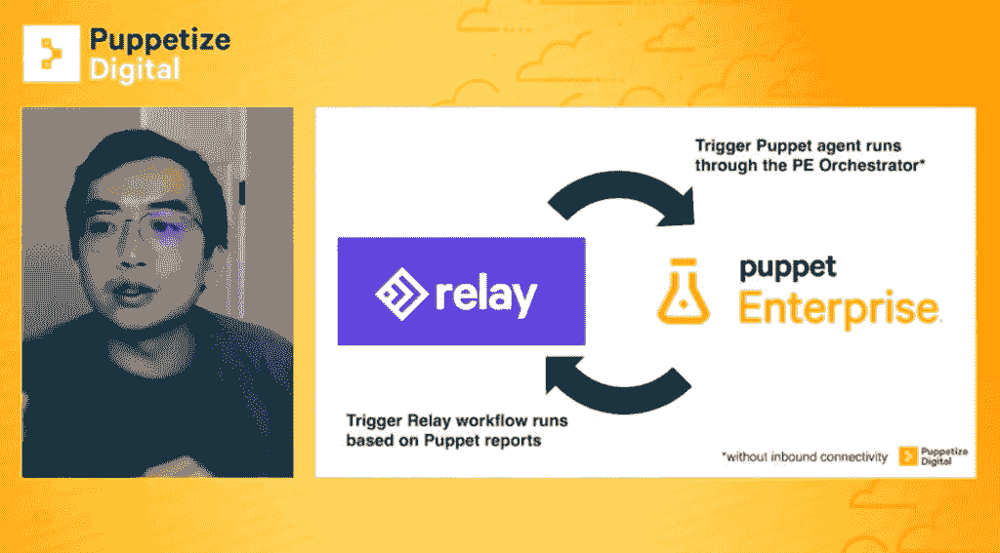
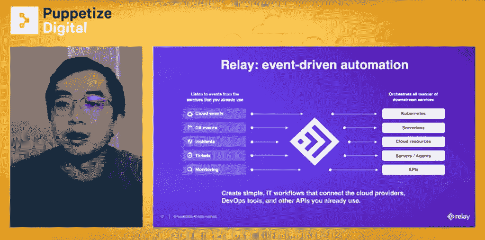
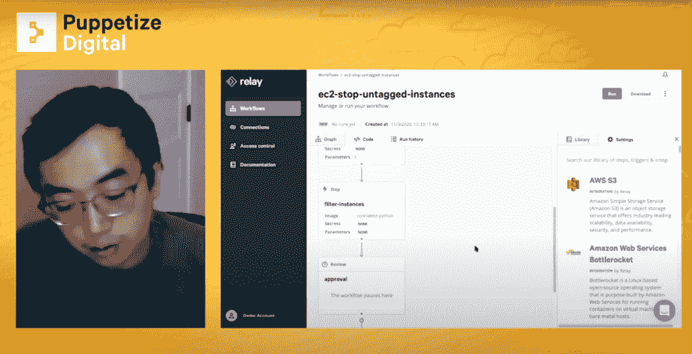
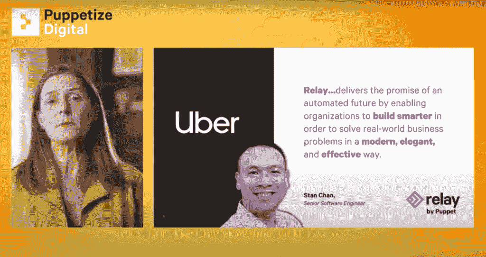

# 木偶接力的新事件驱动自动化用例

> 原文：<https://thenewstack.io/new-event-driven-automation-use-cases-for-puppets-relay/>

[傀儡](https://puppet.com/)赞助本帖。

今年早些时候发布的测试版 Puppet 的事件驱动自动化工具 Relay 承诺通过脚本、API 和其他工具帮助组织自动化混合环境日益复杂的管理。该公司计划在 2021 年初全面发布。

“Relay 是一个工作流自动化平台，它汇集了有效管理云和混合环境所需的所有工具和技术，”Puppet 首席技术官 [Deepak Giridharagopal](https://www.linkedin.com/in/deepakgiridharagopal) 在他的 [Puppetize Digital 2020](https://puppet.com/puppetize/) 主题演讲中说道。“它通过侦听来自工具云提供商和您已经使用的应用程序的事件来工作，然后触发工作流来协调您想要采取的响应行动。”

Giridharagopal 描述了 Relay 现在如何被用来优化亚马逊网络服务(AWS)的成本，微软 Azure 和谷歌云平台的成本。Giridharagopal 说。

同样在 [Puppetize Digital 2020](https://puppet.com/puppetize/) 期间，[木偶产品总监 Kenaz Kwa](https://www.linkedin.com/in/kenaz-kwa-a941b915) 描述了 Relay 的事件驱动自动化现在如何与木偶和木偶企业集成。

在他的演讲“[构建混合云自动化的未来](https://www.youtube.com/watch?v=wQRtqL4z5Vo&list=RDCMUCPfMWIY-qNbLhIrbZm2BFMQ&start_radio=1&t=821&ab_channel=Puppet)”中，Kwa 说，除了其他事情之外，组织可以将开源 Puppet 和 Puppet Enterprise 连接到 Relay 管理的任务。Kwa 说，一个事件的发生可能是由一个“不应该被改变的”文件中的改变所触发的。

因此，在 Puppet 事件之后，可以在强制模式下触发运行。在违反安全性或合规性的情况下，EC2 实例可以自动关闭，等待安全性分析。木偶事件也可以由 Slack 或微软团队进行交流。Kwa 说，触发代理运行也是“在没有入站连接的情况下完成的，不需要实际打开您的防火墙并允许中继服务与您的傀儡企业解决方案对话”。

在过去的三个月里，Puppet 与 DataDog、PagerDuty 和 VictorOps 建立了接力合作关系。除了这些合作关系，Relay 还可以与数十种云提供商工具和 API 集成，“你的团队可能已经使用了，”Giridharagopal 说，“还有一个由步骤和触发器组成的开源生态系统，可以组成更复杂的工作流。”

在汽车共享领域，优步最近采用了 Relay 来帮助支持其全球汽车共享平台的自动化。Puppet 首席执行官 [Yvonne Wassenaar](https://www.linkedin.com/in/yvonnewassenaar) 在她的 [Puppetize Digital 2020](https://puppet.com/puppetize/) 主题演讲中描述了优步如何依靠 Relay 的事件驱动自动化来更好地管理高度分布式混合环境的复杂性。Relay 测试版发布后，瓦塞纳尔描述了随着优步环境变得越来越复杂，优步高级软件工程师 Stan Chan 面临的问题“与你们的许多问题相似”。

“斯坦喜欢 Relay 的原因是，它允许他们建立更智能的工作流程，以现代、优雅和高效的方式解决现实世界的问题，”瓦塞纳尔说。"斯坦所经历的只是一切可能的起点."

亚马逊网络服务公司(AWS) 是新堆栈的赞助商。

<svg xmlns:xlink="http://www.w3.org/1999/xlink" viewBox="0 0 68 31" version="1.1"><title>Group</title> <desc>Created with Sketch.</desc></svg>