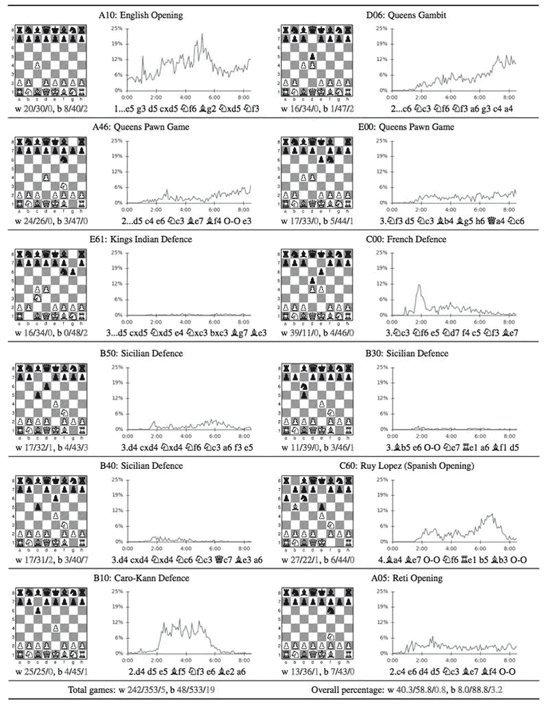

# 谷歌人工智能在短短几个小时内实现了对国际象棋和围棋的“外星人”般的超人掌握

> 原文：<https://thenewstack.io/new-google-ai-achieves-alien-superhuman-mastery-chess-shogi-go-mere-hours/>

一个专门的计算机程序在国际象棋和围棋等游戏中击败人类冠军的消息可能不会像以前那样让人们感到惊讶，就像 1997 年深蓝击败世界象棋冠军加里·卡斯帕罗夫一样，或者更近一些，2016 年谷歌 DeepMind 的 AI AlphaGo 击败李·塞多尔，令人震惊地击败 T2。

但人工智能研究人员的目标一直是开发一种[人工通用智能](https://en.wikipedia.org/wiki/Artificial_general_intelligence) (AGI)，它不仅能够掌握游戏，还能像人类一样以通用方式学习和解决各种问题。

看起来谷歌的子公司 [DeepMind](https://deepmind.com/) 通过他们最新的人工智能开发 AlphaZero 再次向这个目标迈进了一步。他们最近发表的预印研究[概述了 AlphaZero 如何轻松击败世界顶级国际象棋引擎之一——在自学并在四个小时内掌握了游戏之后，并在短短 24 小时内不仅在国际象棋上，而且在其他两种不同类型的棋盘游戏中达到了“超人”的水平。](https://arxiv.org/pdf/1712.01815.pdf)

除了如何最好地让国际象棋计算机相互对抗的细节之外，从更大的角度来看，这里还有一些潜在的改变游戏的东西，不仅仅是解决棋盘游戏。

这一最新进展最值得注意的一点是，与精心调整的游戏程序相比，AlphaZero 唯一的输入是游戏的基本规则。除了击败顶级国际象棋程序 [Stockfish 8](https://stockfishchess.org/download/) 之外，AlphaZero 还击败了专门研究日本更大、更复杂的国际象棋变体*的程序 [Elmo](https://github.com/mk-takizawa/elmo_for_learn) 。经过八个小时的自我训练，AlphaZero 也能够在围棋上击败 AlphaGo Zero。*

 *AlphaZero 没有依赖于人类大师以前玩的游戏和其他惯例(如[开局](https://en.wikipedia.org/wiki/Chess_opening)和[残局](https://en.wikipedia.org/wiki/Chess_endgame)策略)的数据，而是建立在其前身 [AlphaGo Zero](https://thenewstack.io/innovative-gaming-moves-googles-ai-becomes-go-grandmaster-three-days/) 以前使用的通用强化学习算法上，这使它能够在没有人类指导的情况下，通过一遍又一遍地与自己对弈来有效地自学。

其结果是一个高水平的发挥，不像专家们以前见过的任何东西。DeepMind 联合创始人、前国际象棋大师戴密斯·哈萨比斯在加州长滩举行的[神经信息处理系统](https://nips.cc/) (NIPS)会议上说:“它玩起来不像人类，也不像程序。”。“它以第三种方式发挥作用，这种方式几乎与众不同。就像是另一个维度的象棋。”

[https://www.youtube.com/embed/6z1o48Sgrck?feature=oembed](https://www.youtube.com/embed/6z1o48Sgrck?feature=oembed)

视频

## 类人搜索

此外，与 Stockfish 和 Elmo 等强大的专业化游戏程序不同，这些程序分别能够每秒搜索 7000 万步和 3500 万步，AlphaZero 的深度学习神经网络每秒只能搜索 80000 步。虽然乍一看这似乎是一个缺点，但 AlphaZero 通过使用其深度神经网络专注于最有希望的移动序列来弥补这种较低的评估数量——展示了专家可能称为更像人类的游戏和发现方法。该团队的发现还表明，这种规模缩小的方法最具可扩展性和时间效率，相比之下，在[蛮力](https://en.wikipedia.org/wiki/Brute-force_search)或[阿尔法-贝塔](https://en.wikipedia.org/wiki/Alpha%E2%80%93beta_pruning)搜索中使用的手动调整、资源密集型、所谓的“A 型”评估方法。

“这是一个了不起的成就，即使我们在 AlphaGo 之后就应该预料到，”前世界象棋冠军加里·卡斯帕罗夫告诉*。“它接近于(数学家和信息理论家)[克劳德·香农](https://en.wikipedia.org/wiki/Claude_Shannon)和(数学家和计算机科学家)[艾伦·图灵](https://en.wikipedia.org/wiki/Alan_Turing)所梦想的‘B 型’类似人类的机器象棋方法，而不是蛮力。”*

 *其他国际象棋大师也对 AlphaZero 的非传统游戏方式表达了类似的看法，正如丹麦特级大师彼得·海涅·尼尔森在接受 BBC 采访时调侃的那样:“我一直想知道，如果一个高级物种降落在地球上，向我们展示他们如何下棋，那会是什么样子。现在我知道了。”

在自我训练和学习阶段，AlphaZero 随时间推移所采用的开仓频率。

## 批评

在与 Stockfish 8 的 12 场 100 局国际象棋比赛中，每个程序每一步都有一分钟的处理时间，AlphaZero 赢了 290 局，平了 886 局，只输了 24 局。

然而，其他专家批评说，如果 Stockfish 可以访问国际象棋开局数据库，结果会更接近，因为它是以这种方式设计的。根据其他观察者的说法，在测试期间分配给 Stockfish 的计算能力也是相对次优的，并且在测试中使用的 Stockfish 程序是一个较旧的、功能较弱的版本，并且不是为严格固定的时间控制而设计的。在 AlphaZero 与 Elmo 的比赛中，也出现了类似的批评。

作为 Stockfish 的开发者，Tord Romstad 指出:“游戏是在每一步一分钟的固定时间内进行的，这意味着 Stockfish 没有使用它的时间管理试探法。大量的努力被投入到让 Stockfish 识别游戏中的关键点，并决定何时在一次移动中花费一些额外的时间；在每次移动的固定时间，强度会明显受损。”

## *白板*学习

与它的前身 [AlphaGo Zero](https://thenewstack.io/innovative-gaming-moves-googles-ai-becomes-go-grandmaster-three-days/) 一样，最不寻常的是 AlphaZero 使用了一种广义的“ [*tabula rasa*](https://en.wikipedia.org/wiki/Tabula_rasa) ”强化学习算法，这种算法从零开始。没有人工输入，没有手动调整，没有内置的东西，除了给它操作的基础。

从那里开始，无论是什么类型的游戏，AlphaZero 都能够计算出并“发现”传统的——以及新的和创新的——策略来解决自己的问题，从自己玩随机场景。这里更广泛的意义在于，这种强大的通用算法有朝一日可以应用于更复杂和更棘手的问题，有可能在各种领域产生意想不到的创造性和原创性解决方案，如发现新的药物或材料。

卡斯帕罗夫补充说:“我们一直认为，一台机器从头开始玩得这么好，需要太多的经验知识，完全没有人类知识的加入。”“当然，我很想看看我们能从 AlphaZero 那里学到什么，因为这是机器学习的伟大前景——机器能找出人类无法探测到的规则。但显然，其中的含义是美妙的，远远超出了国际象棋和其他游戏。机器在复杂的封闭系统中复制和超越人类几个世纪知识的能力是一种改变世界的工具。”

点击阅读论文的其余部分，或者下载 AlphaZero-Stockfish。pgn 游戏文件[这里](https://deepmind.com/research/alphago/alphazero-resources/)。

[https://www.youtube.com/embed/A3ekFcZ3KNw?feature=oembed](https://www.youtube.com/embed/A3ekFcZ3KNw?feature=oembed)

视频

图片: [Luiz Hanfilaque](https://unsplash.com/photos/7RtM37cLJ3c) ，DeepMind。

<svg xmlns:xlink="http://www.w3.org/1999/xlink" viewBox="0 0 68 31" version="1.1"><title>Group</title> <desc>Created with Sketch.</desc></svg>**