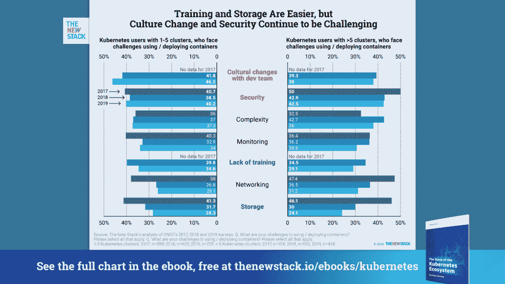

# 全新 Kubernetes 电子书！了解 Kubernetes 的最新部署和趋势

> 原文：<https://thenewstack.io/new-kubernetes-ebook-learn-the-latest-in-kubernetes-deployments-and-trends/>

过去三年来， [Kubernetes](/category/kubernetes/) 和云原生生态系统的发展，以及作为开发架构模型的[微服务](/category/microservices/)的成熟，让我们对容器编排技术和分布式计算有了更深入的了解。

现在更好的理解是，Kubernetes 需要一个用于计算、存储和网络的底层资源池，可以通过内部基础架构或云服务来运行。尽管如此，解释底层核心架构，以及分析 Kubernetes 周围的生态系统在过去几年中是如何发展的还是很有帮助的。

今天，我们发布了我们最新的电子书，“Kubernetes 生态系统的状态[，感谢我们的赞助商](/ebooks/kubernetes/state-of-kubernetes-ecosystem-second-edition-2020) [KubeCon+CloudNativeCon](https://www.cncf.io/) (云本地计算基金会) [DataStax](https://www.datastax.com/) 和 [Dynatrace](https://www.dynatrace.com/) 。我们的目标是在 2020 年提供关于 Kubernetes 的知识基础，并提供扩展的 Kubernetes 生态系统的最新概述。该电子书探讨了 Kubernetes 如何提供网络规模计算的能力，其采用模式及其作为公司核心基础设施的通用组件的作用。

这本 80 页的电子书是我们 2017 年版本的完整修订版，也解释了 Kubernetes 如何成为企业数据中心、云服务和混合方法的底层架构，以及在边缘。您将了解到:

*   Kubernetes 部署趋势
*   Kubernetes 的 DevOps 优势
*   Kubernetes 架构和关键原语
*   采用 Kubernetes 的开源和商业选择
*   现代云原生堆栈的所有组件
*   更多

我们还详细介绍了云原生技术在容器平台中的作用。这本电子书的主要作者贾纳基拉姆·MSV 认为，容器即服务(CaaS)模型现在定义了云原生栈。但是它很复杂，很难管理。得到它的组织已经实现了大规模的开发和管理。它们正在茁壮成长。但真的，几乎所有人都还处于旅途的初期。

Kubernetes 社区仍然面临着挑战，因为它从充满希望的开端发展到作为一个不仅与大型企业运营相关，而且也与中小型企业运营相关的平台的持续发展。

Kubernetes 用户面临的最大挑战。

文化变革仍然是差距。开发人员需要一种方法来轻松打包应用程序，并且需要更清楚地了解谁来配置服务。另一个挑战是政策和安全事务仍然在很大程度上依赖于传统做法。

Kubernetes 以及仍处于起步阶段的部分生态系统大有可为。Kubernetes 上的数据在很大程度上仍然是一个有待定义的空间；如果 Kubernetes 现在是无可争议的控制平面，关于数据平面的问题仍然存在。虽然服务网格功能允许更好的流量管理、安全性和可观察性，但学习曲线仍然相当陡峭。

但是最让我们兴奋的是与可观察性相关的概念。监控是一种非常适合内部部署的企业架构的实践。它被迫做出反应。但是我们再也反应不过来了。这个世界要求我们观察正在发生的事情，向前看，并找到答案。

<svg xmlns:xlink="http://www.w3.org/1999/xlink" viewBox="0 0 68 31" version="1.1"><title>Group</title> <desc>Created with Sketch.</desc></svg>