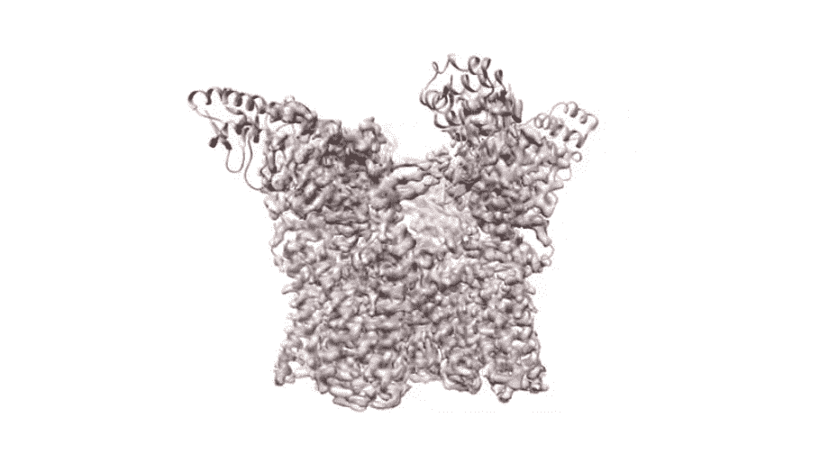
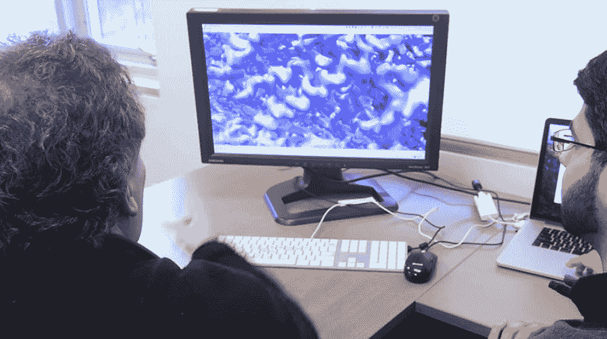
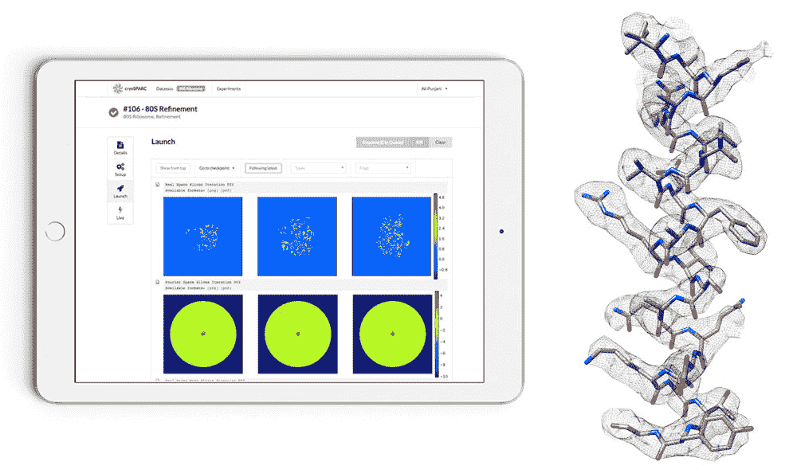

# 新的机器学习算法加速了台式电脑上的药物发现

> 原文：<https://thenewstack.io/new-machine-learning-algorithms-accelerate-drug-discovery-desktop-computers/>

在过去，发现新的救命药物的过程是一个反复试验的过程，有时甚至是由偶然的运气引起的——只要问问生物学家亚历山大·弗莱明就知道了，他凌乱的实验室提供了合适的环境来培养最终成为世界上第一种抗生素青霉素的“霉菌汁”。

虽然近几十年的新技术使这一过程变得更容易，但[机器学习](/category/machine-learning/)有可能帮助人类在医学上取得更大的飞跃。从推荐引擎到语言翻译应用程序，[网络安全](https://thenewstack.io/darktrace-applies-math-unsupervised-machine-learning-automate-network-security/)，[数据库科学](https://thenewstack.io/deep-information-sciences-offers-self-tuning-database-system-based-machine-learning/)，甚至[野生动物保护](https://thenewstack.io/machine-learning-deciphers-howling-dialects-endangered-wolves/)，机器学习已经在我们身边，医疗领域只是受益于新兴技术范式的众多领域之一。

现在，多伦多[大学](https://www.utoronto.ca/)的研究人员已经使用机器学习开发了新的算法，可以生成蛋白质小分子的精确三维结构模型。这是一件大事，因为这项技术将帮助科学家更好地了解蛋白质分子的复杂结构，药物分子如何影响它们，以及进一步了解生命如何在这些微小的尺度上运作。

[https://www.youtube.com/embed/A3RMkN4hyxw?feature=oembed](https://www.youtube.com/embed/A3RMkN4hyxw?feature=oembed)

视频

## 加速药物设计过程

由于药物通过使其分子与体内的蛋白质分子结合来发挥作用，因此药物设计专注于创造只会与特定蛋白质结合的分子，因此了解这些微小蛋白质的结构至关重要。这里的问题是，人们并不总是非常清楚这些结构看起来像什么:它们小得难以想象，从 1 到 100 纳米不等——或者比可见光的最短波长还短。

“设计成功的药物就像解决一个难题，”多伦多大学博士生[阿里·普贾尼](http://www.cs.toronto.edu/~alipunjani/)说，他是开发算法的研究人员之一，这些算法在期刊 [*自然方法*](http://www.nature.com/nmeth/journal/vaop/ncurrent/full/nmeth.4169.html) 上有详细介绍。“不知道蛋白质的三维形状，就像戴着眼罩试图解开那个谜一样。”

观察这些纳米级结构的常规方法包括[冷冻电子显微镜](https://en.wikipedia.org/wiki/Cryo-electron_microscopy)(或 cryo-EM)，它涉及到使用高倍显微镜从不同角度捕捉成千上万张冷冻蛋白质标本的图像，然后将这些图像拼接成三维模型。但这是一个耗时的过程:可能需要多达 50 万个 CPU 小时，或者许多天或数周，才能得出单个蛋白质的高分辨率 3D 模型。

更麻烦的是，有时，这些现有的技术也会产生不正确的结构模型，然后必须由知道他们在寻找什么的人来纠正。

“处理 cryo-EM 图像数据以揭示蛋白质结构的异质性，并将三维图细化到高分辨率经常成为一个严重的瓶颈，”该团队在他们的论文中解释道。“[它需要]专家干预、先验结构知识，以及在昂贵的计算机集群上进行数周的计算。”

相比之下，该团队的新方法将能够在配备单个 GPU 的台式计算机上在短短几分钟内生成一个模型，这意味着运营成本以及绘制蛋白质图谱和发现新药所需的时间将大幅减少。最重要的是，之前关于纳米级蛋白质的结构知识也不再必要。此外，该算法还设计为允许自动分析和发现意外结构。

“我们希望这将使发现在结构生物学中以突破性的步伐发生，”Punjani 说。“最终目标是，它将直接导致疾病的新药物候选物，以及对生命在原子水平上如何工作的更深刻的理解。”

该团队已经通过他们的初创公司[structural Biotechnology](https://structura.bio/?ref=cryosparc_site)推出了一个名为 [cryoSPARC](https://cryosparc.com/) 的 cryo-EM 平台，该平台使用了新的算法。一些实验室已经在使用该软件，但目标是让世界各地的实验室利用这种用户友好的产品来梳理蛋白质的复杂性。

冰冻公园

使用数字工具在某种程度上实现药物发现的自动化，无疑会缓解现在这个既昂贵又耗时的过程。2014 年的一份报告发现，一种新药上市平均需要 12 至 14 年时间和 26 亿美元，其中大多数药物未能通过试验。计算机辅助自动化不仅可以提高效率，显著降低成本，而且这些平台还可以被训练成潜在的连接临床数据之间的点，从而打开人类自己可能错过的更大可能性。

图片:多伦多大学。

<svg xmlns:xlink="http://www.w3.org/1999/xlink" viewBox="0 0 68 31" version="1.1"><title>Group</title> <desc>Created with Sketch.</desc></svg>