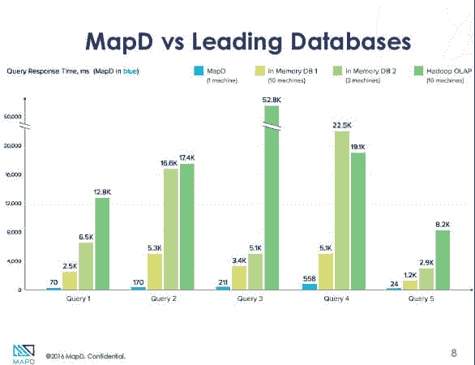
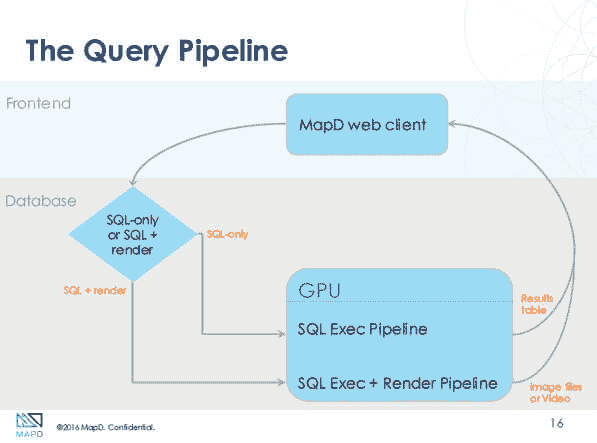
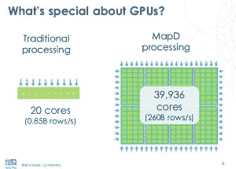

# MapD 提供了一个运行在 GPU 上的柱状数据库系统

> 原文：<https://thenewstack.io/new-mapd-database-system-runs-gpus/>

旧金山初创公司 MapD 发布了一个数据库系统 ParallelDB，该系统是为在 GPU(图形处理器)上运行而构建的，可用于在数毫秒内快速探索数十亿行数据集。

使用 GPU 进行数据库工作的想法最初可能看起来不寻常，但是在您稍微思考一下之后，您会开始奇怪为什么以前没有人将这个想法商业化。

“想象一个 SQL 查询。或者任何类型的关系操作符，对每一行数据做同样的事情。MapD 的创始人兼首席执行官托德·莫斯塔克说:“这非常适合 GPU 的矢量模型。

GPU 提供了巨大的并行性，即同时跨大量向量执行计算任务的能力，这是在计算机屏幕上渲染图形的重要操作。这种并行性没有理由不能用于数据分析；毕竟，数据库行只不过是一个向量。当然，直接从 GPU 可视化数据将显著减少创建此类图形时通常会发生的数据移动量。

今天，数据库系统最大的瓶颈是 CPU 和内存。事实证明，GPU 两者兼备。Mostak 设计了一个基于 GPU 的[数据库架构](https://thenewstack.io/category/data/)，可以提供比传统的基于 CPU 的数据库系统(几乎所有数据库系统)快 100 倍的速度，提供在毫秒而不是分钟内执行查询的能力。

2 月，MapD 的埃德·安东内尔(左)和托德·莫斯塔克在 IBM Interconnect。据该公司称，可以在几毫秒内快速探索数十亿行数据集。

例如，MapD 可以设置在一台服务器中有八个 GPU 卡的机器上，这种设置可以在 40，000 个 GPU 核心上提供每秒 3TB 的吞吐量。

最初，MapD 对具有日志分析、地理信息系统、商业智能和社交媒体分析的大数据项目最有吸引力。

这项技术已经被电信、电信、零售、金融和广告领域的许多大公司测试过。数字广告公司 [Simulmedia](http://www.simulmedia.com/) 一直在测试 MapD，以根据广告单元匹配库存可用性。脸书、耐克和威瑞森正在尝试，麻省理工学院林肯实验室也是如此。

该公司已经从一个投资财团筹集了 1000 万美元的首轮融资，其中包括谷歌风险投资公司、威瑞森风险投资公司，当然还有 GPU 制造商英伟达。

## 不可避免的 Twitter 挑战

Mostak 开发了一个基于 GPU 的数据库系统的想法，当时他是一名学生，在麻省理工学院计算机科学和人工智能实验室做研究，在数据库名人萨姆·马登和 T2·迈克·斯通布雷克手下工作。

Mostak 甚至没有主修计算机科学。Mostak 居住在埃及和叙利亚，在哈佛大学进行中东研究。最终的论文项目涉及分析大量的推文，最初 Mostak 使用 PostgreSQL 以及 Python 和 C 代码。

“一切都花了太长时间，”他说，并指出他必须通宵运行分析工作。Mostak 的计算机科学是一门选修课，所以在那时，他正在上 GPU 编程课，在那里萌发了 GPU 数据库系统的想法。

第一个原型还没有挑战内存数据库系统的大小，内存数据库系统是 MapD 的主要竞争对手。哈佛部署了一个在 4 个 GPU 上运行 16Gb 的实例。然而，GPU 构建者正在取得的重大进展——受到 4K 游戏和[深度学习](https://thenewstack.io/deep-learning-demystified/)分析的刺激——确保了新一代更强大的显卡的相继问世。

现在，在单台服务器上运行的 MapD 数据库可能高达每台服务器 192GB，安装有 8 台 Nvidia Tesla K80s。Nvidia 的下一代[基于 Pascal 架构的卡](http://www.anandtech.com/show/10326/the-nvidia-geforce-gtx-1080-preview)，其中的高性能 SKUs】将拥有 32GB 的 VRAM ，将为 500GB 的数据库奠定基础，与内存数据库的性能相媲美。

让我们停下来思考一下:MapD 承诺在一台服务器上以事务速度运行一个 1/2 TB 的数据库。

MapD 并不是第一个调查数据库系统使用 GPU 的组织。这个想法已经在学术界流传了一段时间。弗吉尼亚州阿灵顿的 GPUdb 提供了它声称的第一个 GPU 加速的数据库系统。

迄今为止，大多数方法都使用 GPU 作为加速器。Mostak 认为，这种方法的问题是，从更高的计算效率中获得的任何收益都被通过 PCI 总线传递数据所花费的时间浪费了。MapD 的方法只是让 GPU 本身成为计算元素(您可以在常规 CPU 上运行 ParallelDB，尽管这种方法没有提供特别的速度优势)。

ParallelDB 是一个列存储数据库。该系统可以接受传入的普通 SQL 查询，并使用苹果支持的开源 [LLVM](http://llvm.org/) (低级虚拟机)编译器，将它们简化为 IR(中间表示)，然后编译为 GPU 代码，重点是对各种 SQL 运算符的执行进行矢量化。该公司有一些正在申请专利的技术，可以在每个 GPU 的 RAM 上缓存热数据，以增加额外的 pep。

GPU 的妙处在于它们有 hella 核。一台服务器可以运行大约 10 到 30 个内核，但大约有 40，000 个 GPU 内核。诚然，与 CPU 相比，GPU 核心相当愚蠢，“但你可以用它们处理很多事情，”Mostak 说。

但是最大内核数量并不是 GPU 带来的唯一优势。

“人们认为 GPU 很棒，因为它们有如此强大的计算能力，但我们认为你真的赢了，因为 GPU 有如此大的内存带宽，”Mostak 说。Pascal 卡将能够以 8TB/秒的速度扫描数据，这是对 CPU 能力的巨大飞跃。

附带的可视化软件可以将计算直接从 GPU 拉入 OpenMP 显卡进行可视化。“我们可以将 SQL 查询的输出放到渲染管道中，”Mostak 说。这对于在地图上显示一百万个点，或者创建异常密集的散点图或网络图是很有用的。除了使用其可视化软件，ParallelDB 还可以使用其他 ODBC(开放式数据库连接)-fluent 商业智能套件，如 Tableau。

https://www.youtube.com/watch?v=iBJomD2mQf0

所有这些权力的好处是什么？降低成本和提高性能。

“MapD 已经提出了一个独特的解决方案，能够使用 GPU 技术实时分析和查询大量数据，”T2 451 研究中心数据平台和分析高级分析师 James E. Curtis 在一份声明中说。“他们以一种极具成本效益的方式大幅减少了查询时间，这使得 MapD 成为大数据市场中一支极具颠覆性的力量。”

在一次测试中，威瑞森用 20 台 Apache Impala 服务器对 MapD 进行了基准测试，这些服务器运行了 30 亿行。黑斑羚工具包需要 15-20 秒，而单个 MapD 服务器需要大约 160 毫秒。

因此，MapD 可能会成为亚马逊红移(Redshift)旗下 Vertica 等柱状商店的低价替代品。MapD 的 ParallelDB 和 inquire 可以作为软件进行现场部署，也可以作为服务从 IBM Softlayer 或 Amazon AWS 获得。

IBM 是新堆栈的赞助商。

专题图片:英伟达[最新发布的 GTX 1080](https://blogs.nvidia.com/blog/2016/05/17/geforce-gtx-1080-2/) ，首款基于该公司 Pascal 28 纳米制造技术的显卡。

<svg xmlns:xlink="http://www.w3.org/1999/xlink" viewBox="0 0 68 31" version="1.1"><title>Group</title> <desc>Created with Sketch.</desc></svg>