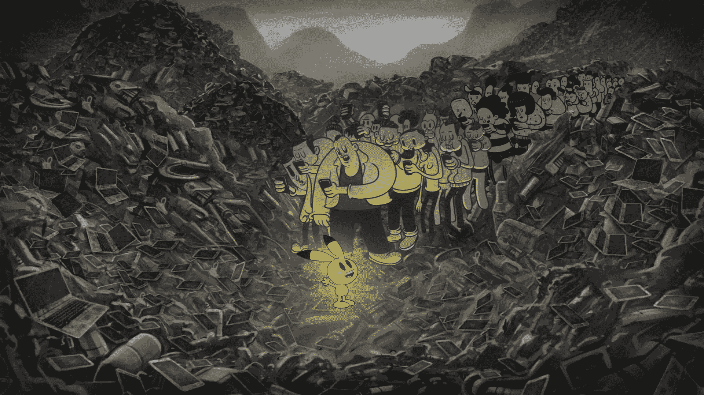
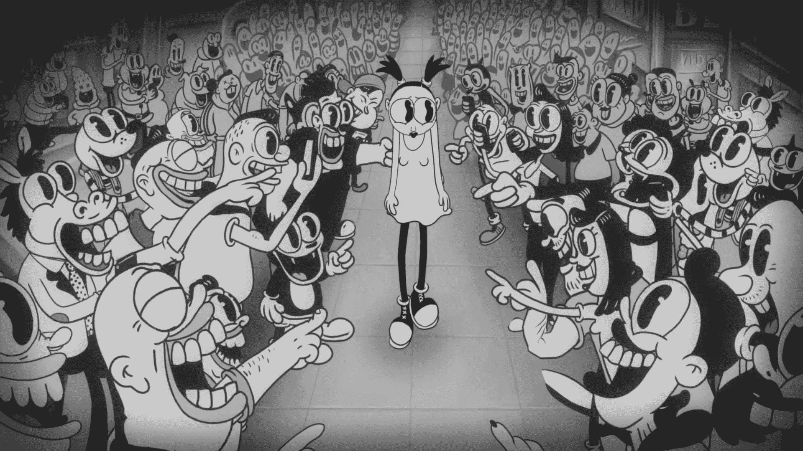

# 新的莫比视频预示着痴迷智能手机的人类孤独的未来

> 原文：<https://thenewstack.io/new-moby-video-mocks-obsession-cellphones/>

莫比刚刚发布了一部你今年可能会看到的最令人愉快又不安的漫画。为了宣传他的新专辑——“[这些系统正在失败](http://pitchfork.com/reviews/albums/22515-these-systems-are-failing/)”——这位著名的技术艺术家(有时也是[的 DJ](http://moby.com/dj/) )制作了一个音乐视频，对智能手机以及困扰智能手机的社会进行了毁灭性的批评。这首歌问了一个音乐的问题:“你和我一样迷失在这个世界吗？”

为了合作，莫比获得了动画制作人史提夫·卡茨的大量才华，也许他最近因在《辛普森一家》中出色的“LA-Z Rider”客串片段而出名。

他们的视频似乎认为，当我们专注于手机时，我们正在失去人性。

[https://www.youtube.com/embed/VASywEuqFd8?feature=oembed](https://www.youtube.com/embed/VASywEuqFd8?feature=oembed)

视频

它以复古的外观开场，配有充满静电的配乐和古老的标题卡——但它渴望回到的时代是… *我们的时代！*我们的英雄似乎是一个大眼睛的小男孩，被一大群卡通人物包围着，这些卡通人物遍布布满闪光广告牌的摩天大楼。在太空中，有卫星，但它们只是把信息传回给被困在人群中的那个睁大眼睛的男孩。

当一排排高大的卡通人物走过时，他悲伤地坐着，每个人都俯身看着手机。随着音乐向人类发出黑暗的警告，人们一个接一个地掉进下水道——每个人都被面前的手机吸引住了。

*使劲看，我们的城市没了。
夕阳下的黑色日子。梦见上帝点燃的空气。
这么多。你会在那里找到我。*

所以再仔细看看，你会发现四十种让我们变得盲目的方式。
*我需要一个更好的地方*
*在光的旁边燃烧……*

在一幕又一幕的场景中，这幅漫画展示了整个人群对手机的痴迷。一名女子在燃烧的建筑物前自拍。一群旁观者拍下了警察殴打地上一名男子的画面——没有干预。地铁上有个拿着啤酒罐的大恶霸在和一个女人搭讪。但是人们所能做的就是对那个撞到他们脚踝的小男孩大喊大叫。这幅漫画对我们社会的其他部分进行了一些抨击。举个例子，这些卡通人物中有很大一部分人在监狱里。还有一大群人在餐馆里拍摄他们的食物——忘记了外面受惊的动物正被运往屠宰场。

一名女性没有在 Tinder 上刷脸，而是真的刷了她面前的男人，让他变成一个更有吸引力的约会对象。还有一大群人被一个[口袋妖怪 Go](https://thenewstack.io/wild-week-augment-realitys-first-killer-app-pokemon-go/) 角色惊呆了——在昏暗的垃圾堆里闪闪发光，否则那里只会堆满电子垃圾。

随着视频进入最令人不安的片段，这首歌的歌词发生了微妙的变化——现在谈论的是“向垂死的太阳扔刀子”。一个年轻女孩跳舞的照片成了网上的照片，标题是“OMG！！女孩在派对上跳得很差！失败警报！！!"在视频的后面，她最终站在一个高高的窗台上，考虑自杀——下面的人群举起手机拍摄。

这幅漫画以最令人不安的画面结尾:一群人背对着美丽的日落，漫不经心地走在悬崖边上——每一个人都盯着自己的手机……

这是一个令人不安的有效讽刺，它也隐含着对我们媒体饱和的社会的批评。仔细观看这部漫画，你会发现许多照片中都嵌入了广告——墙上的传单，餐馆外的广告牌——每张照片上都有消费品的图片，比如一瓶番茄酱或麦片。但无论图片显示什么，产品的名称总是一样的:“这些系统正在失败。”

莫比以前探索过我们对娱乐的痴迷。他的歌曲《自然布鲁斯》的视频显示，养老院里的老人——许多人坐在轮椅上——都聚集在电视机前观看音乐视频。(它获得了 MTV 欧洲音乐的“最佳视频”奖)。但从他最新的视频来看，51 岁的莫比显然还记得一个没有智能手机的世界。

为了传达他的最新信息，莫比求助于伦敦的史提夫·卡茨·T4，他似乎擅长反乌托邦漫画。

卡茨最广为人知的可能是今年早些时候《辛普森一家》第*集片头出现的一部 90 秒的精彩卡通片的负责人。当荷马第 585 次坐在家里的沙发上时，一个隐藏的电梯突然出现，荷马作为一个 20 世纪 80 年代的动作英雄出现在街上，准备用他的技术增强的 LA-Z Rider 沙发车打击犯罪，在一个*迈阿密风云*风格的蒙太奇中:*

[https://www.youtube.com/embed/kZu5iDTtNg0?feature=oembed](https://www.youtube.com/embed/kZu5iDTtNg0?feature=oembed)

视频

卡茨后来告诉一位采访者，虽然他满足于一种更轻松的方式，“我想过做一些基调更黑暗的东西，更多的社会评论，甚至是对这部剧的性质和寿命的评论。”

事实上，卡茨第一次在网上出名是来自一部名为《人 T1》的三分钟动画片，这部动画片《T2》黑暗地描绘了人类对动物和其他自然资源的冷漠。在不到四年的时间里，它已经被浏览了近 2000 万次。这可能是他被选中制作莫比视频动画的原因之一。多么完美的结合——莫比的反乌托邦歌词与漫画家尖锐的讽刺混合在一起。

莫比的新项目似乎有了一个良好的开端。就在发布几天后，这张专辑已经成为亚马逊最畅销专辑的第 257 位——在“摇滚音乐”类别中排名第 152 位——并且已经在亚马逊上获得了至少一个粉丝的好评。“它确实给人一种愤怒、失望和表现主义的感觉，但凭借其压倒一切的主题、振奋人心的合唱和朗朗上口的低音节奏，它提醒我为什么我在过去 20 多年里一直非常享受地听着莫比的音乐。”

但更大的轰动似乎是专辑的第一首单曲的音乐录影带。它于周二上线，一天之内吸引了超过 25 万的浏览量，超过 7200 个赞和 624 条评论。第二天晚上，浏览量总计 578，479 次，有 14，660 个赞——到周四，浏览量接近 100 万，有超过 21，000 个赞。

在观看了视频关于我们的社会需要认识到智能手机及其随时可用的娱乐的吸魂能力的不祥警告后，一位 YouTube 观众发表了一条评论，这可能是一个终极问题。

“谁在用手机看这个？”

* * *

## WebReduce

<svg xmlns:xlink="http://www.w3.org/1999/xlink" viewBox="0 0 68 31" version="1.1"><title>Group</title> <desc>Created with Sketch.</desc></svg>