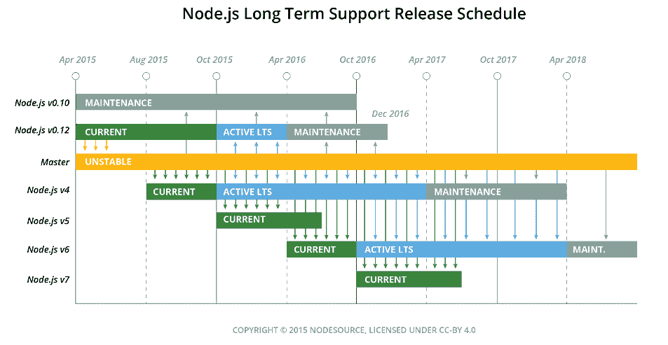
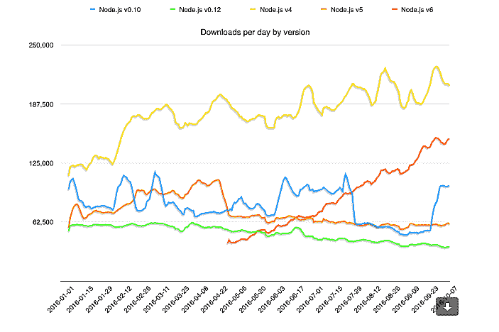

# 新的节点气味:Node.js 获得了另一个长期支持版本

> 原文：<https://thenewstack.io/new-node-smell-node-js-gets-second-long-term-support-release/>

准备好长期的节点关系了吗？

在短短的七年时间里， [Node.js](/tag/node.js/) 已经从一个斗志昂扬、只支持 Linux 的 [JavaScript](/tag/javascript/) 运行环境发展成为真正的网络霸主。该平台由 [Node.js Foundation](https://nodejs.org/en/) 发布，每月有 500 万次下载，运行在从云栈和 API 引擎到移动网站的所有东西的罩下——甚至是不折不扣的机器人。

Node.js 也越来越受到企业和共享经济部门的欢迎。像沃尔玛、网飞和纽约时报这样的巨头公司已经将服务器端的运营建立在 Node 上，优步和 AirBnB 依靠 Node.js 来匹配客户和旅行/住宿。

然而，随着补丁和更新的发布，具有复杂环境的大型组织面临着不断升级其节点世界的挑战。为了满足大中型企业客户的需求，特别是那些对不稳定性零容忍的客户，Node.js 项目刚刚发布了 Node.js v6.9.0 的长期支持策略，代号为“Boron”

与该项目的 LTS 计划一致，即按照元素周期表的字母顺序命名版本，Node.js 的合作者选择“硼”作为 v6 LTS 的代号。节点 v4-创建于 2015 年 9 月，当时 Node.js v0.12 和 io.js v3.3 合并为节点 v4.0 被命名为“Argon”。(此版本中的 **process.release.lts** 属性包含字符串“Boron ”,用于轻松检查节点进程是否在 lts 版本上运行。但是，在其他发布版本中，该属性将没有值)。

企业 Node.js 发行商 NodeSource 的联合创始人丹·肖(Dan Shaw)表示，作为一名开源贡献者和企业所有者，他对 Node.js 的企业版感到非常兴奋。

“Node.js 的表面积触及世界，”肖说。“我们可以将这种稳定的增长归功于核心技术委员会在确保最终用户体验稳定、稳定、稳定方面所做的出色工作。出色的发行说明、对正在发生的事情的深刻见解，以及创建应用程序的真正可靠的平台。”

“对于今天的节点开发人员来说，令人高兴的现实是，在从一个版本转移到下一个版本的过程中，没有太多的东西会被打破，而且会有很棒的新功能，”他继续说道。

作为一个例子，Shaw 引用了谷歌团队的一项贡献，该贡献将节点调试引入了[Chrome dev tools](https://mattdesl.svbtle.com/debugging-nodejs-in-chrome-devtools)——“进入 Node.js 系统的丰富调试管道”，这是 Node.js 在市场上成熟的又一标志。

## 从“当前”平稳过渡到“LTS”

该基金会周二宣布，Node.js v6 将成为 LTS 发布线，直到 2018 年 4 月，新功能很少登陆，只有在基金会的[核心技术委员会](https://nodejs.org/en/about/governance/)批准后(根据该项目 LTS 工作组的建议行事)。随后是额外的 12 个月“维护模式”，仅涵盖关键错误和安全修复，总长期支持期为 30 个月。

Node.js 基金会的社区经理 Mikeal Rogers 表示:“LTS 计划是 Node.js 项目与开发者签订的一份合同，承诺为开发者提供近三年的稳定性和支持。“Node.js v6 有许多出色的特性，这些特性侧重于性能、安全性增强和更高的可靠性。如果你是一家希望将 Node.js 投入生产的公司，而不是为了升级而每六个月投入大量开发人员，这对你来说是一个完美的发布线。”

Node.js 最近才完全采用了[语义版本](http://semver.org/)协议，这将成为 LTS 覆盖的 Node.js V6 的一部分。因此，新功能将是次要的，仅限于错误修复、安全更新、非主要 npm 更新和性能改进，显示出破坏现有依赖应用程序的风险极小。

## 偶数和奇数，六和七

Node.js v 6，代号为“Boron”，于 2016 年 4 月发布，与该项目每年 4 月削减新的偶数编号 semver-major 版本的习惯一致，六个月后的 10 月，新的奇数编号版本随之发布。

奇数版本是新特性的测试平台，面向那些能够忍受一点不稳定性，并且能够轻松升级 Node.js 部署的用户。这些支持为期八个月，侧重于平台的持续更新和迭代。

> “如果您有一个健壮的测试环境设置，那么我们建议您直接升级到 Node.js v6。如果你不愿意进行这么大的版本升级，Node.js v4 也是一个不错的升级”——Mike al Rogers。

Node.js v7 上个月发布了测试版，将于 10 月 25 日正式发布。这是 Node.js 项目的“检查点版本”,将专注于稳定性，对 Node.js v6 的增量改进，以及更新到谷歌的 [V8](https://developers.google.com/v8/) JavaScript 引擎和 [libuv](https://github.com/libuv/libuv) 异步库的最新版本。

根据该基金会的声明，“Node.js v7 将与 JavaScript 引擎 V8 5.4 一起发布，该引擎专注于与内存相关的性能改进。其中包括新的 JavaScript 语言特性，比如指数运算符、新的对象属性迭代器和对异步函数的实验性支持。需要注意的是，在 V8 5.5 发布之前，不支持异步功能。这些功能仍处于实验模式，因此您可以试用它们，但它们可能包含错误，不应用于生产。”

鉴于这是一个奇数版本，v7 的生命周期将于 2017 年 6 月结束。有关 Node.js v7 有趣的新特性和突破性变化的更多信息，请访问 [GitHub](https://github.com/nodejs/node/pull/9099) 。

## 节点给予，节点取走

随着这些新的面向企业的 Node 迭代加入群体，遗留版本正在被关闭。Node.js v0.10 [将于 10 月 31 日达到“生命终结”，Node.js v0.12 于 2016 年 12 月](https://nodejs.org/en/blog/release/v6.9.0/)。这两条线上都不会有进一步的发布，包括安全或稳定性补丁。

该项目有令人信服的理由进行清理:12 月 31 日之后，“我们将无法获得这些版本的 OpenSSL 更新。这意味着我们将无法提供任何安全更新。此外，自从 Chromium 团队在四年前淘汰 V8 以来，Node.js 核心团队一直在维护 Node.js v0.10 中包含的 V8 版本。这对用户来说是一种风险，因为团队将不再维护它。”

NodeSource 的 Shaw 观察到，“在生态系统中仍然有相当数量的 v0.10 用户。”他说，他们因为时间而停滞不前——有其他紧急情况的初创公司，或者员工有限的组织，去做测试和做出改变。“那些回到 10 或 12，那些真正古老的版本，节点团队能做什么来支持或维护这些，有真正的限制，”肖说。“我们需要鼓励每个人转向 LTS 的工作流程。水很棒。就是管用。”

Node.js 项目人员敦促用户升级——不仅仅是从 v0.10 和 v0.12 升级，还包括任何徘徊在最后一个检查点版本 v5 上的人。较新的偶数节点版本更稳定，并且运行 V8、 [OpenSSL](https://www.openssl.org/) 和其他关键依赖项的更现代版本。

“如果您有一个健壮的测试环境设置，那么我们建议您直接升级到 Node.js v6。罗杰斯说:“如果你不愿意进行这么大的版本升级，Node.js v4 也是一个很好的升级。然而，他警告任何走这条路的人，只剩下 18 个月的时间从 Node.js v4 过渡到当前的 LTS 版本 v6，该版本将于 2018 年 4 月停止维护。

在[目前的下载速度](https://nodejs.org/metrics/)，Node.js v6 将在年底前接管目前 LTS 线 v4 的下载量。这是一件好事:v6 将成为 LTS 的产品线，并在未来 30 个月处于维护模式。Node.js v4 将于 2018 年 4 月停止维护。

一句话:是时候更新了。

## 下一个事件视界

一旦你完成了所有这些升级，你可能会对 Node.js 下一步的想法感兴趣。上个月，指导委员会成员 [James Snell](https://github.com/jasnell) 在 Node.js Interactive Amsterdam 上发表了“Node.js Core 的联盟状态”主题演讲，详细介绍了 Node.js core 在过去一年的发展情况以及下一步的发展方向。

结果:节点世界可以期待语言兼容性的改进，采用现代 web 标准，VM 中立性和 API 开发的内部增长，以及对不断增长的 Node.js 用例的支持。

通过 Pixabay 的特征图像。

<svg xmlns:xlink="http://www.w3.org/1999/xlink" viewBox="0 0 68 31" version="1.1"><title>Group</title> <desc>Created with Sketch.</desc></svg>