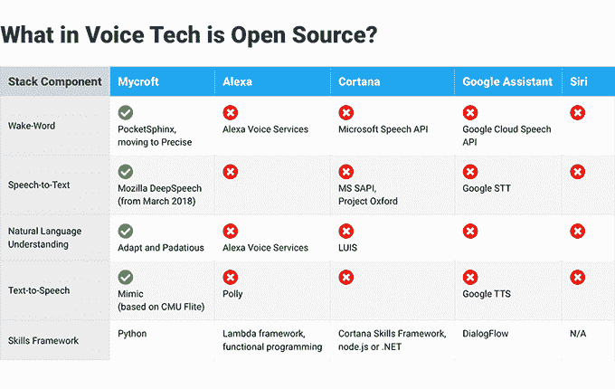
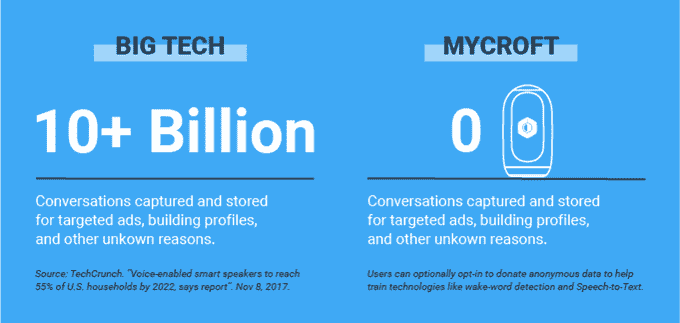

# 不会窃取你隐私的智能音箱:开源的迈克罗夫特·马克 2 号

> 原文：<https://thenewstack.io/new-open-source-smart-speaker-mycroft-mark-ii/>

迈克罗夫特·马克 2 号智能手机自称是“对亚马逊 Echo 和谷歌 Home 的开放回答”，提供语音驱动命令的能力，“同时保持隐私和数据独立性”

这是一款智能扬声器，具有常见的功能，如播放音乐、发布天气预报和发送提醒。但它更具可定制性，提供不同的“唤醒词”——即不同的名称来激活设备——甚至不同的声音。

[https://www.youtube.com/embed/Ud3XLEGIu8U?feature=oembed](https://www.youtube.com/embed/Ud3XLEGIu8U?feature=oembed)

视频

迈克罗夫特·马克 2 号正在[众筹](https://www.kickstarter.com/projects/aiforeveryone/mycroft-mark-ii-the-open-voice-assistant/)。它最初的筹款目标是 5 万美元，但截至上周末活动结束时，它已经筹集了近八倍于这个数字的*资金，从 2245 名支持者那里筹集了 394572 美元。事实上，该项目在 1 月 25 日启动后的 7 个小时内就已经获得了全部资金。为了延续智能音箱的可用性，它现在可以通过 IndieGoGo 上的*新*众筹活动[获得。](https://www.indiegogo.com/projects/mycroft-mark-ii-the-open-voice-assistant)*

一个用户已经定制了 Mycroft，让它在没有*任何*唤醒词的情况下回应。相反，只要用户的头转向网络摄像头，它就会识别出来。

[https://www.youtube.com/embed/ytKUTBfjnQI?feature=oembed](https://www.youtube.com/embed/ytKUTBfjnQI?feature=oembed)

视频

还有不同的*外观*，从动画脸到显示时间或天气的屏幕小部件。用户社区甚至致力于支持更多的语言，包括西班牙语、葡萄牙语、意大利语、法语和德语。

这是 2015 年早期众筹产品的后续产品——尽管 Fast Company [称 Mark I](https://www.fastcompany.com/40522226/can-mycrofts-privacy-centric-voice-assistant-take-on-alexa-and-google) 更像是黑客的草图，由树莓派电路板手工打造(具体来说就是树莓 Pi 2 和 Arduino 板。)他们从那次努力中学到了很多——而且*也成长了很多。“我们从 6 人的团队发展到 17 人的团队，”他们最新的活动解释道，“现在已经将 Mark I 运往 56 个国家和美国 38 个州。”*

根据其 Kickstarter 活动，新的迈克罗夫特马克 2 号是基于当前用户反馈的“不间断迭代”的结果。“Mark I 在很大程度上是一款面向制造商和开源开发者的设备。马克 2 号是一款面向消费者的扬声器，专为您和您的家人设计，无论您的专业技术水平如何。但与此同时，它是开放的硬件和软件，面向你们这些开发者、创客和黑客……”

一名粉丝已经教会了这款新的带摄像头的设备玩石头剪子布。

[https://www.youtube.com/embed/e3yYXWvvRn4?feature=oembed](https://www.youtube.com/embed/e3yYXWvvRn4?feature=oembed)

视频

但与竞争对手最大的不同是哲学上的。“你的个人数据保持隐私，你可以定制你的体验，麦考夫在语音游戏中是一个中立的玩家，”最近的众筹活动解释道。

在一个名为“开源胜出”的章节中，创作者将迈克罗夫特描述为“语音助手的瑞士；技术生态系统战争中的中立玩家……我们没有战略理由将用户引入任何品牌的服务。”后来他们的活动称其为“唯一尊重你隐私的语音助手……在迈克罗夫特，我们会删除收到的录音，除非你主动选择加入我们的开放数据集来分享你的数据。”

首席执行官约书亚·蒙哥马利称其为“一个开放、透明、注重隐私的智能助手。”

## 为什么隐私很重要

蒙哥马利强调了隐私对《快公司》的重要性，暗示大型科技公司处理用户数据的方式“完全是以牺牲用户为代价的自我充实”

在最近的一篇博客文章中，蒙哥马利回忆了他早期的一个项目——建立一个所有人都可以访问的无线网状网络，不管收入如何——以及他学到的重要经验。“你不需要为了获得优质服务而将你所有的私人和个人数据交给大科技。事实上，即使没有您的个人数据，这些公司中的大多数也可以为您提供出色的服务……”

“随着像迈克罗夫特这样的语音助理技术成为我们生活中更大的一部分，我鼓励你仔细考虑它们产生的数据以及这些数据是如何使用的。”

在最近的一次采访中，该公司的首席技术官指出，一些用户更愿意让“本地智能”提供这些服务，而不是基于云的系统。“随时了解我的日历和我的当前位置是预测何时提高房间温度的好方法，但我不想让亚马逊或谷歌获得这么多信息。”

虽然《快公司》指出，麦克罗夫特已经吸引了一些替代企业投资者——捷豹路虎和麦克风公司舒尔——但“真正的钱是向企业提供开源人工智能，这些企业可能会对向科技巨头提供音频日志和用户数据更加谨慎。”

Montgomery 还告诉该杂志，他正在与几家公司进行谈判，这些公司希望基于他们自己的品牌创造独特的语音助手。

## 下一个伟大的开源接口？

蒙哥马利指出，大型科技公司已经将语音作为未来几年我们与计算机互动的主要方式之一。

“需要有一个开放的替代方案，”他在 YouTube 上对一名采访者说，“这样，从运输汽车的大型企业集团，到有 STEM 项目的高中生，每个人都可以部署一个定制的语音助手，做他们想让它做的事情。这确实是我们的目标，是一个可以在任何地方运行的人工智能，像人一样互动，任何人都可以访问。”

[https://www.youtube.com/embed/Vg5w8E47iGk?feature=oembed](https://www.youtube.com/embed/Vg5w8E47iGk?feature=oembed)

视频

或者，正如他们的运动解释的那样，“人工智能和语音技术对我们的集体未来太重要了，不能继续成为硅谷巨头的财产。”

这就是为什么非营利组织 Mozilla Foundation 一直在用他们的[公共语音项目](https://voice.mozilla.org/)为语音助手收集一组公共领域的训练数据——补充来自 [LibreSpeech](http://www.openslr.org/12) 和 [VoxForge](http://www.voxforge.org/) 的其他公共可用训练数据集。迈克罗夫特希望通过让用户选择向更大的开源训练数据池添加他们自己的语音命令来为此做出贡献。

“我们一起变得更强大，”一个迈克罗夫特页面解释说，它为社区提供了一个非常独特的机会:“通过建立塑造技术的数据来帮助建立这项技术。”

这可能比任何人意识到的都重要。“在机器学习的世界里，最珍贵的东西是可以学习的正确数据，”迈克罗夫特的首席技术官[史蒂夫·彭罗德](https://mycroft.ai/blog/mycroft-welcomes-new-cto-steve-penrod/)最近解释道。“很多时候……就像抚养孩子一样，你输入系统的数据决定了系统的输出。因此，仔细的策展可以产生具有观点和个性的系统……将数据集结合在一起将允许用户塑造这个助手——独特的声音、独特的态度、独特的兴趣。”

该运动甚至将该产品视为迈向更多样化未来的一步。“建立一个任何人都可以为之做出贡献的人工智能意味着制造更能代表我们今天生活的世界的技术，一种公平、中立、前瞻性的技术。”

随着人工智能助手开始填满我们的世界，这将变得更加重要。“它们将变得无处不在，以至于你甚至不会注意到它们，”潘克洛夫告诉一位采访者。

“它们将成为生活的一部分。”

* * *

# WebReduce

<svg xmlns:xlink="http://www.w3.org/1999/xlink" viewBox="0 0 68 31" version="1.1"><title>Group</title> <desc>Created with Sketch.</desc></svg>