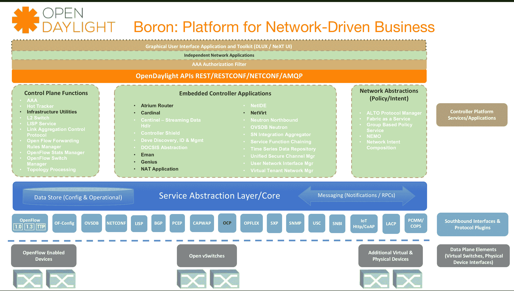

# 新的 OpenDaylight 硼版本增强了 OpenStack 支持

> 原文：<https://thenewstack.io/new-opendaylight-boron-release-strengthens-openstack-support/>

软件定义网络(SDN)和网络功能虚拟化(NFV)等架构旨在打破供应商锁定专有解决方案的网络黑匣子，使运营商、服务提供商和云供应商能够使用开源软件完全控制其网络配置。这正是开源项目 OpenDaylight 的目标。

OpenDaylight 项目发布了其同名框架[的第五个版本，代号为 Boron](https://www.opendaylight.org/what-we-do/current-release/boron) ，旨在为采用 SDN 架构提供代码和蓝图。

OpenDaylight 成立于 2013 年，是一个由网络和云玩家社区领导的 [Linux 基金会协作](https://www.linuxfoundation.org/projects)项目，包括 Arista Networks、Big Switch Networks、Brocade、Cisco、Citrix、爱立信、惠普、IBM、Juniper Networks、微软、NEC、Nuage Networks、PLUMgrid、Red Hat 和 VMware。

OpenDaylight 执行董事尼拉·雅克(Neela Jacques)表示:“在 Boron 和之前的版本之间，令人惊讶的是，Boron 的创新实际上有多少来自最终用户。“我们的代码库有 872 名贡献者。如果我们看看提交的数量，你会发现在一年之内，我们不仅增加了 500 名代码贡献者，实际上我们还增加了 47，000 个代码提交。”

Boron 中超过一半的新项目来自用户组织，包括:

*   **ECOMP(增强型控制、协调、管理和策略):** ECOMP 是一款 AT & T 制造的控制器，用于电信网络的下一代协调。
*   **[YangIDE](https://github.com/xored/yang-ide):**YangIDE，也来自于 AT & T，是一个用于网络配置协议(NETCONF)的 [YANG](https://tools.ietf.org/html/rfc6020) 数据建模语言的集成开发环境(IDE)。
*   **NetIDE:** 来自 Telefonica 和 Intel 的 IDE，可以更轻松地在控制器部署之间共享应用。
*   **EMAN (OpenDaylight 能源管理):** Comcast 软件，用于测量和 im 证明网络的能源效率。

此外，Genius 项目是一项社区范围的工作，为应用程序合成提供了一个与应用程序无关的框架。这支持模块化分布式应用程序以及服务功能链(SFC)的部署。Genius 最初是作为 OpenDaylight 的早期版本中的“概念验证”项目引入的，现在它与应用程序无关，可以用于运行生产云网络。

Boron 提供了几个增强来增强 OpenDaylight 对云部署的支持。OpenStack 相关功能已在统一的开发框架内重新构建，以实现更好的可扩展性和性能，包括集群、高可用性(HA)和数据持久性。虚拟网络功能(VNFs)的南向增强包括对 OpenFlow 和 [NETCONF](https://tools.ietf.org/html/rfc6241) 协议的优化，以及对 [Open vSwitch](http://openvswitch.org/support/dist-docs/vtep.5.html) 和[数据平面开发套件](http://dpdk.org/) (DPDK)的支持。

 
新合并的 NetVirt 项目改进了 [OpenStack Neutron](https://wiki.openstack.org/wiki/Neutron) 和 OpenDaylight 控制器之间的协调，并增强了对 IPv6、安全组(通过 OpenFlow 配置)和 VLANs 的支持。

## 新兴的网络软件开源生态系统

OpenDaylight 并不是唯一由 Linux 基金会主办的 SDN 和 NFV 项目。这只是基金会旗下众多软件定义网络项目中的一个。

“如果你看看我们在 Linux 基金会关注的网络项目，你会发现我们在网络堆栈的每一层都非常关注这些可持续的生态系统。如果你再深入一点，我们有 Open vSwitch、FD.io、IO Visor 等等，”Linux 基金会执行董事吉姆·泽姆林说。“使 Linux 基金会成为此类项目的独特之家的是，它能够交叉授粉项目。不同的网络项目既竞争又合作，相辅相成。”

通过 Pixabay 的特征图像。

<svg xmlns:xlink="http://www.w3.org/1999/xlink" viewBox="0 0 68 31" version="1.1"><title>Group</title> <desc>Created with Sketch.</desc></svg>