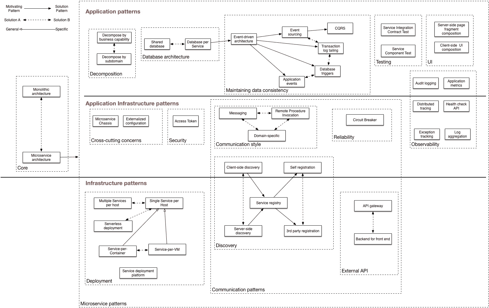

# 一种新的模式语言使微服务变得更容易

> 原文：<https://thenewstack.io/new-pattern-language-set-make-microservices-easier/>

云先锋 Chris Richardson 认为没有微服务，也许今年早些时候在纽约举行的甲骨文开发者大会上吸引了他的观众。相反，他坚持认为，你应该把一系列[微服务](/category/microservices/)视为一种服务架构，他建议道。

为了帮助系统架构师掌握微服务，Richardson 正在开发一种模式语言，为常见的用例场景提供模板。

Richardson 被广泛认为是服务架构的思想领袖，多年来一直是 Java 的拥护者。他是最初的 CloudFoundry.com 的创始人，这是亚马逊 EC2 的早期 Java 平台即服务，被 SpringSource 收购。SpringSource 本身很快就被 VMware 收购，后来 VMware 继续使用 Cloud Foundry 的名称来命名今天众所周知的开源企业平台服务[。他写了《POJOs in Action](https://www.cloudfoundry.org/) 》一书，描述了如何用框架构建企业 Java 应用程序。理查森的下一本书[微服务模式](https://www.manning.com/books/microservice-patterns)将于今年晚些时候出版。他目前提供微服务咨询和培训，并运营着 [Eventuate.io](http://eventuate.io/) ，该公司提供了一个应用平台，用于“创建一个简化事务性微服务开发的开源/SaaS 平台”

在他的演讲中，Richardson 将微服务架构描述为“将应用程序构建为一组围绕业务功能组织的松散耦合的服务。”他说，微服务架构将技术能力映射到这些服务中，因此它实际上是一种服务架构，而不是“微服务”他说，这个新架构的主要目标是“通过解决复杂性来加快软件开发的速度”

但是微服务架构会产生自身的复杂性，所以 Richardson 创建了一种[模式语言](http://www.sis.pitt.edu/spring/patterns/node2.html)来帮助解决这些挑战。Richardson 说:[这种模式语言](http://microservices.io/patterns/microservices.html)可以用来指导你决定是否要进入微服务架构。一旦实施，它可以帮助解决该决策带来的各种问题。

> 他解释说，在寻找解决方案时，缺点经常被忽略，而模式语言迫使你去定义它们。

那么什么是模式呢？按照理查森的说法，这是“一个在特定环境下发生的问题的可重复使用的解决方案。”他解释说，特殊的背景很重要。“你不能盲目地一遍又一遍地应用相同的解决方案。”

理查森将一个模式分解为七个特征:

*   一个便于参考的名字，
*   也称为解决方案的上下文，
*   一个你试图解决的问题，
*   力量，是需要解决的问题或冲突，
*   描述了一种解决方案，
*   当这种模式被应用时，
*   最后，相关的模式

他说，相关模式可以为已定义的问题提供一种替代解决方案，或者提供一种需要你考虑替代方案的独立模式格式。

他解释说，在寻找解决方案时，缺点经常被忽略，而模式语言迫使你去定义它们。“当你应用这种模式时，会出现一些问题，而这些相关的模式将会解决这些问题，”他说。

他解释说，这驱动了模式语言的结构。除了描述优点，它还要求你描述缺点，并迫使你描述你必须解决的问题。

模式的主要目的是简化由于微服务的分布式架构而变得复杂的过程。例如，您需要一组发现模式，因为您必须知道其他服务的网络位置。有[公共接口模式](http://microservices.io/patterns/client-side-discovery.html)、 [API 网关模式](http://microservices.io/patterns/apigateway.html)和[部署模式](http://microservices.io/patterns/deployment/multiple-services-per-host.html)，所有这些都有助于那些过程。

一组[可观察性模式](http://microservices.io/patterns/observability/application-metrics.html)帮助请求可以从一个服务跳到另一个服务，故障排除模式有助于[分布式跟踪](http://microservices.io/patterns/observability/distributed-tracing.html)和[日志聚合](http://microservices.io/patterns/observability/application-logging.html)。[测试模式](http://microservices.io/patterns/testing/service-component-test.html)独立提供测试服务，因此测试简单、快速且可靠。

## 这一切都回到了数据上

微服务架构中的关键挑战是如何管理分布式数据。由于数据被业务服务分解，每个业务服务都有自己的数据库查询，过去很简单，现在变得非常复杂。

Richardson 以一个在线商店为例，展示了订单数据与客户数据分离的情况，客户数据保存在不同的数据库中，可能在不同的服务器或容器上。由于不能直接访问彼此的数据，两个数据源只能通过 API 进行通信。

理查森说，这产生了有趣的问题，尤其是在交易方面。事务用于维护数据一致性和实施业务规则。在在线商店中，当下订单时，订单系统需要验证客户信用限额，但是数据在单独的数据库中，可能在单独的服务器或容器上。

为了解决这个问题，模式语言包含了一个最终一致的方法，叫做 sagas。

因此，saga 不是跨越多个服务的一系列事务，而是创建一系列本地事务，其中 saga 的每一步都发出一个事件或发出一条消息来触发流程的下一步。他说，通过使用一系列交易，数据最终会变得一致。

Richardson 分析了这在商店中的工作方式:一个订单在没有任何验证的情况下进来并被创建。创建一个指示“我已经创建了一个订单”的事件，该事件将由客户服务处理，客户服务将在客户中保留信用，然后发出一个指示信用保留结果的事件。要么是信用保留事件，要么是信用失败事件，这两种事件都会被订单服务消费，然后订单服务会批准或拒绝订单。

他指出，在单一系统中执行查询很简单，但在微服务结构中变得复杂得多。按照 Richardson 的说法，解决方案是[命令查询责任分离](https://docs.microsoft.com/en-us/azure/architecture/patterns/cqrs) (CQRS)，它使用来自业务逻辑的事件流来保持视图最新。

在某种程度上，他说，“它使用 MySQL 数据库的弹性搜索来实现技术搜索查询，只不过我们使用了它的一般化，并使用事件来保持它接近实时更新。"

使用微服务架构的另一个复杂性是如何可靠地更新数据库和发布事件。理查兹对此也有一个解决方案:活动采购。事件源是一种以事件为中心的持久性形式。

“每一个都将每个域对象作为一系列事件来保存，因此当创建一个订单时，一个订单事件被插入到事件存储中，这使得它可用于发布，然后当订单被批准时，我们插入一个事件来发布它，然后当它被发货时，我们插入一个订单发货事件，”他说。

他说，这是系统中领域对象的真实来源。

<svg xmlns:xlink="http://www.w3.org/1999/xlink" viewBox="0 0 68 31" version="1.1"><title>Group</title> <desc>Created with Sketch.</desc></svg>