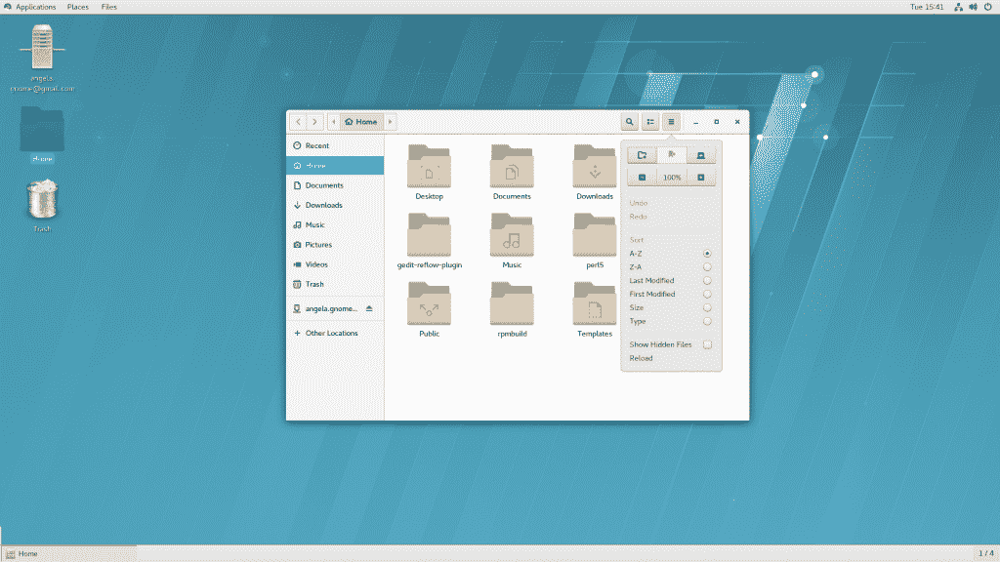
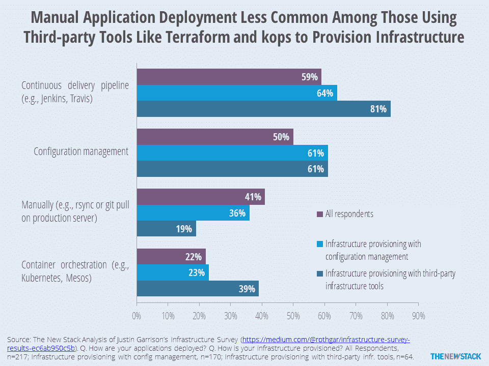

# Red Hat Enterprise Linux 在安全性、基础设施管理方面加倍努力

> 原文：<https://thenewstack.io/new-red-hat-beta/>

安全和更好的管理是最新版本的红帽企业版 Linux，RHEL 7.4 的主要特点，上周[发布了测试版](https://www.redhat.com/en/about/blog/red-hat-enterprise-linux-74-beta-now-available)。

安全性和合规性是现代组织面临的主要挑战， [Steve Almy](https://www.linkedin.com/in/stevealmy/) 指出，他是红帽公司在 RHEL 的主要产品经理。因此，[的新功能](https://access.redhat.com/documentation/en/red-hat-enterprise-linux/)旨在减少公司内部的管理工作量。特别是，这些特性旨在帮助系统管理员应对安全性意识不强的最终用户。

其中一个新增功能是支持网络绑定磁盘加密，这是一种工具，旨在大规模减少磁盘加密的管理负担。他解释了这一举动背后的基本原理:“如果您正在运行一个包含 1，000 个工作负载的数据中心，使用这些本地磁盘，我们认为存在用户不会加密这些本地磁盘的危险。使用网络绑定磁盘加密，管理员可以打开加密，但它们是在本地网络上解密的。但是一旦磁盘从本地网络中移除，它们就会被加密——这是一种防止磁盘泄漏的方法。

为 RHEL 7.4 更新的 Gnome 桌面

这种保护最终用户免受自身伤害的愿望也可以在另一个新功能 USB Guard 的引入中看到。这允许设置对这些 USB 拇指驱动器的访问权限，以便最终用户既不能读取也不能链接到不安全的设备。

Red Hat 还增加了一些额外的合规性功能，更新了审计功能，使管理员能够从关键事件中收集更多信息，并改进了解释记录的方式。

## 自动化国家

不仅仅是安全性和合规性在行使 Red Hat，用户对更多自动化的需求也在不断增长。该公司去年收购了配置管理公司 Ansible，并开始在 RHEL 推出 Ansible 的一些功能。

“客户一直在寻求 Ansible，因为他们发现管理单一系统已经不够了。如何大规模管理 1000 和 2000 个系统？这是现在的问题，”阿尔米说。

他说，在 RHEL 7.4 中，Red Hat 在软件中引入了一组可配置的角色——允许配置五个子系统——kdump(内核崩溃转储)、email(后缀)、selinux、timesync 和 networking。

在 Ansible 完全融入 RHEL 之前还有很长的路要走，但是“我们正在试水”Almy 说。“我们的目标是为 RHEL 6 和 RHEL 7 提供单一界面。

Almy 说，这种整合存在一些挑战，这表明 Ansible 在未来将成为红帽客户军械库的更大市场。“一旦他们开始玩 Ansible，他们会发现它的优点是它可以做任何事情……缺点是它可以做任何事情。”

该公司还推出了其他旨在改善管理员命运的增强功能。其中包括对 RAID 接管的更改，使系统管理员能够更轻松地更改 RAID 配置。“这将意味着他们可以即时进行更改，”Almy 说，“而不必安排停机时间。”他补充说，还有一种更模块化的网络管理方法，提供了更大的灵活性。

还会有一些其他的增强。例如，该公司将在 7.4 中包含 Atomic Base，这是其基本映像的精简版本。

新的测试版现在掌握在用户手中，而 Red Hat 确保了软件的稳定性。“我们的目标是在夏末全面上市，”Almy 说。“如果不安全，我们不会发布。”

[红帽](https://www.openshift.com/)是新堆栈的赞助商。

专题图片:[红帽企业峰会](https://www.redhat.com/en/about/blog/security-red-hat-summit-day-1)谈安全。

<svg xmlns:xlink="http://www.w3.org/1999/xlink" viewBox="0 0 68 31" version="1.1"><title>Group</title> <desc>Created with Sketch.</desc></svg>