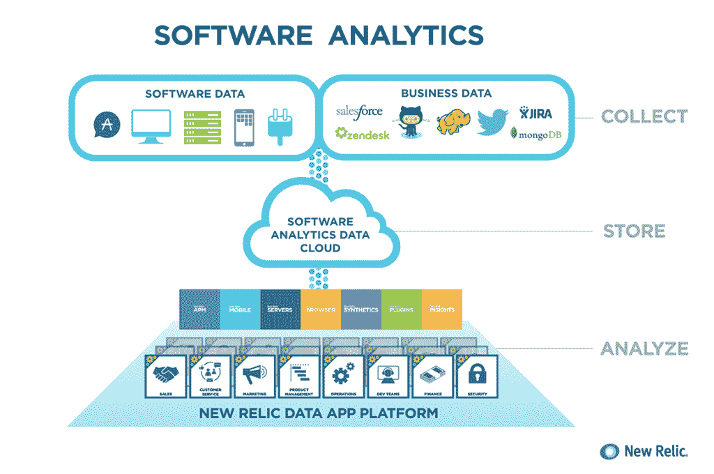
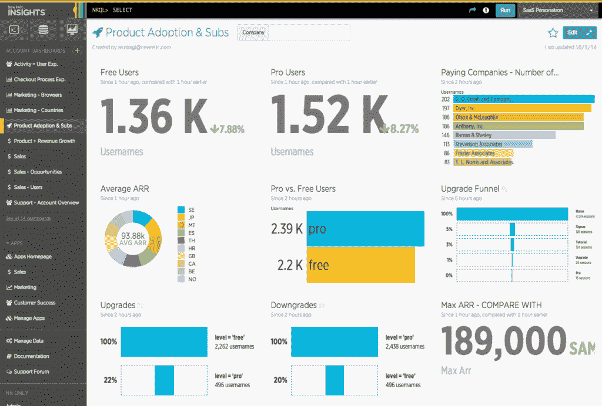
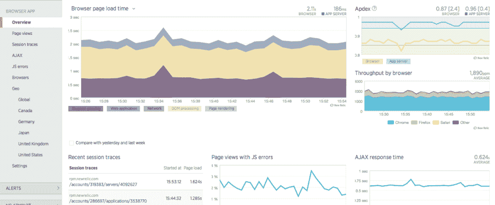

# 新遗迹解决了一种新的开发者

> 原文：<https://thenewstack.io/new-relic-addresses-a-new-kind-of-developer/>

去年， [New Relic 的](http://newrelic.com) FutureStack13 活动将软件分析作为公司会议讨论的主题。今年的 FutureStack14 的主题仍然是软件分析，但它反映了一种正在商业行列中出现的新型开发者。

考虑到几乎所有领先的互联网公司都将数据作为工具开发的基础，这一点都不奇怪。现在，这些先驱开发的实践正在成为新一代商业工具的基础，允许开发人员和商业人士将数据融入他们自己的应用程序。

New Relic 使用自己的数据来创建 Insights，这是一个为客户提供的工具平台，如今该公司正在提供更多功能。Insights 是根据其收集的监控数据构建的。这是大量的数据。New Relic 的技术现已安装在超过 10 亿部手机上。这是 New Relic 可以用来构建其平台的数据。

凭借 New Relic Insights，该公司发布的服务既反映了对开发人员的关注，也反映了对业务用户的关注。

新增加的功能包括为商业用户提供这些三维数据，以帮助他们更好地理解销售渠道，进行分析，并开发客户行为高级细分的可视化功能。

Cirne 说，人们正在从他们从看起来像应用程序的见解中获得的数据分析中构建东西。例如，SaaS 提供商可能想知道最活跃的客户正在使用什么功能。“我们将使开发解决这些问题的应用成为可能。”

该公司首席执行官卢·西恩(Lew Cirne)上周接受电话采访时表示，全球有 30 万名数据爱好者在使用 New Relic 进行监控。目标是将工具放到知识工作者手中，并使总数增加几倍。

该公司自称为软件分析提供商，但其根基是一项监控服务。为了反映这段历史，New Relic 在今天的 FutureStack 活动上推出了一系列新的监控功能。

New Relic 为使用 JavaScript 的应用程序增加了崩溃报告和移动浏览器。例如，该服务通过测量使用 AngularJS 的 Ajax 重型 Web 应用程序来监控应用程序及其性能。

如果应用程序崩溃，客户就不会使用它们。加载时间过长会让用户感到厌烦。媒体公司尤其需要更高的效率，因为他们的广告如果加载时间过长，可能会成为最终用户体验的真正障碍。

它还增加了一个合成引擎，以模拟全球不同地理位置的加载时间。10 年前，最大的领导者是水星互动。

自从惠普收购了他们，市场就空了。

“有这种潜在的需求，”Cirne 说，工具可以向移动应用程序开发者展示他们的应用程序在世界不同地区的表现。

这些工具反映了 New Relic 努力成为一体化工具提供商，为需要一个平台而不是一系列单点工具的客户服务。

对于商业用户可以用来制作他们自己的工具的工具的需求正在增长。数据是构成开发者所塑造的东西的物质。塑造是更多这样的公司试图解决的难题。解决这些新开发人员需求的热潮已经开始。New Relic 绝对有优势，如果没有其他优势的话，就是它已经拥有的可以提供给客户的数据。

新遗迹是新堆栈的赞助商。

特色图片[通过](https://www.flickr.com/photos/matthewblack/1299313106/in/photolist-2YPjw7-2YJNSM-2YPBDW-2YPcN9-dihoSq-bY3bdE-bY32y7-bY3Mp9-bY3rn5-bY39r3-bY2Zyw-bY2P2S-bY3553-bY3oYs-bY2Xhw-bY2AFy-bY3qhS-bY3AkY-bY2HC3-bY31zA-bY3hcm-bY3FJj-bY3Pvu-2ZNpHV-2ZSZay-2YJPzB-2ZSXZw-2YP75J-2ZNoqR-7cZW4U-dsqbHe-bY3Vd7-eePAtL-eePABA-eeHRGR-5MGfNp-7UGxXr-fQgw8q-eePAbh-eePzS5-eePAnU-eeHRWD-eePzMA-7ND718-7ND76K-7ND7iF-7gfCu1-34RXUv-bY2DDJ-bY3K4y) Flickr 知识共享。

<svg xmlns:xlink="http://www.w3.org/1999/xlink" viewBox="0 0 68 31" version="1.1"><title>Group</title> <desc>Created with Sketch.</desc></svg>