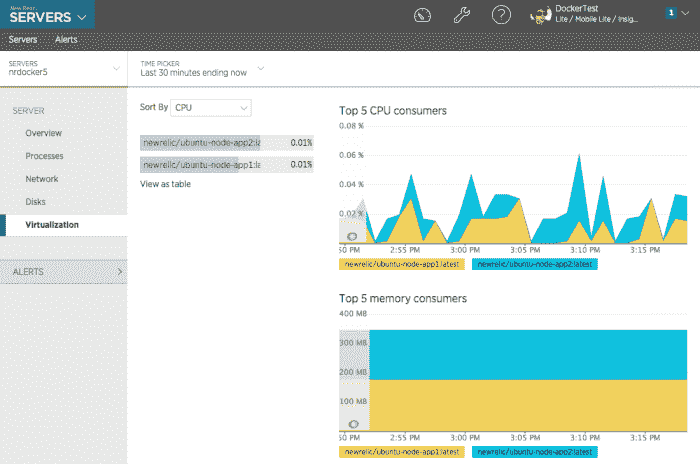
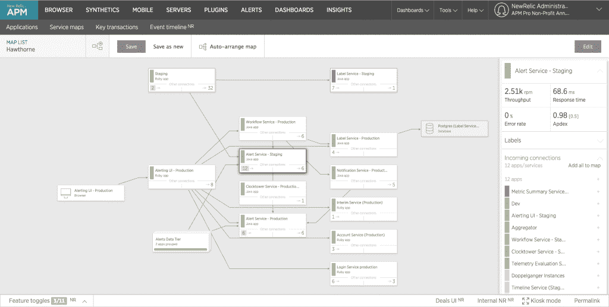
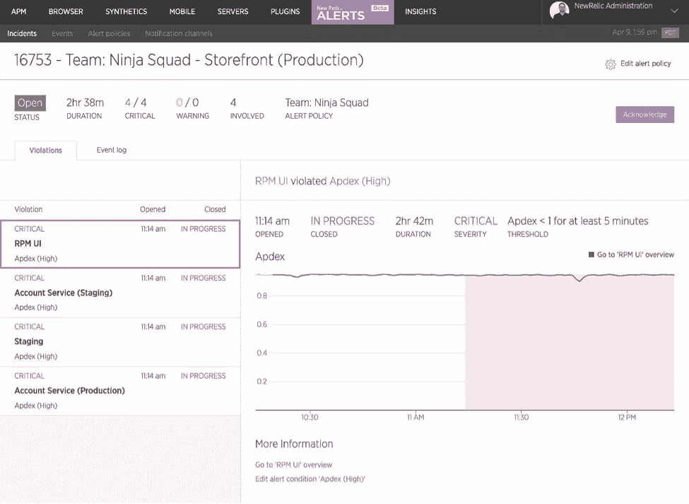

# 新遗迹增加 Docker 支持，解决微服务架构问题

> 原文：<https://thenewstack.io/new-relic-adds-docker-support-addresses-microservices-architectures/>

New Relic 正在进军微服务领域，其新功能旨在帮助开发人员和运营团队拥抱这些新技术。

另外，它宣布[加入云铸造基金会](http://newrelic.com/press-release/20150506-1)。

新功能和发布包括:

【T2

*   **服务地图**–监控复杂微服务应用架构的可视化工具。

*   **警报**–一个简化的可配置警报系统，旨在消除“警报疲劳”

虽然容器提供了隔离、可预测性和可移植性等好处，但它们也产生了自己的问题，New Relic 的产品管理副总裁 Patrick Lightbody 在谈到该公司即将推出的原生 Docker monitoring 时表示。

“问题是它在运行的软件和操作系统之间引入了一堵新的不透明的墙。您的软件不知道它在 ABC 容器中的主机 XYZ 上，这打破了依赖于连接主机和软件的传统监控工具。因此，我们在 APM 监控和服务器监控两方面都增加了 Docker 意识，以帮助再次建立这些联系，”他说。

“我们希望让这堵不透明的墙变得更透明一些，这样当有人对一个问题进行分类时，他们就不会碰到砖墙，不知道这个容器实际上在哪里运行，它实际上在什么机器上运行，以及相对于在该机器上运行的所有其他容器，它实际上使用了什么资源。对于 Docker 的运营者来说，这些信息很难获得。现在我们可以让人们看到逻辑软件架构中的每个层、每个节点和每个连接点。”

他说，New Relic 在 Docker 的董事会中有一名成员，并在内部使用 Docker 容器。

“我们有一些使用模式，在这些模式中，我们运行 Docker 容器，该容器运行我们的应用程序服务器非常长，它收集数据-每分钟数百万次交易。此外，我们还有其他模型，每次我们去监控某个东西时，我们有一个所谓的合成监控解决方案，我们检查人们的网站，我们启动一个 Docker 容器，然后在几秒钟后关闭它。我们已经感受到了监控它的痛苦。”

他说，New Relic 以后可能会考虑增加对其他运行时的支持，如 CoreOS 的 Rocket 和其他运行时，如果他们有市场吸引力和关键管理层，它用来绘制进程、容器和服务器之间的连接。

虽然服务地图背后的概念并不新鲜，但该公司决定重新开始，回到所有公司都倾向于做的事情:让某人在白板上画出架构。同时，它希望解决微服务架构爆炸式增长带来的问题。

“将所有节点放在一个屏幕上并绘制所有连接的传统方式在这些现代体系结构中确实不起作用，因为您可能有数百甚至数千个组件在与数百个其他组件通信，并且您基本上在屏幕上的可视化中就像一个老鼠窝，没有人能搞清楚它的来龙去脉。他说:“对问题进行分类或者传达软件的逻辑架构是非常低效的。

在公司内部，甚至前端团队绘制架构的方式也可能不同于后端团队，因为他们考虑要绘制多大的框，是否要绘制某些依赖关系。服务地图允许不同的团队定制他们的架构图，显示组件的所有依赖关系和实时健康状态，但是对架构的任何更改都将反映在地图中。

其警报系统旨在将第一个警报后发生的所有单个违规事件汇总到一个事件仪表板中，而不是在最初的问题得到解决时发出一个又一个警报。它允许用户为他们最关心的指标选择更多的选项和控制。

它可以在新的 Relic 软件分析平台上工作，与 iOS 和 Android 应用程序集成，并具有可定制的 webhooks，用于集成到其他系统，如 Slack、HipChat、OpsGenie、PagerDuty、VictorOps 和 Campfire。

越来越多的 New Relic 客户已经在使用 Cloud Foundry 平台，因此这将有助于扩大分析公司的影响力。New Relic 计划贡献一个 tile、service broker 和 build pack，目标是简化 Cloud Foundry 上的应用程序开发，并在没有专用监控基础架构的情况下实现这些应用程序的成功。

两个月前，竞争对手云监控公司 [Datadog 发布了主机地图](https://thenewstack.io/with-host-maps-datadog-offers-a-view-of-scaled-out-architectures/)，这是一个可视化工具，可以提供主机信息以及它们可能存在的任何问题。其他竞争对手包括 [AppDyamics](https://www.appdynamics.com/) 和 Rocana(前身为 ScalingData)，后者上周宣布获得由谷歌风投牵头的[1500 万美元的 B 轮融资](http://techcrunch.com/2015/05/01/rocana-lands-15m-to-bring-big-data-analysis-to-it-ops/)。

12 月，New Relic 进行了首次公开募股，募集了 1 . 15 亿美元。

Datadog 和 New Relic 是新堆栈的赞助商。

通过 Flickr 知识共享的特色图片[。](https://www.flickr.com/photos/jplauriente/15444315015/in/photolist-pwL9Mn-appgrr-j3KCqr-aQhrW6-aVh5bz-7VXBS6-e7NzCh-rAjzpp-qsAaeg-7W1Srs-d57N9-kgmiti-xzMLM-8Huor-foXNBL-6o9qRo-nbjLZT-oqxetu-ehGxS4-7jeHKU-r9simZ-8WrdH6-j2RiSk-bqUR68-ku7nVr-bh6hDF-fhTf4d-3eQok4-bPH592-ro6a91-dVpb7r-qd3QGs-qqD3c6-2WjQNY-7AuuJU-ji56hf-oDuxYt-gRdHM2-55DijE-baXh4g-bs171k-xVtqH-i3NEsY-s9GEtj-jjAGGB-amAfDC-5Jva9M-9tucpM-4nFPXf-5FJ7wE)

<svg xmlns:xlink="http://www.w3.org/1999/xlink" viewBox="0 0 68 31" version="1.1"><title>Group</title> <desc>Created with Sketch.</desc></svg>