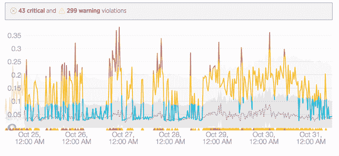
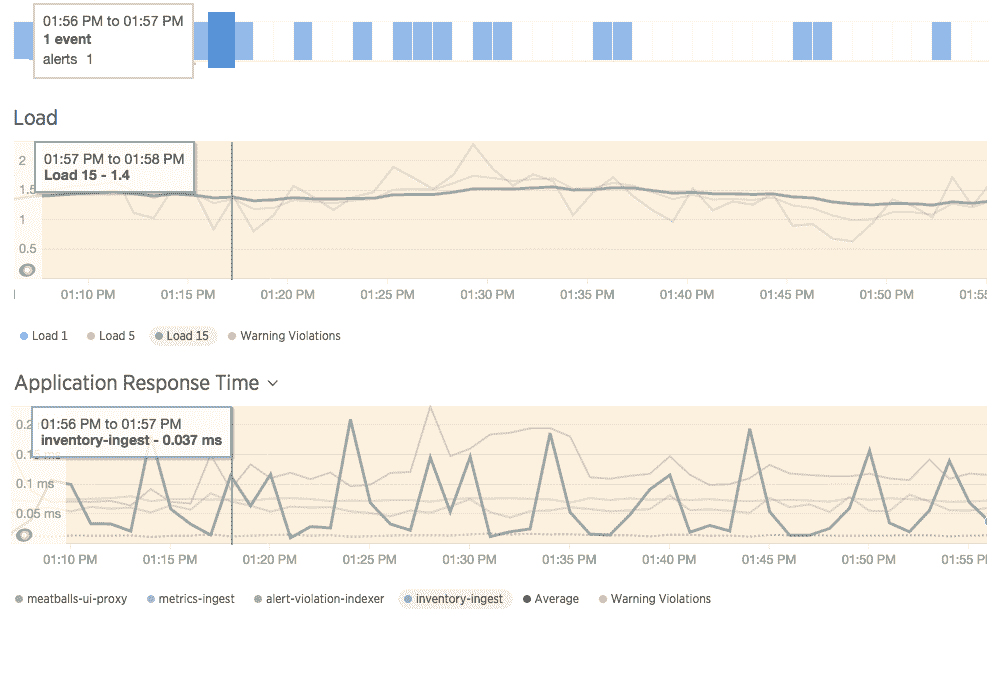
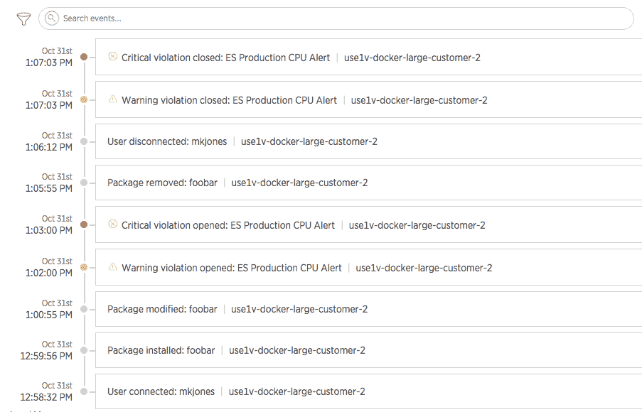

# New Relic 在其监控服务中增加了基础设施和移动应用程序跟踪

> 原文：<https://thenewstack.io/new-relic-adds-infrastructure-mobile-app-tracking/>

随着数据通过动态使用的容器从公共云到私有云在应用之间移动，从这里到那里检测 CPU 使用情况，一个潜在的缺点是当系统崩溃或出现需要解决的问题时，要知道去哪里查看。

一家应用程序监控软件即服务公司开发了一些新功能来解决这些问题。其新的[基础设施](https://newrelic.com/press-release/20161107-3)、[统一仪表板](https://newrelic.com/press-release/20161107-2)和移动碰撞分析服务将成为其[数字智能平台](https://newrelic.com/products)的一部分，将于 2016 年 11 月 16 日开始向客户提供，该周该公司的 FutureStack 大会将在旧金山举行。

动态基线视图

“集装箱化的基础设施创造了成千上万个以随机方式来来去去的动态实例，”New Relic 产品营销高级总监 Bharath Gowda 说。

“IT 运营经理需要回答以下问题:我的应用程序运行得如何？为什么我的应用程序运行缓慢？为什么不管用？”高达说。在当今的动态环境中，错误跟踪和提取元数据非常耗时。

高达在上周接受采访时说，数字情报平台的解决方案对这些问题采取了独特的方法。

APM 相关性一览

该平台将代理部署到操作系统中，这些操作系统可以查看通过云实例、微服务、容器或传统服务器的任意组合运行的应用、流程和服务之间的资源使用情况。通过不仅收集应用程序的数据，还收集运行应用程序的基础架构的数据，现在可以在整个堆栈中获得可见性。

高达说，配置数据的收集是一个关键的新功能，这些数据告诉服务器事情应该如何工作。在这种动态和多层次的环境中，当配置文件发生变化时，会在意想不到的地方产生影响。[数字智能平台](https://newrelic.com/products)收集关于配置文件何时被更改的数据，以及关于谁更改了它们的信息，以便快速排除故障。他解释说，该平台提供了对实时健康指标的完整可见性，包括 CPU 内存以及配置文件。它为开发人员提供了一个全面的视图，以了解他们的基础设施以及周围的生态系统的情况。

它还能够跟踪包，谁登录，包是如何运行的，以及正在进行的任何更改。代理收集数据并将其发送到 New Relic cloud，在那里，数据被输入到统一的仪表板和警报中。

高达解释说，标签驱动的警报利用了亚马逊网络服务(AWS)的标签系统。AWS 带有标签，New Relic 使用这些标签来设置警报或仪表板。Op 团队不需要改变任何东西。

在该平台中发布的基线警报还允许客户使用 NRQL 查询，这是 New Relic Insights 的查询语言。

## **移动体验**

高达说，为了让开发者了解一个应用程序是否运行良好，他们也必须了解用户体验。应用程序如何响应像按钮或点击这样的用户事件？客户在什么时候放弃该流程？当然，我的底层基础架构表现如何？

新的移动平台 New Relic Mobile、New Relic Browser、New Relic Synthetics 和 Mobile Crash Analysis 收集所有这些不同点的数据，包括终端用户、基础设施和应用程序，让运营商和开发者能够全面了解应用程序的所有级别，而不管应用程序在堆栈中的位置。

事件跟踪变得简单

据该公司称，收集的数据为移动崩溃提供了背景，使团队能够通过地理位置、设备类型、应用版本和文件名等现成的数据属性来确定修复和高级过滤的优先级。点击崩溃图表会自动将其添加到 New Relic Insights，这样产品负责人就可以评估移动应用崩溃和其他关键指标的影响。

“IT 运营团队的任务是支持更多生命周期短的服务，并大幅增加他们推动的代码更新数量，”New Relic 首席产品官[吉姆·戈切](https://www.linkedin.com/in/jim-gochee-b170911)在新闻稿中说。“New Relic Infrastructure 为现代运营团队提供了对其动态基础架构的无与伦比的可见性，消除了孤岛，并将团队聚集在一起，以快速识别和解决问题领域。”

新遗迹是新堆栈的赞助商。

<svg xmlns:xlink="http://www.w3.org/1999/xlink" viewBox="0 0 68 31" version="1.1"><title>Group</title> <desc>Created with Sketch.</desc></svg>