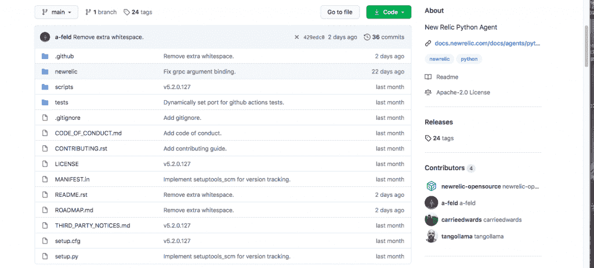

# 新遗迹改变商业模式，开源代理和工具

> 原文：<https://thenewstack.io/new-relic-changes-business-model-open-sources-agents-and-instrumentation/>

观察平台提供商 [New Relic](https://newrelic.com/) 正在改变其专有的商业模式，因为[在其产品目录中开放了一些代理。在 New Relic 高管所描述的适应开源采用的“巨变”中，该公司已经开始在 GitHub 上开源其代理和工具与公共云服务和其他项目的集成。](https://github.com/newrelic/c-sdk)

虽然该公司将继续销售其新的 Relic One 平台作为服务，但新的 Relic 将在新的 Relic One 目录中提供其代理、集成、软件开发工具包、命令行界面及其“定制可视化”。新遗迹已经提供了它的 C，Go，的代码。NET，Node，Python 和 Ruby 代理。New Relic 说，Java 代理程序计划在 9 月推出，PHP 将在 10 月推出。

“这些代理都是公开的，”首席产品官[比尔·斯台普斯](https://www.linkedin.com/in/williamstaples)——他在微软采用开源并将其用于 Azure 的过程中发挥了重要作用——告诉新的堆栈。

“我们正在从社区中收集意见，并公布我们的路线图，”Staples 说。“我们 100%致力于开源理念。”

图片:GitHub

与此同时，New Relic 将为[云原生计算基金会(CNCF)](https://www.cncf.io/) [OpenTelemetry](https://opentelemetry.io/) 标准贡献代码和财政资源，希望有助于规范仪器，这通常被视为云原生基础设施管理中的不足。New Relic 代表表示，New Relic 还积极促进和支持用于仪器和其他遥测项目的普罗米修斯标准，包括 Dropwizard、Kamon、Micrometer、StatsD 和 Telegraf，以及 Grafana 等相关工具。

新遗迹的“政治非激进主义”商业模式

今年早些时候，New Relic 因其首席执行官兼创始人卢·西恩(Lew Cirne)在一份泄露的备忘录中关于该公司在黑人的命也是命问题上的立场的评论而受到审查。虽然 New Relic 支持这一运动，但 Cirne 在备忘录中提到了一些据报道的内部分歧，即 New Relic 应如何与声称有种族主义观点的公司合作。Cirne 写道: *New Relic 是一家公共软件公司，而不是一个政治组织。他写道*虽然种族主义是邪恶的，真实的，在任何情况下都不能被容忍*，他还补充道*我们在敏感政治问题上采取的任何公开立场(可能)都会疏远主要选民*。一些人将这些评论解释为不愿意支持 BLM，尽管一位新遗迹发言人说，Cirne 的评论在很大程度上被断章取义了。该发言人指出，例如，New Relic 匹配员工的捐款以支持 BLM，捐款总额超过 70，000 美元。这位发言人说，员工的志愿者工作也是在工作时间进行的，这是 New Relic 所鼓励的。《俄勒冈人报》没有公布这封信中的一段，Cirne 写道:*我们确实有一个简短的、明确的名单，列出了我们不会服务的组织。他们是仇恨组织。这份名单不是由我或任何其他遗迹或遗迹群定义的。这份名单是由南方贫困法律中心定义的，这是一个专注于这一主题的无党派专家机构。**

通过这种方式，一个组织可以获取 New Relic 的开源代码并将其用于自己的目的，同时也为项目做出贡献。根据许可条款，他们可以将代理库用于他们的应用程序。一旦应用程序运行，发出的遥测诊断信息基本上“可以指向任何数量的开源后端或商业后端”，如 New Relic 提供的那些，Staples 说。

例如，对于云部署，New Relic 客户可能会依赖 New Relic 的商业服务进行网络存储和可视化分析，同时还会使用 New Relic 的开源代理来开发其应用程序和代码。

Clive Longbottom and Associates 的分析师 Clive Longbottom 说，New Relic 的举动可以被视为“创造客户粘性”的一种方式。“如果 New Relic 可以让其他人使用 SDK 创建模块和集成，那么他们就可以在对自己没有风险的情况下扩展他们的范围，”隆巴顿说。“如果他们能够获得良好的追随者，这意味着新软件的爆炸，例如在物联网和人工智能领域，可以通过开源社区来覆盖，而不是 New Relic 试图做一切。总的来说，这是一个足够聪明的举措——只要 New Relic 成功地将其客户群货币化。”

New Relic 在很大程度上响应了开源采用的转变，以及对标准化的需求，特别是标准化。例如，[企业管理协会(EMA)](https://www.enterprisemanagement.com/) 的分析师 [Torsten Volk](https://www.linkedin.com/in/torstenvolk) 告诉新堆栈，在云原生世界中，“可观察性的差异不再在于专有设备，而在于整体平台架构的可扩展性”。

“基于 Kubernetes 的微服务的整个原理专注于不受限制地在任何地方运行的应用程序。因此，针对专有应用堆栈的专有工具变得越来越不可行，”Volk 说。“简而言之，企业正在选择最能支持其云本机横向扩展架构的可观察性解决方案。”

代理因此成为一种商品。“开源它们并全力支持开放式遥测标准是有意义的，”Volk 说。“然后，New Relic 可以专注于通过其后端平台实现差异化，这正是人工智能驱动的魔力所在。”

Volk 说，Docker 过去的困难是一个应该避免的案例。

“正如 Docker 公司的倒闭所表明的那样，如果你坚持专有解决方案太久，市场将会惩罚你，”Volk 说。“因此，这一步骤只是反映了当今市场的现实，即任何阻止或减缓真正的横向扩展软件平台实施的解决方案都将受到惩罚。”

> “在一个横向扩展的世界中，专有仪器将被视为数字转型之锚上的海藻”——企业管理协会(EMA)的 Torsten Volk

然而，随着这些关键工具变得更加标准化，并应用于高度复杂的多云和本地传统环境(DevOps 团队通常管理这些环境),工具变得更加商品化是一个积极的变化。因此，仪器仍然“非常重要，因为 70-80%的应用程序仍然没有现代化，并且依赖于传统的监控，”Volk 说。“对于 New Relic 来说，开放他们的完整和全面的代理的大金库将诱使 DevOps 团队尝试其中的一些代理，如果他们成功，他们可能最终会选择 New Relic 作为他们新的可观测性平台供应商。至少，此举将使 New Relic 成为云原生空间的相关参与者，而不是被视为“软件对 Kubernetes 来说太贵的家伙。"

New Relic 的转变有助于证明开源是软件提供商的未来模式，OpenTelemetry 项目本身以及 New Relic 对它的支持有助于证明开源模式如何高度适用于大规模框架应用程序。

“越多的供应商关注 OpenTelemetry 的成功，而不是开发他们的专有解决方案，客户就越有可能在 OpenTelemetry 的使用上标准化他们的组织，”Volk 说。“开源的整个想法是基于这样一种信念，即多个供应商合作开发商品产品，如监控代理，客户将有更多的选择，供应商可以将他们的资源用于进一步开发他们自己的“秘方”，而不是为 MySQL 或 Red Hat Enterprise Linux 创建第 n 个监控代理。”

沃尔克说，尽管如此，New Relic 的开源项目在许多方面也代表着一场赌博，可以说是一个“激进”的举动。

“激进是为了可信度。在一个越来越多的企业更喜欢开源软件的世界里，你需要在早期阶段就表明你是全力以赴的。“全力以赴”不仅仅意味着分享你的源代码，因为只有当多个供应商全力支持一个项目时，开源软件才有机会被大规模采用，”Volk 说。“因此，对于 New Relic 来说，支持 OpenTelemetry 并在堆栈中寻找未来的差异化非常有意义。在一个横向扩展的世界中，专有仪器将被视为数字转型之锚上的海藻。”

<svg xmlns:xlink="http://www.w3.org/1999/xlink" viewBox="0 0 68 31" version="1.1"><title>Group</title> <desc>Created with Sketch.</desc></svg>