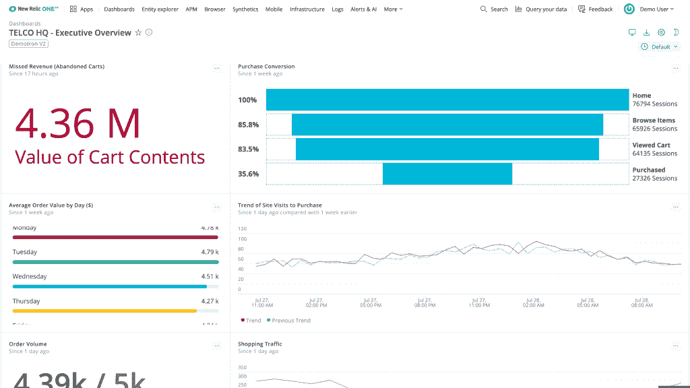

# New Relic 将可观测性工具集整合到一个平台中

> 原文：<https://thenewstack.io/new-relic-combines-observability-toolset-into-a-single-platform/>

New Relic 将其可观察性工具和产品组合整合到公司描述的单一平台中。

除了放弃将独立工具和插件商业化的常用商业模式之外， [New Relic](https://newrelic.com/) 正在将不同的产品组合在一个保护伞下，同时还简化了其定价结构。举例来说，它现在主要按座位模式向客户收费，而不是对不同的工具分别定价。

“从今天起，不再有 APM 本身作为新遗迹的产品，”新遗迹战略和全栈可观测性副总裁 Buddy Brewer 告诉新栈。

这个想法是为组织提供一个可观察性平台，这个平台不是由必须单独管理和支付的不同组件组成的。这意味着 DevOps 团队成员在理想情况下不应监控不同的面板和界面来访问新的 Relic One 平台，该平台由遥测数据平台、可观测性和应用智能组成。

Brewer 说，目标是提供一种替代方案，迫使组织购买“组成现代应用程序”的不同组件。

“人们通常从不同的地方购买遥测、VPN 服务和应用数据，因此他们都在访问不同的数据库——很难将所有这些东西联系在一起，”布鲁尔说。“我们想要做的是提供一个简单、易用的统一解决方案，让人们能够以一种易于安装、调试和操作的方式来对堆栈的每个元素进行诊断。”

在定价方面，其可观察性平台的起始价格为每个用户每月 99 美元，而遥测数据平台的价格为每 GB 摄取量 0.25 美元，其应用智能功能按交易或事件计费。

在实践层面上，运营团队成员可能通常依赖一系列不同的可观测性来源来诊断用户报告的问题。例如，组织可能依赖一系列组件来监控用户数据，并在检查不同的日志馈送和其他数据时尝试诊断 Docker 容器或 Lambda 函数中的问题。

“假设你遇到了一个 Docker 容器问题，”Brewer 说。“为了解决这一问题，您通常需要许可许多产品和解决方案才能获得这种可见性…我们提供的是您购买的单个产品，因此您可以跨整个堆栈访问它。”

New Relic 宣称的“重塑公司形象”的目标是其重新调整自身以适应组织从传统数据中心模式的转变的一部分。随着组织在云原生和多云环境中转变运营和部署应用程序，他们通常会从数百种开源工具中进行选择，以实现转变。

Brewer 说，在上周开放其产品目录中的许多代理之后，New Relic 意识到有必要重新调整其提供的工具，旨在帮助解决组织必须从单一供应商购买许多产品的问题，这造成了“极大的复杂性”。

“我们都做了同样的事情:分层的增量解决方案解决不同的问题，每个增量解决方案都有不同的定价、合同等。——所有这些东西，”布鲁尔说。“这是我们看到的趋势之一，促使我们必须这样做，以回应我们从客户那里了解到的情况:现在是 2020 年，他们发现自己处于一种已经持续了一段时间的状况，现在正是这个转折点。”

[新遗迹](https://newrelic.com/)是新栈的赞助商。

通过 Pixabay 的特征图像。

目前，新堆栈不允许直接在该网站上发表评论。我们邀请所有希望讨论一个故事的读者通过[推特](https://twitter.com/thenewstack)或[脸书](https://www.facebook.com/thenewstack/)访问我们。我们也欢迎您通过电子邮件发送新闻提示和反馈: [feedback@thenewstack.io](mailto:feedback@thenewstack.io) 。

<svg xmlns:xlink="http://www.w3.org/1999/xlink" viewBox="0 0 68 31" version="1.1"><title>Group</title> <desc>Created with Sketch.</desc></svg>