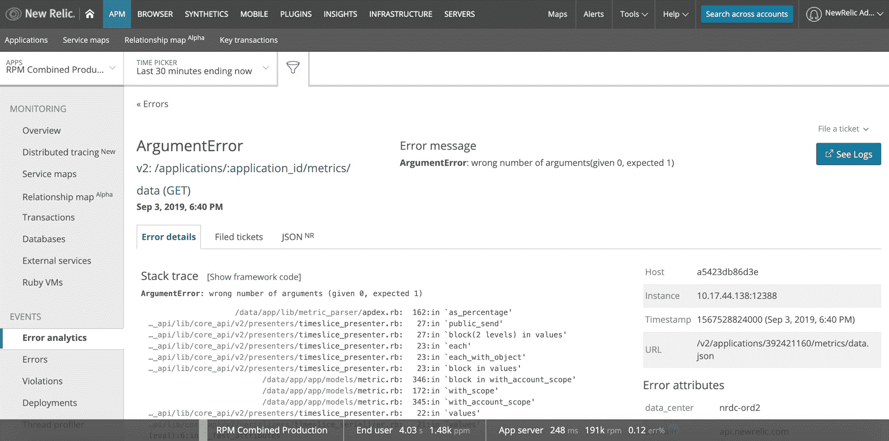

# 新遗物使日志管理变得易于观察

> 原文：<https://thenewstack.io/new-relic-eases-log-management-into-observability/>

[新遗迹](http://newrelic.com/?utm_content=inline-mention)赞助本帖。 TNS 所有者 [Insight Partners](https://www.insightpartners.com/) 是新遗迹的投资者。

New Relic 将其旗舰产品 [New Relic One](https://newrelic.com/platform) 平台扩展到[平台，还包括日志记录功能](https://blog.newrelic.com/product-news/logs-in-context-faster-simpler-access-actionable-insights/)，为跟踪跨多个服务器、数据库和其他支持软件运行的分布式应用程序的性能和挖掘潜在故障点做好准备。

上个月在纽约举行的 [FutureStack 活动上](https://thenewstack.io/new-relic-ai-an-antidote-to-alert-fatigue/)，该公司为 New Relic One 发布了一款新的日志聚合和管理工具，名为 New Relic Logs。这项服务已经正式发布，该公司已经为下一个版本开放了公开测试。

新遗迹产品总经理兼首席软件工程师 Julian Giuca 说[新遗迹日志](https://docs.newrelic.com/docs/logs)背后的想法是让新遗迹一号用户更容易将日志数据纳入整个系统的可观察性。这将允许他们识别其日志数据中有意义的趋势，将日志数据与性能数据和事件的其他来源相关联。

开发人员和 DevOps“希望更快地找到‘为什么’:为什么我的服务器会崩溃？为什么我会在凌晨 2 点被叫醒，”朱卡说。“因此，我们开发了一个工具，这个工具是我们在过去一年半的时间里与客户讨论他们的难题时获得的。”他说，客户想要快速、可扩展、互联、易于管理的东西。例如，他们不想管理索引。

几乎数据中心或云中的每一个软件都会创建其性能日志:防火墙、服务器、数据库和负载平衡器。它们都将事件写入日志文件，其中包含的信息对故障排除很有价值。当处理微服务时，日志数据聚合可能特别有用，因为应用程序可能由数百个微服务组成，并且由多种编程语言构建。每一个都可能有不同的日志框架，需要集成到一个可观察性平台中。

New Relic 日志将日志消息与来自 New Relic APM 等来源的错误报告和事件数据相关联。在本例中，用户可以将日志数据与 APM 中的堆栈跟踪相关联，而不必被迫转换上下文或在多个工具之间移动。

为什么要进入日志管理软件和服务市场，这个市场已经有 [Logstash](https://aws.amazon.com/elasticsearch-service/logstash/) 、 [Datadog](https://www.datadoghq.com) 、 [Fluentd](https://www.fluentd.org/) 、 [Fluent Bit](https://fluentbit.io/) 等技术在服务了？使用这些一流的软件包有许多缺点， [New Relic 断言](https://blog.newrelic.com/product-news/logs-in-context-faster-simpler-access-actionable-insights/)。它们可能难以学习如何使用、难以定制、性能通常滞后，并且需要时间来与其他监控工具集成。

在这种情况下，新遗迹日志提供了许多优势。第一，它很快，因为它将数据存储在该公司传说中的高速 NRDB(新遗迹数据库)上。它还可以与其他日志工具配合使用，如 [Sumo Logic](https://www.sumologic.com/) 和 [AWS CloudWatch](https://aws.amazon.com/cloudwatch/) 。例如，一个单行配置可以拆分数据，使其同时进入 Sumo 逻辑和 New Relic One。从其他日志管理软件生成的所有数据都被格式化成 JSON 有效负载，因此可以很容易地对它们进行编程。

不过最好的部分是与 New Relic One 的集成，它可以提供关于每笔交易的更多上下文。New Relic One 分配了一个唯一的标识符，该标识符与每个事务相关联，因此每个事务都可以通过执行它的各种应用程序进行跟踪。

“每一个被调用的函数，New Relic 都会注意那个 ID 的时机。每个被称为新遗迹的测井曲线都在关注那个 ID。所以你得到了这种关联。你可以看到所有被调用的功能，跨多个服务器和应用程序的整个代码堆栈，”Giuca 说。

<svg xmlns:xlink="http://www.w3.org/1999/xlink" viewBox="0 0 68 31" version="1.1"><title>Group</title> <desc>Created with Sketch.</desc></svg>