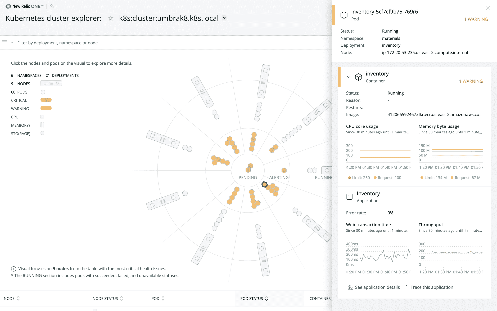
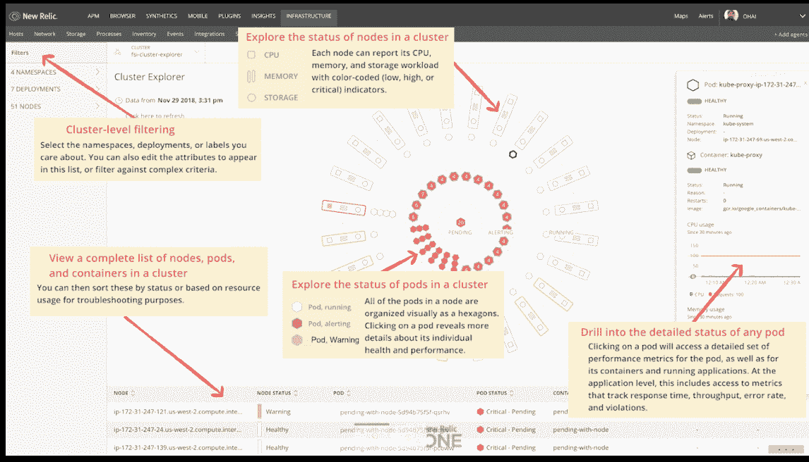

# New Relic One 提供了一个企业范围的视图

> 原文：<https://thenewstack.io/new-relic-one-offers-an-enterprise-wide-view/>

New Relic 公布了其未来平台的第一个方面，一个称为 New Relic One 的连接层，它位于现有的监控和可视性产品之上，使企业能够在一个地方看到所有东西。

“我们从客户那里了解到，他们的环境现在变得更加复杂和多样化。…现在是成百上千的微服务，许多不同类型的东西、语言和容器。他们想要一个地方，在那里他们可以一起看到所有的东西，也可以看到所有东西是如何关联的，”新遗迹产品管理副总裁 Nadya Duke Boone 说。

它称所有这些东西为“实体”实体是任何需要被检测的东西，它生成数据、指标和日志，并且不是孤立运行的。可以是微服务、手机 app、Kubernetes 集群或者 Lambda 函数。

IT 客户往往有成千上万的实体。

“现代软件有更多的实体类型，更多的服务，更多的联系，更多的团队，所有这些都被更多的工具跟踪，通常被分隔成小仓库，这使得几乎不可能共享信息，”新遗迹首席执行官 Lew Cirne 在[的博客帖子](https://blog.newrelic.com/product-news/introducing-new-relic-one/)中写道。

“为了真正理解现代软件系统，你需要一个泛企业解决方案，让你在上下文中查看每个实体。例如，如果您收到警报，您不仅仅需要知道某个东西正在尖峰。你还需要知道，‘产生这些数据的东西是什么？以及“它依赖于什么？”"

其未来的平台建立在最近收购的[significal](https://blog.newrelic.com/product-news/signifai/)和 Kubernetes specialist[CoScale](https://thenewstack.io/coscale-offers-full-stack-monitoring-containers-microservices/)的基础上。

“New Relic One 是一个新的用户界面，它使用客户今天发送给我们的数据……但也是一个新的后端，它可以自动索引实体，以便可以搜索并连接它们，实时显示这些关系。它适用于整个企业，”Boone 说。

它包括 40 多项新功能，包括 AWS Lambda 监控、新仪表板、可编程性、全局搜索和跨帐户服务地图。

Boone 说，监控数据可以按团队组织，如开发对生产，甚至服务器对软件。现在有了 New Relic One，客户可以选择是查看这些孤岛中的数据，还是一起查看。

“在我们的 beta 测试中，我们有一个客户发现他们的开发系统在和生产系统对话，这当然是一个大禁忌。因为他们有这种企业范围的观点，他们可以看到(这类)问题。这比他们只能看到开发或生产时更加透明，”她说。

视野可以是宽广的，也可以是深邃的。

“我们已经做了很多工作来增强搜索体验，找到您正在寻找的实体，或者能够使用过滤器对它们进行分组，但我们还提供真正深入到分布式跟踪的搜索。…一条穿过许多许多服务器的轨迹，其中每一部分都是如此。我们让顾客走进去，发现仅仅一个时间段内发生的事情，”她说。

今年晚些时候，该公司将为其产品增加日志管理、新的 AIOps 功能和可编程用户界面，以方便添加专门针对客户业务需求定制的新组件或页面。

New Stack 的 Alex Williams 以前写过关于重大收购和 New Relic 的[转移到 AIOps](https://thenewstack.io/new-relic-signifai-and-the-shifting-view-of-monitoring-technologies/) ，或使用机器智能更好地监控和诊断复杂的 IT 系统。

[New Relic 的产品管理高级副总裁亚伦·强森](https://www.linkedin.com/in/aaronjohnson/)和 SignifAI 的联合创始人兼前首席技术官[盖伊·菲格尔](https://www.linkedin.com/in/guyfig/)在[的一集《新堆栈制造商](https://thenewstack.io/new-relic-takes-on-aiops/)中讨论了这一点。

在之前的一集中，Johnson 讨论了 New Relic 的分布式追踪方法:

[来自《新遗迹:分布式追踪的现代可视性》的主题演讲](https://thenewstack.simplecast.com/episodes/the-keynotes-from-new-relic-modern-visibility-with-distributed-tracing)

新遗迹是新堆栈的赞助商。

通过 Pixabay 的特征图像。

<svg xmlns:xlink="http://www.w3.org/1999/xlink" viewBox="0 0 68 31" version="1.1"><title>Group</title> <desc>Created with Sketch.</desc></svg>