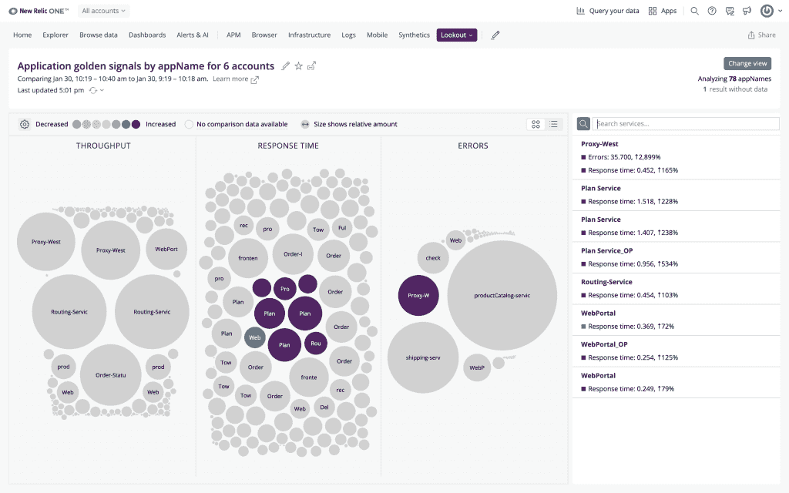
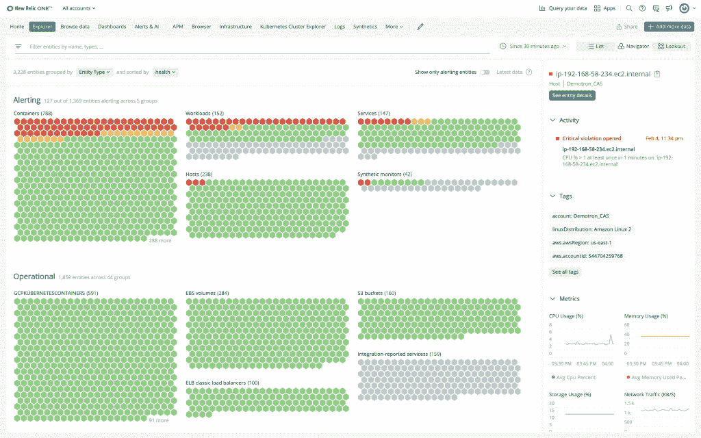

# 新遗迹一号平台“重新想象”全堆栈可观测性

> 原文：<https://thenewstack.io/new-relic-one-platform-reimagines-full-stack-observability/>

新遗迹已经“重新构想”了其[新遗迹一号应用监控平台](https://newrelic.com/platform)，增加了一个新功能，称为新遗迹浏览器，以帮助填补[在可观测性方面急需的空白](https://newrelic.com/platform/full-stack-observability)。

New Relic Explorer 向 New Stack 表示，通过提供它描述为更加[的与遥测数据交互的直观体验](https://thenewstack.io/data-visualization-and-observability-the-critical-bridge-to-taking-action/)，New Relic Explorer 旨在支持越来越难以处理大量遥测数据的 DevOps 团队。

“今天的工程团队在全面观察和理解他们的软件系统中发生的事情的能力方面受到限制。Brewer 告诉 New Stack:“对于依赖于几个分散的临时工具的工程师来说尤其如此，因为这些工具很少考虑到如何与其他解决方案协同工作。“New Relic Explorer 将工程师软件堆栈中的不同工具结合在一起，并提供易于理解的可视化功能，以打破孤岛，消除监控和故障排除中的猜测因素。”

虽然普通工程师越来越需要在更少的时间内完成更多的数据，但他们也在努力“深入细节并发现实体关系、应用程序间的变化等”。，”布鲁尔说。

“新遗迹探索者是关于可观察性的。在后微服务架构的世界里，现代应用程序抛出的遥测数据数量惊人。布鲁尔说:“开发人员无法再使用传统的工具来跟踪 it，这些工具围绕着基础设施、DEM(数字体验监控)和应用性能等架构孤岛。“因此，我们使用 New Relic Explorer 所做的是将所有这些遥测数据整合到一个汇总视图中，将所有不同的遥测数据类型整合到一个实时更新的应用健康屏幕中。”

[https://www.youtube.com/embed/5CjDwltXRGo?feature=oembed](https://www.youtube.com/embed/5CjDwltXRGo?feature=oembed)

视频

## 很远的距离

Brewer 说，New Relic Explorer 创建的主要目标是将来自应用程序和基础设施的整个组织的遥测数据结合起来，形成一个单一的实时视图，以观察整个软件系统的健康状况和变化，“不需要任何配置”。“我认为它是新的‘任务控制’或‘可观察性主页’，”他说。

新遗迹说[新遗迹探索者](https://blog.newrelic.com/product-news/new-relic-explorer-simple-intuitive-observability/)的可观测性的具体新功能和可视化包括:

**New Relic Lookout:**New Relic 称之为“行业首创”，该功能提供了遥测数据任何变化的实时视图。

**New Relic Navigator:** 一个组织可能拥有的所有 IT 实体都可以进行可视化，并且可以观察所有应用程序、服务、容器、功能、主机等。，根据“警报条件”显示为红色、黄色或绿色

Brewer 说，New Relic Explorer 的“相关实体”允许开发人员“从整体健康视图快速深入到有问题影响客户的特定容器或服务”。他说，提供的信息包括 DevOps 团队“需要确定根本原因并采取行动”的事件、日志和跟踪。

“我们的早期采用者告诉我们，New Relic Explorer 中的统一视图有助于他们更快地适应他们的可观测性数据告诉他们的事情，使他们能够将平均解决时间缩短几分钟，”布鲁尔说。

## 真实案例

布鲁尔说，布鲁尔观察到的一些新遗迹探索者早期客户的一个更明显的用例是它用于观察关键事件。布鲁尔说:“他们在屏幕上显示新的遗迹浏览器，以确保他们的软件在最重要的时刻能够承受更高的流量。”“因为它在一个屏幕上显示了如此多的整体健康信息，并且可以实时更新，所以他们能够确保提供客户期望的高质量体验。”

“我们没有预料到的”一个更令人惊讶的用例是，“整个应用程序资产”的摘要视图允许组织访问“进入问题区域细节的简单向下钻取路径”，同时“释放通常不‘在杂草中工作’的人们卷起袖子诊断问题的能力，”布鲁尔说。“在一个案例中，一位经理注意到了一个问题，找到了问题的根本原因，并将问题直接发送给负责的团队。布鲁尔说:“通常，他们会要求团队中的某个人来做这件事。"这可能为他们节省了至少一天的来回时间."

<svg xmlns:xlink="http://www.w3.org/1999/xlink" viewBox="0 0 68 31" version="1.1"><title>Group</title> <desc>Created with Sketch.</desc></svg>