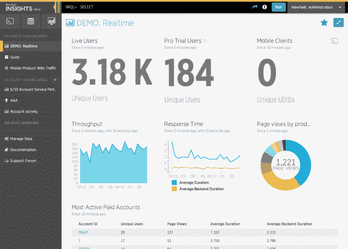
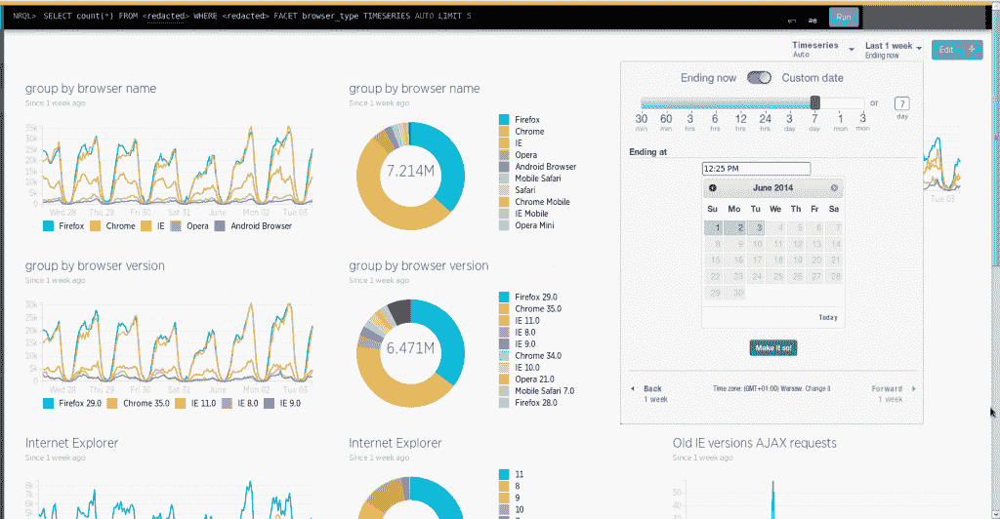
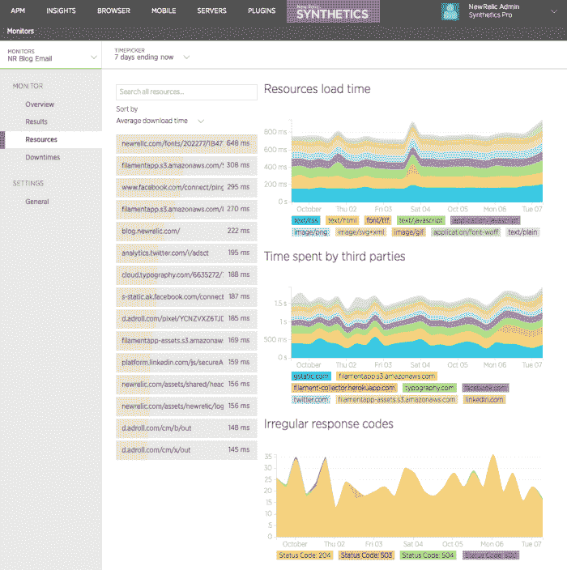
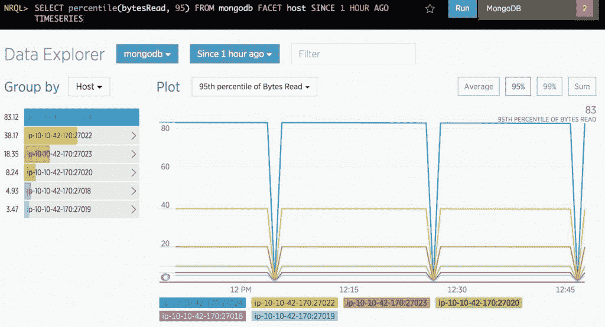
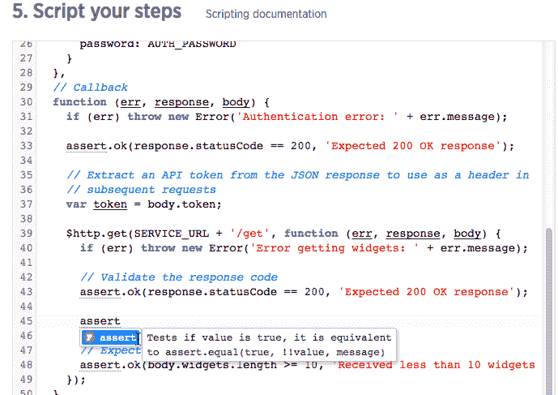

# New Relic 仪器如何处理微服务工作负载

> 原文：<https://thenewstack.io/new-relic-revolutionizing-application-monitoring/>

在过去，众所周知，应用程序监控解决方案很难部署，会使运行它们的任何基础架构的硬件陷入困境。如今，开发人员可以完全从云中监控他们的应用程序性能、诊断问题和查看他们的容器环境，如果他们愿意的话。

提供这项服务的公司之一， [New Relic](http://newrelic.com/) 是一个 100%基于 SaaS 的应用程序监控解决方案。New Relic 为其用户提供了各种工具来更好地管理其基础设施的性能。其中包括浏览器监控应用、后端服务器性能监控、用于分析的洞察监控，以及帮助开发人员识别问题经常发生的位置的合成应用。

随着应用开发流程变得越来越复杂和快节奏，New Relic 正在定制其服务以服务于这些新环境，为基于容器的微服务工作负载以及自动化管道的合成工作负载提供工具。

“客户需要衡量绩效和成功；他们的生意依赖于此。从商业角度来看，我们专注于让客户成功的东西，”首席云架构师、新遗迹的倡导者[李·艾奇森](https://www.linkedin.com/in/leeatchison)说。

新遗迹洞察小部件

## 容器

New Relic 为大规模监控容器的开发人员提供了许多可用的特性。其中包括微服务映射、跨应用跟踪、外部服务性能、部署和应用容量。

新遗迹浏览器监控

[New Relic APM](http://newrelic.com/application-monitoring) 跟踪跨服务的事务，为用户提供跨所有可用层的应用和微服务的端到端可见性。对于使用数据库的人来说，New Relic 为用户提供了根据响应时间查看整个堆栈的数据库调用、查看最慢的 SQL 报告、分析查询以及可视化整个操作表的能力。

识别数据库问题可以提高应用程序的性能。如果某项服务表现不佳，用户可以快速访问概览图，以更好地了解这如何影响他们的整体系统。New Relic APM 中的概览图不仅向用户展示了其应用环境的广泛概览，还允许深入查看在各个服务器上运行的各个应用实例。这不仅允许查看服务如何执行，还允许查看它如何与其他服务通信以及如何与其他服务进行比较。

新遗迹合成仪表板

部署分析允许开发人员在构建进入开发之前和之后查看其应用程序的快照。如果所做的更改影响了应用程序的最终用户，可以在投入生产之前回滚。Atchison 指出，New Relic 用户还可以知道容器何时被终止和替换，并能够将这些信息发送到后端进行数据关联。这不仅有助于收集当前活动的容器的信息，而且有助于收集容器的历史信息。

New Relic 并没有限制 Docker 的用户使用这个特性，它为 Amazon EC2 容器提供了同样的功能。New Relic 可以判断 EC2 实例何时启动、终止或断开，关联可用数据以提供当前正在运行的实例的视图，以及一段时间内的性能图像。

MongoDB 云和 Ops Manager 在 New Relic 中的集成

## 综合监控

由于开发人员可以在生产前自动化更多的任务，这就给了他们一个更好的机会，在用户部署到生产中之前发现影响用户的质量问题。通过利用模拟真实世界流量的合成 API，开发人员可以更准确地了解他们的应用程序在生产中如何运行，然后才真正在生产中进行故障转移。

新遗迹产品营销高级总监[巴拉思·高达](https://twitter.com/bgowda)说:“更多的测试和生产发生在性能管道之前，而监控正朝着开发方向发展。新遗迹最近更新了它的[新遗迹合成](http://newrelic.com/synthetics)服务，这样它就可以模拟来自全球的交通负荷。

随着应用程序在不断变化的基础上更新、改进和重建，开发人员比以往任何时候都更多地将新版本投入生产。当在预生产和生产之间的空间中工作时，这些变化中的许多不会一次向所有客户推出。通过实现滚动部署时间表，团队能够更好地解决推进新构建时可能出现的任何问题。

通过在前期制作中实现合成测试，而不仅仅是在后期制作中利用它，开发人员可以更好地在早期发现问题。如果危机发生，综合测试变得更有价值。

“从开发人员的角度来看，这是关于确定问题的严重性，它影响到谁，以及当应用程序不工作时会发生什么。高达说:“合成测试可以更深入地了解用户，减少错误警报。

通常，当 DevOps 团队成员调用 API 时，他们可以将合成测试脚本静音——这意味着其他团队成员不会在半夜被错误的问题提醒。用触发器解决用户问题是 New Relic 向前发展的一个关键焦点，允许根据触发行为的结果按需启动合成测试。DevOps 还可以运行和测试各种脚本，同时还具有运行 API 测试的能力。

新遗迹合成:API 测试脚本

当使用合成监控时，开发人员可以选择在内部运行产品的单独实例，以监控其随时间的性能。实施 New Relic Synthetics 等系统可确保公司每天全天运行测试，以帮助识别和解决系统问题。

New Relic 用户已经接受了合成监控，用于以高可用性运行测试套件，验证部署，并确定改善客户体验的地方。艾奇逊指出，当应用于电子商务领域时，合成监控尤其有用，它允许开发人员重复创建假订单，以验证系统是否完全正常运行，而不会影响客户。

通过 Pixabay 的特征图像。

<svg xmlns:xlink="http://www.w3.org/1999/xlink" viewBox="0 0 68 31" version="1.1"><title>Group</title> <desc>Created with Sketch.</desc></svg>