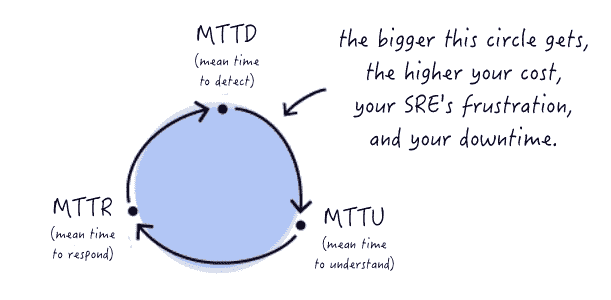
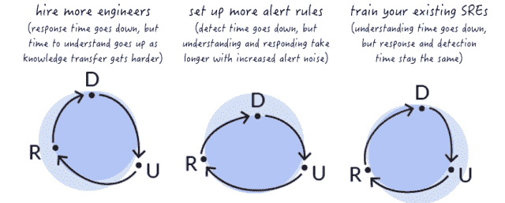

# 新遗迹、意义与监测技术的转变

> 原文：<https://thenewstack.io/new-relic-signifai-and-the-shifting-view-of-monitoring-technologies/>

[New Relic 的](https://blog.newrelic.com/product-news/signifai/)最近收购 SignifAI 显示了系统监控领域正在发生的变化。技术工具提供商正在将机器智能和其他工具结合成单一的集成服务，可以更好地向 DevOps 技术专家和现场可靠性工程师(SRE)通报其系统的状态。

[451 Research](https://451research.com/) 的分析师 [Nancy Gohring](https://www.linkedin.com/in/nancygohring/) 在一份关于此次收购的报告中写道:“随着监控提供商水平扩张，在单一工具中收集越来越多的运营数据，我们预计对独立事件分析和事件管理工具的需求将会下降。”。借助这些数据，监控专家可以运行分析，提供根本原因分析和独立事件分析工具提供的其他优势

这一重大收购也表明了“AIOps”的出现，即使用机器智能来更好地监控和排除复杂 IT 系统的故障。ML 可以检测分布式系统之间的相关性，引入可观察性，很快引入机器智能和更大的自学系统领域。

SignifAI 是一个技术超集——它运行在 Prometheus、OpenShift 和大约 60 种监控工具上。它提供:

*   Chewie，一个管理监控平台的 API，其目的是降低团队事件管理报告中的噪音。
*   与 Prometheus 和 OpenShift 集成，用于监控警报和指标与相关日志和事件的可见性和相关性。
*   重大决策——SRE 和 DevOps 团队的关联引擎，使用关联来提供对生产系统的洞察。

SignifAI 分析事件信息和指标。随着时间的推移，通过使用重要技术不断向系统提供更多反馈，相关性可以变得高度可调。建立在数据基础上的公司有能力减少花费在耗时任务上的时间，例如梳理他们收集的事件信息并采取行动以发现根本问题。

来自企业多个部门的团队可能需要一整天的时间来确定错误率激增的根本原因。最终，在梳理所有数据后，可能只是单个问题，而不是影响客户的更广泛的问题。一次又一次地进行这种锻炼，当机会被推迟或根本不被追求时，警觉疲劳就成了一个真正的问题。

New Relic 的产品管理高级副总裁亚伦·强森说，New Relic 的所有产品现在每分钟吸收 21 亿个数据点。像 New Relic APM 这样的工具使用分布式跟踪来发现分布式架构中的问题。SignifAI 帮助客户筛选 New Relic 等监控工具创建的数据。

## 分布式跟踪

在一次采访中，Johnson 指出分布式跟踪是一个前沿和核心问题，以及为什么它与发展趋势相关。

约翰逊说，可观测性是新遗迹的一个巨大趋势。分布式跟踪、指标和/或日志或事件正在改变人们对监控的看法。现在，当工程师构建他们的应用程序时，可观察性是最重要的。当对问题的根源没有清晰的看法时，这有助于在趋势之间相互指责。

在去年 7 月的一篇帖子中，SignifAI 产品经理[安妮卡·加伯斯](https://www.linkedin.com/in/annika-garbers/)解释了为什么自动关联有助于优化 SRE 的运营效率。相关性来自于使用其集成来优化检测、理解和响应问题所需的平均时间的能力。每个都有单独的关键绩效指标(KPI)。雇佣更多的工程师，增加额外的配置或进一步培训团队可能只能解决部分问题，在某些情况下会使问题变得更糟。

由于缺乏查看数据中关系的自动化功能，解析 KPI 可能会变得复杂。

这是 New Relic 在过去四个月里的第二次购买。公司[于 2018 年 10 月从 CoScale](https://blog.newrelic.com/product-news/coscale/) 收购资产。根据 Gohring 的说法，收购比利时公司有助于完善 New Relic 对集装箱和 Kubernetes 的监控能力。

新遗迹是新堆栈的赞助商。

作者亚历克斯·威廉姆斯是新书库的出版商。

<svg xmlns:xlink="http://www.w3.org/1999/xlink" viewBox="0 0 68 31" version="1.1"><title>Group</title> <desc>Created with Sketch.</desc></svg>