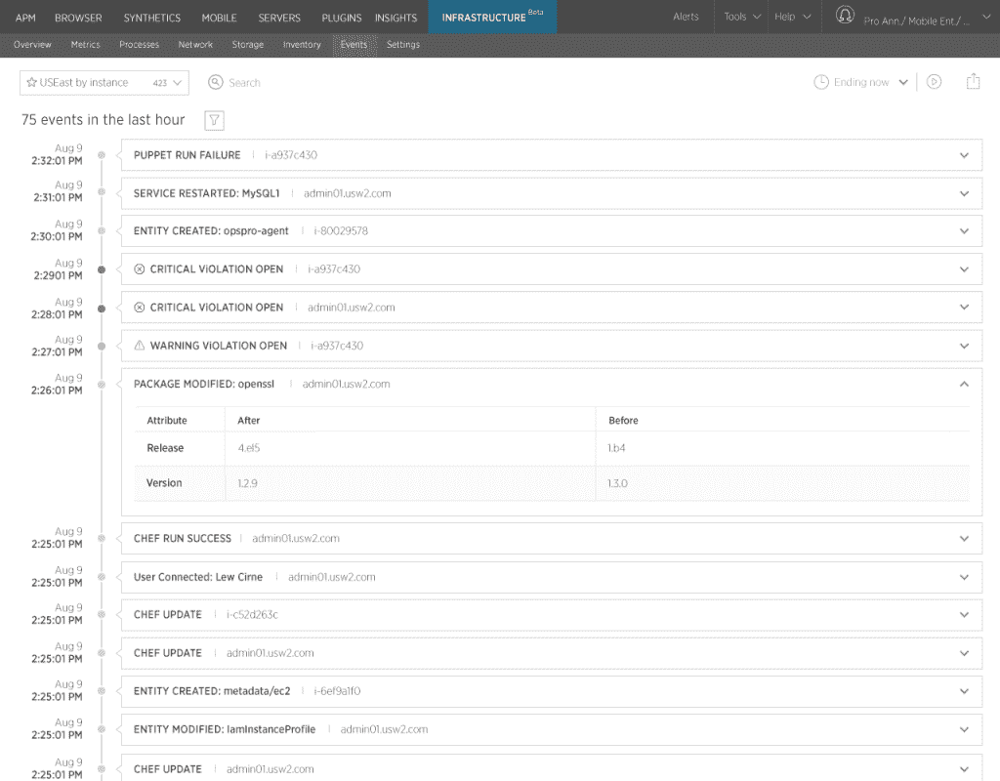

# New Relic 通过基础架构监控处理配置错误

> 原文：<https://thenewstack.io/new-relic-takes-configuration-errors-infrastructure-monitoring/>

根据 [Jim Stoneham](https://twitter.com/jimstoneham?ref_src=twsrc%5Egoogle%7Ctwcamp%5Eserp%7Ctwgr%5Eauthor) 、 [New Relic](https://newrelic.com/) 产品副总裁的说法，去年 7 月纽约证券交易所的[四小时宕机被归咎于一个错误配置的软件版本，这只是与配置相关的事件中令人不安的上升之一。](http://searchitoperations.techtarget.com/news/4500249707/NYSE-outage-highlights-need-for-IT-automation)

该公司刚刚推出了[新的遗留基础设施](https://newrelic.com/infrastructure)，以提供对 IT 堆栈及其运营的实时可见性。这是该公司去年 11 月收购旧金山初创公司 Opsmatic 的产品，该公司专注于监控关键的配置变化。

“如果你看一下传统的服务器监控工具，它们正在捕获指标、CPU、磁盘、网络，你可以看到正在发生的事情的健康状况，但你并没有真正看到表面之下。你看不到正在发生的变化，这是一颗等待爆炸的定时炸弹。

他说，客户试图使用配置管理工具来实现这一点，但这需要描述主机上的一切，以确保你覆盖了整个表面区域，而且人们经常忽略包括操作系统版本、内核设置和其他细节。

“人们也尝试过日志分析工具，但在那里，你必须告诉正确的日志，当你进行查询时，可能需要几分钟才能得到结果。因此，当您构建正在发生的事情的画面时，通常比您遭受停机时花费的时间要多。在纽约证券交易所，你要处理数亿美元的交易，”他说。

New Relic Infrastructure 在每台主机中放置一个轻量级软件代理，并立即开始收集数据，包括每个软件包、用户会话、进程、内核设置，这些都可能影响云或数据中心中的实例。它在检测变化的同时，还会监控 CPU、磁盘和网络等指标，以观察该主机的性能和变化情况。它适合一套端到端的服务，包括应用性能监控和服务器监控。所有的数据都进入 [New Relic Insights](https://thenewstack.io/new-relic-addresses-a-new-kind-of-developer/) ，它是一个基于云的数据平台和分析引擎。

## 基础设施洞察

SignalFX 软件工程师 Rajesh Raman 最近与新堆栈的 Alex Williams 谈论了分析在监控中的重要性。“监控和运行基础设施的人需要深入了解该基础设施，以及他们的应用程序是如何运行的，”Raman 说。

监控供应商 SevOne 最近进行的一项调查发现，传统的监控工具并不能满足大多数 it 组织的需求，在接受调查的 322 名 IT 高管中，只有 11%的人对他们现有的工具感到满意。他们表示，他们不完全信任数据(84%)，对可扩展性不满意(86%)，并认为他们的工具不支持他们的战略计划，如混合云、物联网和软件定义的网络。

他们最大的抱怨？他们解决问题的速度不够快。这种不满催生了像 [Splunk](http://www.splunk.com/) 、 [Datadog](https://www.datadoghq.com/) 等。

新遗迹基础设施的使用案例包括:

*   **对云、容器或传统服务器的任意组合进行分类**。
*   **避免停机和事故**，通过由来自云、自动化工具或自定义属性的标签和元数据驱动的控制面板和警报，提供更快的平均检测时间(MTTD)和解决时间(MTTR)。它为 AWS EC2 和 Docker 标签提供本地监控。
*   **零时差:**它的搜索工具有助于快速找到 bug，而不是几个小时或几天。用户可以在整个基础架构中按位置或类型搜索事件。
*   **资源优化:**它提供了关于是否应该在集群中添加或删除节点以节省资金的见解。
*   **团队行动的可见性:**通过识别一个系统的每一个变化和谁做出了它，这个系统在那个环境中采取的每一个行动上都“闪耀着一束非常明亮的光”。

“我们为每个群集或主机都提供了控制面板，但您也可以快速浏览每个群集。因此，如果你有数以万计的主机分布在数百个集群中，你可以看到哪些在工作，哪些没有工作，”他说。

“我认为让人们看到他们的基础设施在数据中心的实际布局是很重要的，”Stoneham 说。“我有一个 web 层，我有一个东海岸和西海岸的数据中心，我有一个在三个集群中运行的数据库，该产品旨在使用标记快速定义这些集群。我们从 AWS 等系统或 Puppet 和 Chef 等自动化系统中获取标签，并允许他们非常快速地构建自己世界的视图。这通常可以在运营牛棚的大屏幕上看到，因为它提供了系统运行状况的一目了然的视图。”

客户表示，在过去，当他们遇到零日漏洞时，他们不得不停下手头的工作，花费数天时间检查在混合基础架构中所有主机上运行的版本。

“应该像快速搜索一样简单。当你有了所有主机上运行的实时视图，就很容易查看数据并回答这样的问题，”他说。

如果有零日漏洞，例如 open SSL 问题，它可能会显示 12 台主机运行一个版本的 OpenSSL，8 台运行另一个版本。

“从这里，你可以抓取主机列表，并去修补新版本，”他说。

这种搜索功能还可以用来查找您担心的错误服务或已部署的东西。它非常像是基础设施的搜索引擎。

随着团队变得越来越协作，对团队行动的洞察可能是有价值的。如果有问题，而且有人最近做了各种改变，你知道该找谁谈。

“这并不意味着惩罚，只是为了确保每个人都明白这是可见的，并让每个人都知道最近发生了什么，”他说。“我发现这在某种程度上改善了文化和行为，”斯顿汉姆说。

[新遗迹](https://newrelic.com/)是新栈的赞助商。

专题图片:[没时间拍照(35/365)](https://www.flickr.com/photos/lars_p/4365641577/in/photolist-7DM49n-8VsU1D-6k1Dzz-75BmVZ-2SXh7K-2T2EUE-2zjpH-7wgQti-2SXieP-4EciDR-jzRHfS-7X6s7n-ad15Jw-5uRbD-3K8bX2-66VsMM-ad15D3-7RQVmW-7nf7Tv-4Q5Cby-pHoDRA-2SXfzP-dJXSNf-2rk6Y-6v2KxA-2SXp9P-38bxBE-2SXfXp-oi64Rk-9oqAt-aViUb2-eN71bh-5wSqxC-2yRLC-eC38e-andv8L-dDUQKh-5wSmVb-5wSnQC-5wSDR9-5wN4Re-7DgDka-5wSsvm-2T2Fkh-6EbYaE-5wNeMe-5wStjm-pk6k9j-7TqgoC-5wSAoG) 作者 [Lars P.](https://www.flickr.com/photos/lars_p/) ，授权于 **[CC BY-SA 2.0](https://creativecommons.org/licenses/by/2.0/)** 。

<svg xmlns:xlink="http://www.w3.org/1999/xlink" viewBox="0 0 68 31" version="1.1"><title>Group</title> <desc>Created with Sketch.</desc></svg>