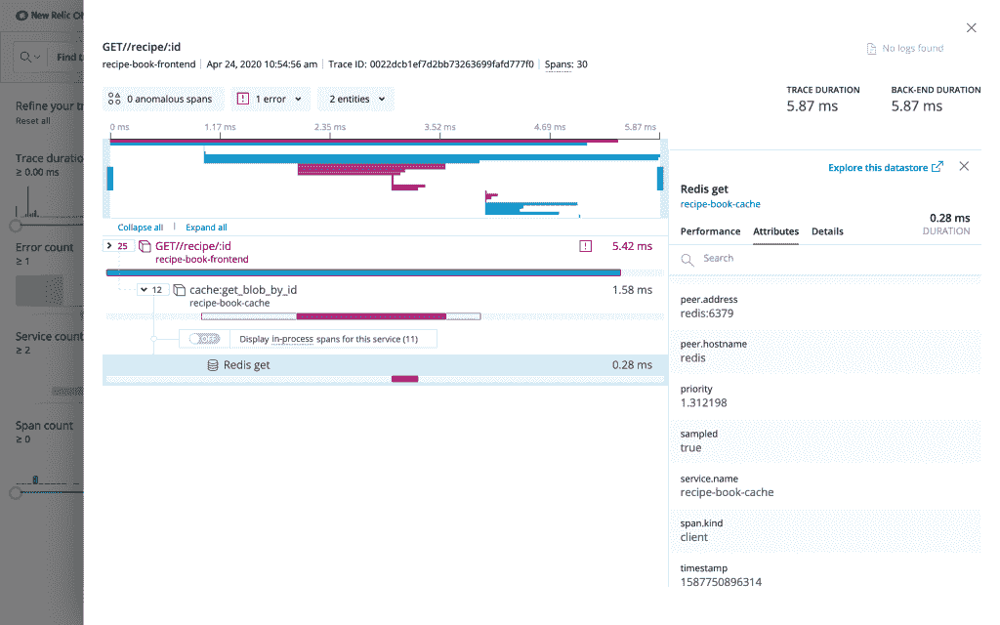
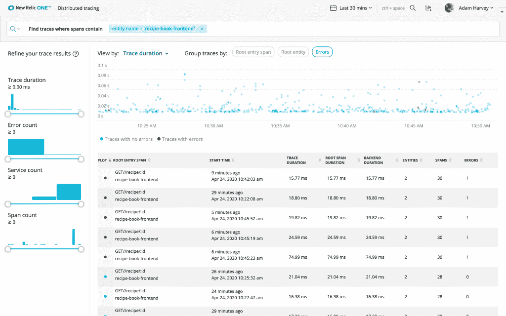

# 新文物担当分布式追踪的重任

> 原文：<https://thenewstack.io/new-relic-takes-on-distributed-tracings-heavy-lifting/>

可观测性平台提供商 New Relic 已经在其分布式跟踪包中添加了它所谓的“无限跟踪”。该公司声称，通过增加这一功能，New Relic 消除了组织创建和投资监控和调试高度分布式环境所需的底层基础设施的需求，例如跨多云环境部署的基础设施。通过这种方式，无限跟踪承担了从应用管理提供商(APM)可能跟踪的众多环境中收集的数据的存储、部署和管理等任务。

虽然 New Relic 和其他分布式跟踪系统之前已经存在，但之前没有一个能够处理“大规模的客户消防水龙带数据的多租户池”， [New Relic](https://newrelic.com/) 产品管理高级总监 [Andrew Tunall](https://www.linkedin.com/in/andrewtunall) 告诉 New Stack“你的 DevOps 可以开始向我们发送你的数据进行分布式跟踪，并能够看到它，”图纳尔说 New Relic 以前没有这种完全托管的产品，其他人也没有。"

主要概念是无限跟踪如何自动化许多与基于尾部的错误采样相关的任务。使用传统的基于尾部的采样系统，组织必须安装和管理误差检测的跨度观察。组织还需要以日志、指标和事件跟踪的形式管理这些观测数据的安装和存储。

例如，一个组织可能面临将大量出口和存储数据的管理委托给操作或站点可靠性工程(SRE)团队，对于许多组织来说，这可能导致数百万个跟踪生成的数据点。New Relic 表示，通过无限追踪，它可以自动完成这一过程。

对于一个“已经决定不走纯开源路线”的组织来说， [451 Research](https://451research.com/) 的分析师 [Nancy Gohring](https://www.linkedin.com/in/nancygohring/) 说，选择分布式跟踪工具时要考虑的关键因素包括:

*   系统是否允许访问故障排除所需的痕迹，“无需倾家荡产”
*   系统是否以对工具用户有帮助的方式智能地分析痕迹。
*   系统是否能够与收集其他类型数据(如度量和日志)的相邻监控工具很好地集成。

虽然注意到市场上有几家供应商在这三个领域具有竞争力，Gohring 说:“像大多数商业分布式跟踪产品一样，与运行纯开源分布式跟踪软件相比，New Relic 的服务消除了许多负担，”例如 Dapper T1 和 T2 Zipkin T3 提供的服务。

New Relic 提供了一个组织的示例，该组织的平均跨度负载可能为每分钟 300 万跨度，例如当发布新应用程序时，该负载可能会跃升至每分钟 3 亿跨度。

图纳尔说，对于要管理的如此大量的微服务数据，跟踪包括“你试图理解的那些关键信号之一”，以便对数百或数千个运行分布式系统的微服务进行故障排除或优化系统。“因此，结果是指标告诉我们有什么地方出错了，可能不太频繁，可能在一个非常奇怪的百分位数，但我们很少真正捕捉到数据，告诉我们具体发生了什么，这才是跟踪信号的真正目的，”图纳尔说。

有了无限跟踪，分布式跟踪“完全为我们的客户管理”，图纳尔说。例如，根据 Tunall 的说法，无限跟踪允许执行的 [GraphQL 查询](https://graphql.org/learn/)提供跟踪观察器，它是工作负载的公共可访问端点，只需几秒钟即可创建和提供。

“因此，如果你考虑一个新的 DevOps 团队，他们开发了一个新的应用程序，他们已经有了持续部署和快速迭代工具，”图纳尔说。“他们现在最不想做的事情就是增加管理系统的工作，以收集和转发他们的数据给遥测提供商。”

通过 Pixabay 的特征图像。

<svg xmlns:xlink="http://www.w3.org/1999/xlink" viewBox="0 0 68 31" version="1.1"><title>Group</title> <desc>Created with Sketch.</desc></svg>