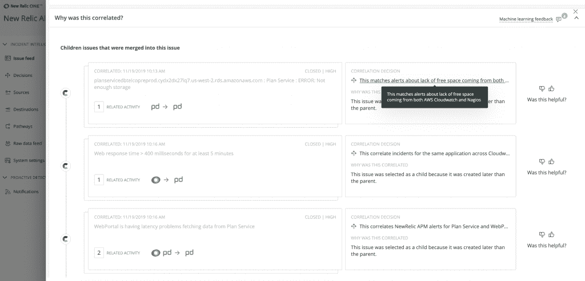

# 新遗迹将人工智能和人工智能应用于事件响应的宏伟计划

> 原文：<https://thenewstack.io/new-relics-ambitious-plan-to-apply-ai-and-ml-to-incident-responses/>

应用性能管理公司 [New Relic](https://newrelic.com/) 已经开始应用机器学习(ML)和人工智能(AI)来自动化事件响应、管理和补救。如果成功，这些新功能将有助于减轻组织 IT 工作效率损失的主要原因，这些组织通常需要管理不同的运营，包括多云和内部基础架构。

New Relic AI 提供了广泛的 AIOps 功能，有助于减少管理工作流程时的“噪音”和其他干扰。这一想法是为了解决一个常见的痛点，即必须投入 IT 资源来响应数量庞大的遥测警报。这种“嘈杂”的警报通常由误报组成。因此，这种自动化系统有可能通过代替 IT 工作人员来解决这些问题，否则他们将不得不提供手动修复。

New Relic 的产品营销总监 [Michael Olson](https://www.linkedin.com/in/michaelolson1/) 表示，来自 DevOps 和站点可靠性工程(SRE)团队的反馈表明，New Relic 希望更有效地监控和解释可以在各种多云和本地网络上传播的大量运营数据。

*“能够快速检测、诊断并最终解决生产事故非常困难。随叫随到的团队告诉我们，他们很难从收到的大量警报中发现制造噪音的信号，并对事件进行优先级排序和确定如何采取行动。这样，他们可以在问题影响客户体验或业务服务水平目标之前解决问题。因此，我们认为，随着软件系统复杂性的增加，开发人员和 SRE 团队确实需要更快、更简单的方法来解决事故。”*

奥尔森表示，New Relic AI 的 AIOps 能力包括:

*   主动异常检测。
*   事件智能通过关联相关事件并为其提供上下文和指导来降低警报噪音，从而帮助随叫随到团队更快地进行诊断和响应。
*   集成到客户现有的事件管理工作流中。

图:新遗迹。

同时，最终的结果才是最重要的。[企业管理协会(EMA)](https://www.enterprisemanagement.com/) 的分析师 [Torsten Volk](https://www.linkedin.com/in/torstenvolk) 说:“这里的关键是深入研究实际的人工智能改进，他们使用什么指标来衡量他们的效果，以及有多少客户已经从这种新的人工智能/人工智能中受益。”。“在这方面，差异化是一个巨大的挑战，因为没有人真正量化他们的人工智能魔法的价值。”

New Relic 平台的 ML 和 AI 方面也是一个组件，可以帮助组织的开发人员释放更多资源，以帮助他们跟上以越来越快的速度发布代码更新和应用程序的残酷节奏。

“随着企业被迫在不牺牲质量或增加开发人员和运营商成本的情况下更频繁地发布软件，他们需要放弃传统的孤岛式监控方法，其中基础设施、应用程序、用户体验和业务服务通常通过单独的平台进行监控和管理，”Volk 说。“因此，工程和 DevOps 高管需要关注 New Relic One、Dynatrace、DataDog 和 Splunk/SignalFX 等平台，以确定他们如何在整个企业中创建强化学习循环，从而能够利用高级分析、机器学习和深度学习来发出更早、更准确的警报，自动进行根本原因分析，并最终以自主方式采取行动。”

图:新遗迹。

New Relic 当然专注于“所有正确的发布主题，如集成、警报噪音和主动性，但现在该公司需要证明自己的 AIOps 解决方案的价值，”Volk 说。

集团副总裁兼产品总经理 [Guy Fighel](https://www.linkedin.com/in/guyfig/) 表示，最终结果是 New Relic AI 补充了 New Relic 的 APM 基础设施和跟踪能力。“一个真正的可观察性平台的好处是，客户可以立即使用该平台进行事件响应检测和补救，这是 New Relic 已经提供了相当长一段时间的东西，”Fighel 说。这包括收集事件数据，并使用从我们的平台或其他系统触发的其他类型的事件和警报来清除这些数据

新遗迹是新堆栈的赞助商。

通过 Pixabay 的特征图像。

<svg xmlns:xlink="http://www.w3.org/1999/xlink" viewBox="0 0 68 31" version="1.1"><title>Group</title> <desc>Created with Sketch.</desc></svg>