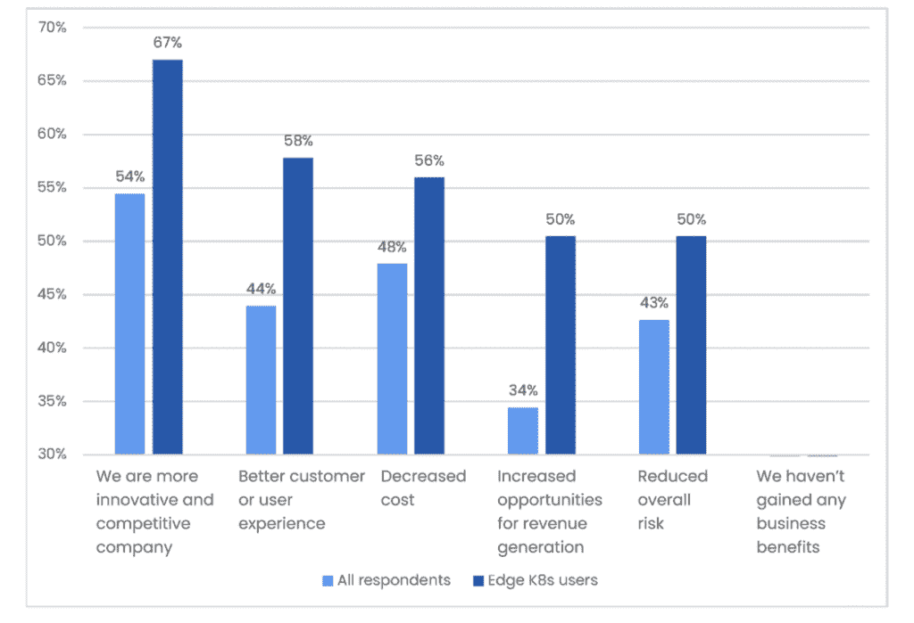

# 新的研究表明，边缘 Kubernetes 的未来是光明的

> 原文：<https://thenewstack.io/new-research-shows-the-future-is-bright-for-edge-kubernetes/>

在 Spectro Cloud，我们一直认为是时候让 Kubernetes 站在边缘了。我们相信，凭借[右边缘架构](https://thenewstack.io/a-new-kubernetes-edge-architecture/)，Kubernetes 可以为每个行业的企业带来改变世界的新用例。

 [杰里米·奥克伊

Jeremy 是 Spectro Cloud 的现场工程副总裁。Jeremy 曾是思科的高管，负责一系列产品的云产品管理和技术营销。他通过收购 CliQr 来到思科，在那里他担任战略联盟副总裁。Jeremy 在数据中心、云、网络、存储、安全、基础设施协调和自动化的工程和设计方面拥有超过 25 年的经验，曾是一家大型上市房地产公司的 CISO。](https://www.linkedin.com/in/jeremy-oakey-1635679/) 

但今天这一愿景有多真实？

为了找到答案，我们赞助了独立研究机构[维度研究](https://dimensionalresearch.com/)，为像你一样的 Kubernetes 用户把脉。结果:我们即将发布的 2022 年“[库伯内特斯](https://info.spectrocloud.com/report-kubernetes-2022)生产状况”报告。

去年,[我们的研究](https://info.spectrocloud.com/kubernetes-2021-operationalizing-for-scale)主要集中在获得使用中的集群的大小和形状的清晰图片，以及组织如何开始他们的 Kubernetes 之旅，今年，我们将深入不同的主题，包括 edge。

我们调查了 308 名受访者的健康样本，他们代表了从从业者到高级管理人员的运营、开发和开发人员角色，从 250 名员工的企业到大型企业。一个关键标准是:他们必须在生产中使用 Kubernetes*。换句话说，他们必须根据经验说话。*

我们将要与你分享的数据是最新鲜的。这项调查是在这个月进行的(从某种程度上来说，是 Kubernetes 的生日月！)，TNS 的读者甚至在我们发布报告之前就已经先听到了这个消息。

那么，我们开始吧。

## Edge 作为战略性业务竞争优势的势头越来越大

标题数字:35%的 K8s 生产用户说他们今天在边缘使用 Kubernetes。

如果这对你来说听起来很高，那就值得对照类似于[这个](https://www.cncf.io/wp-content/uploads/2021/05/KubernetesEdge_Survey_Report_2021_v2.pdf)或者[这个](https://www.section.io/blog/edge-developers-lead-kubernetes-adoption/)的切线调查进行检查。我们认为它正在步入正轨，这无疑标志着比公共云中的 Kubernetes 更早的成熟阶段，89%的受访者表示他们在生产中使用 Kubernetes。

我们的调查表明，edge 不仅仅是出于技术和运营原因而选择的另一个位置。正如我们将看到的，这是一个可以创造真正竞争优势的业务促成因素。

在我们的所有受访者中，81%的人表示他们的行业中存在“令人信服的”edge 使用案例，那些已经在 edge 上使用 Kubernetes 的人更有可能报告看到 Kubernetes 带来的战略业务优势，而不仅仅是 IT 运营优势。

67%的 edge 用户表示，Kubernetes 使他们成为一家更具创新性和竞争力的公司**、**，相比之下，接受调查的用户中有 54%表示，这为创收创造了机会，相比之下，接受调查的用户中有 34%表示。由于这些更显著的好处，25%的 edge Kubernetes 用户更有可能表示他们对 Kubernetes 的整体体验“非常满意”，而所有受访者中只有 18%的人表示满意。

“贵公司通过使用 Kubernetes 获得了哪些商业利益？选择所有适用的选项。”

当然，当你考虑创新和创收时，每个企业和每个行业都有不同的使用案例。一个与我们密切相关的例子是 GE Healthcare 通过其 Edison 平台所做的事情([在 KubeCon EU here](https://www.youtube.com/watch?v=WBZVmurXFbQ) 上展示)，将 Kubernetes 放在临床站点，以支持计算密集型和利润丰厚的医疗成像工作负载。但是如果你需要一些灵感，为什么不看看 Linux 基金会发布的更广泛的边缘计算“[边缘状态”报告](https://stateoftheedge.com/reports/)？

## Edge 的未来就是增长

那就是今天。明天怎么样？

正如我们所看到的，edge Kubernetes 现在是少数人的追求，35%的人以某种形式这样做。55%的受访者表示，他们预计未来 12 个月将在 edge Kubernetes 发展，这自然意味着许多人预计将首次开始他们的旅程。

只看今天已经在做 edge 的，信心更大了。66%的人表示，他们预计未来 12 个月 Kubernetes 使用的优势将会增长，只有 3%的人预计会下降。换句话说，一旦开始，你很可能就不会停下来。

“在未来 12 个月内，您预计贵组织在边缘环境中使用 Kubernetes 的情况会有什么变化？”

但是，尽管有这种势头和好处，通往边缘的道路并不平坦。

## 从经验中学习:优势是艰难的

总的来说，Kubernetes 社区被 edge 吓倒了。72%的受访者表示，在边缘设备上部署和管理 Kubernetes 太具挑战性。

至于那些使用 edge 的人，他们更有可能“强烈同意”edge 具有挑战性:23%的 edge 用户对 15%的所有受访者。

“在边缘设备上部署和管理 Kubernetes 太具挑战性了。”

很自然，下一个问题是，“你觉得它有什么挑战性？”这是数据变得非常有趣的地方。我们询问了受访者希望看到的一系列特定于边缘的挑战。

从整体来看，51%的受访者认为最大的挑战是安全性和合规性。在当今的 IT 世界中，安全性几乎总是最受关注的问题，但当考虑边缘计算时，很容易理解为什么安全性和合规性是关注的问题。易受物理篡改的无人值守设备；难以监控和修补的远程设备；在分散的位置捕获大量潜在的敏感、受监管数据:这是 CISO 的噩梦。

但是，当我们看看那些使用过 edge K8s 的人，那些在实践中遇到这些挑战的人的反应时，情况却惊人地不同。看看下面的图表。对我们来说，有几件事很明显。

首先，edge 用户更有可能说他们经历了几乎所有的挑战。性能有限？41%的边缘用户选择，而所有受访者中只有 21%选择。昂贵的现场工程访问？37%的边缘用户选择，而所有受访者中只有 18%选择。换句话说:每个人都认为 edge Kubernetes 具有挑战性，但一旦你尝试了，它在很多方面甚至比你想象的更难。

“就您所知，在边缘设备上部署和管理 Kubernetes 的挑战是什么？”

第二，也许是最惊人的，使用 edge K8s 的人提到的最大挑战是“当扩展到许多边缘设备时，太多的集群需要管理。”这使安全性和合规性跃居首位。大规模的可管理性很难，在分布式环境中更是如此。

很明显，对于边缘计算的所有引人注目的用例，特别是边缘 Kubernetes，早期采用者面临着一条崎岖的道路。作为部署和管理技术的环境，Edge 极具挑战性，它放大了与规模相关的任何挑战。

您如何在低接触环境中进行资源调配？如何在单设备集群上执行无中断升级？如何在低连接性环境中大规模实施策略？当设备暴露在现场时，您如何确保安全性？对于从事边缘部署的架构师来说，这些都是真实而棘手的挑战，如果不能有效解决，它们可能会影响这些“引人注目”的边缘用例的投资回报。

## 集中控制是管理边缘位置的关键

用户如何管理 Kubernetes 提供了一些更有趣的见解。在所有受访者中，34%的人表示他们目前使用商业管理平台(其他选项包括 DIY 定制脚本、开源工具或云仪表盘)。但是对于 edge 用户，这个数字上升到 46%。是什么让他们采取了这一举措？

我们询问受访者希望从管理平台中获得什么好处。那些投资 edge 的人表示，他们重视一系列功能(见下表)，但管理平台最有吸引力的好处(56%的人提到)是拥有一个单一工具来部署和管理跨多个环境的所有 Kubernetes 集群，这直接触及了我们上面讨论的痛点。

“Kubernetes 管理平台的以下哪些功能会让您的组织受益？选择所有适用的选项。”

似乎那些使用商业 K8s 管理平台的人对他们的 edge 未来更有信心。他们表示预计 edge Kubernetes 在未来 12 个月内将出现强劲增长的可能性是预期的两倍，表示对 Kubernetes 整体体验非常满意的可能性是预期的三倍。

## 深入了解整个调查

在我们 2022 年的“Kubernetes 生产状态”调查中有很多丰富的数据——关于 edge 和更多。如果您想深入研究所有发现，完整的报告将在几周内发布，我们计划在 9 月的 Spectro Cloud 网络研讨会上讨论这些发现。[在此注册，将报告收进您的收件箱](https://info.spectrocloud.com/report-kubernetes-2022)。

<svg xmlns:xlink="http://www.w3.org/1999/xlink" viewBox="0 0 68 31" version="1.1"><title>Group</title> <desc>Created with Sketch.</desc></svg>