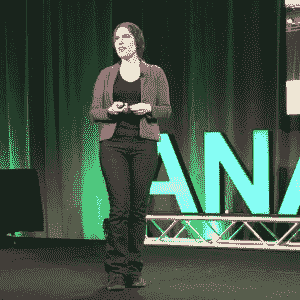

# 构建成功的数据驱动应用的新科学

> 原文：<https://thenewstack.io/new-science-building-useful-data-apps/>

几年前，当 [Bit.ly](https://bitly.com/) 需要在其新的 Hadoop 集群中燃烧时，该公司当时的首席科学家[希拉里·梅森](https://hilarymason.com/about/)和她的团队决定使用周期来分析三年的 Bit.ly 流量，以确定猫或狗是否更受欢迎。

事实证明，狗赢了。梅森坦率地承认这个项目是“巨大的能源浪费”但它也给我们上了宝贵的一课，告诉我们什么是可能的。

她在今年早些时候于德克萨斯州奥斯汀举行的 Anacondacon 大会上对观众说:“我们的计算能力如此廉价，可以应用于如此微不足道的事情，这种想法真的让我大吃一惊。”。几年前甚至不可行的东西现在变得如此容易实现，甚至可以应用于最琐碎的用途。

这就是我们今天的数据应用，梅森解释说。

多亏了抽象和框架，过去由一个团队在几周内完成的开发现在可以由一个程序员在一天内完成。在自然语言设计、非结构化数据解析和其他数据分析技术方面有很多好的工作。到目前为止，大多数企业都有大量的数据，这仅仅是做生意的副作用。为什么不把这些元素都放在一起呢？

今年的会议由 [Continuum IO](https://www.continuum.io/) 举办，讨论了该公司的 Python 和 R 统计语言发行版如何越来越多地用于这类数据科学工作。梅森是应对这个新兴市场的最佳人选。离开 Bit.ly 后，梅森创立了 [Fast Forward Labs](http://www.fastforwardlabs.com/) ，这是一家位于布鲁克林的咨询公司，专注于帮助组织设计数据驱动的应用。

梅森将数据产品定义为任何依靠数据为用户产生某种价值的应用或服务。也许成功数据产品的最佳例子是谷歌地图，它依赖于实时位置数据和一套预测算法。梅森指出，谷歌地图之所以成功，主要是因为它“无聊”，她说。“西方社会的任何人都可以看到这个，他们知道如何阅读它。”

> 你试图解决的问题的一般公式比你想解决的具体问题要复杂 10 倍。

“这里有大量的计算，但你不需要了解它来使用这个产品，”她说。"然而，没有这种计算，它就不可能存在."

一般来说，一个成功的数据应用程序解决了大众的一些高价值需求:执行我们要花很多钱才能完成的任务，和/或它执行一个重要的任务。谷歌地图在这两方面都超过了。

## 潜在的陷阱

然而，在你开始构建自己的谷歌地图之前，梅森建议你要记住一些需要解决的问题(“不幸的是，有很多这样的问题，”她指出)。

对于那些考虑公开发布内部应用的人来说，有一点要记住:你试图解决的问题的一般表述比你想要解决的具体问题复杂 10 倍。当您只满足于一个领域时，让软件在特定的用例中工作，也就是您的用例，要容易得多。更难的是将软件扩展到所有可能有用的领域。

“这太难了，它不会很好地发生。梅森说:“你最终会得到很多平庸的解决方案，失去很多机会。“这是当今数据产品领域的一个大问题。”

当然，大多数企业会购买软件，而不是从头开始构建。但是，对于该软件的提供商来说，也将有许多边缘情况要应对，这些情况在监管环境方面可能是严重的，或者以某种根本方式涉及人类的福祉。

> “对于数据科学家来说，有史以来最大的诀窍是，如果你不能解决你想要解决的问题，就去找一个你能解决的、相对简单得多的问题。”—希拉里·梅森

要考虑的第二个因素是，数据科学不是标准的软件开发。“围绕技术开发的过程不适应数据科学及其独特的需求，”梅森说。标准软件开发的一般方法是找到尽可能简单的算法，无论任务需要执行的规模有多大，都要努力完成。

然而，任何基于数据科学的流程都应该不断更新。世界在变，数据在漂移。模型可能需要重新训练。组织需要开发一个量化的测试机制。来自生产模型的数据需要回到测试阶段。理想情况下，测试和开发之间的循环应该是自动化的。

“很多人都做得很好，但是没有标准的方法。没有一套最佳实践，”梅森说。

要记住的另一个方面是，处理数据可能比最初看起来更复杂。在 Bit.ly，梅森和她的团队试图创建一个数据驱动的应用程序，该程序可以估计照片中食物的卡路里含量。原来网上有很多来源列出了食物的卡路里含量，但是没有一个来源是一致的。一个汉堡含有 300 到 2500 卡路里的热量。需要一个更清晰的数据模型。

最终，Bit.ly 团队将应用程序简化为只让用户知道照片中的食物是否健康。“对数据科学家来说，有史以来最大的诀窍是，如果你不能解决你想解决的问题，就去找一个你能解决的更简单的相邻问题，”她说。

添加人工智能和[机器学习](/category/machine-learning/) [让事情变得更加复杂](https://thenewstack.io/ai-programming-much-uncertainty/)。训练模型识别照片中的物体可能充满陷阱。梅森为一家汉堡店制作的一个演示，当出现在背景为一片水域的照片中时，他不断地将法国的火识别为螃蟹。在另一个案例中，梅森给自己拍摄的肮脏的纽约地铁站的照片被认定为教养机构或监狱。

“我们的训练场地里根本没有地铁。而训练集中最接近的就是这个监狱数据，”梅森指出。“因为这些模型本身是不可解释的。没有什么简单的方法可以让你编辑并说‘不要说地铁是监狱。’"

通过 Pixabay 的特征图像。

<svg xmlns:xlink="http://www.w3.org/1999/xlink" viewBox="0 0 68 31" version="1.1"><title>Group</title> <desc>Created with Sketch.</desc></svg>