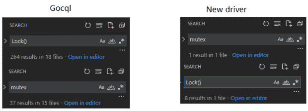
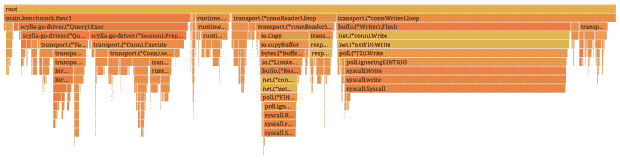
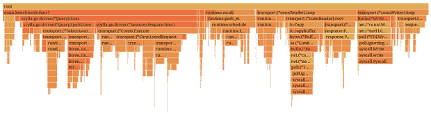
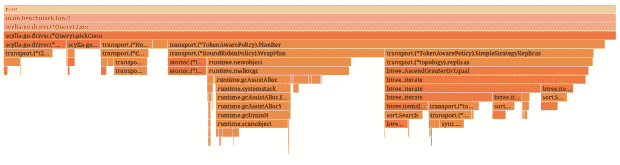
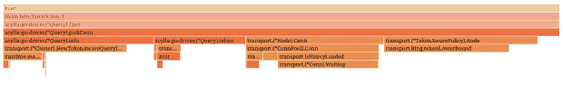
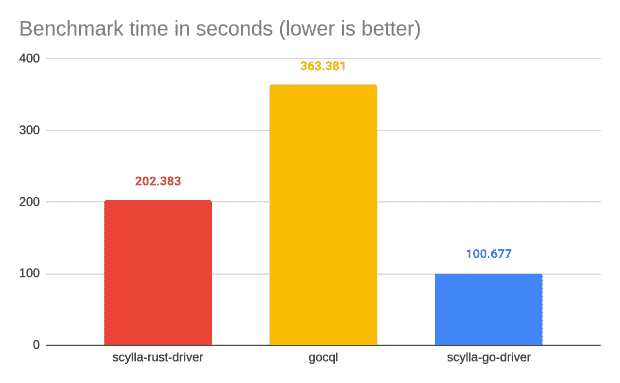
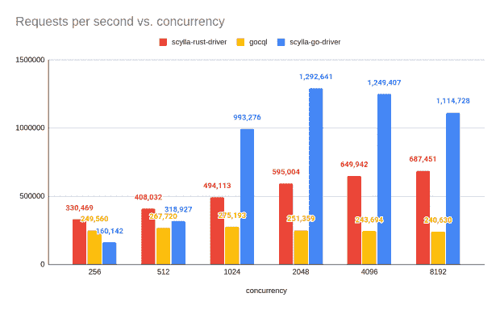
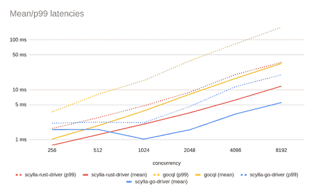
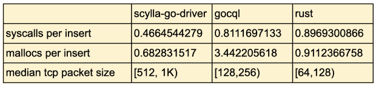

# 新的 ScyllaDB Go 驱动程序:比 GoCQL 和 Rust 更快

> 原文：<https://thenewstack.io/new-scylladb-go-driver-faster-than-gocql-and-rust-counterpart/>

自 2019 年以来，ScyllaDB 一直与华沙大学合作，指导学生团队撰写学士论文。在成功的 [ScyllaDB Rust 驱动](https://www.scylladb.com/2021/07/13/scylla-rust-driver-update-and-benchmarks/)和 Go 1.18 中泛型的发布之后，是时候诞生一个新的 ScyllaDB Go 驱动了——目标是在性能方面击败 [GoCQL](https://github.com/scylladb/gocql/) 和 ScyllaDB Rust 驱动。

本文将解释该项目如何成功实现这一目标。

*想从 ScyllaDB、优步、Lyft、Square、谷歌、AWS、RedHat、英特尔、Vercel、Redis Labs 等公司的工程师那里了解更多令人惊叹的性能工程技术吗？细读来自* [*P99 CONF*](https://www.p99conf.io/) *的按需技术讲座，这是一个为痴迷于性能的工程师举办的虚拟会议。*

## 重点:性能，性能，性能

在设计驱动程序时，我们试图让它尽可能遵循 [ScyllaDB 的无共享方法](https://www.scylladb.com/product/technology/shard-per-core-architecture/)，避免不必要的互斥体用于获取数据的所有权，并专注于使用惯用 Go 通道和原子的组件之间清晰、高效的通信。

这导致新的驱动程序只有一个互斥体，位于一个 TCP 连接的本地。相比之下，GoCQL 大量使用它们，因此很难在不造成意外数据竞争的情况下做出更大的改变。

我们还密切关注适当的内存管理，尽可能减少垃圾。在基准测试期间，我们观察到 GoCQL 结果受到垃圾收集器的严重影响。使用默认的 Go 垃圾收集器(GOGC)，它的性能比使用最佳设置时慢 30%。

我们很高兴地宣布，垃圾收集器对新驱动程序的影响可以忽略不计，主要是因为驱动程序执行内存分配的频率比 GoCQL 低五倍。

在创建新组件时，我们执行了各种微基准测试，以做出正确的性能决策。

让我们更深入地了解这个驱动程序是如何工作的，以及它为什么如此之快。

## 连接架构

连接可能是车手表现中最关键的部分，类似于 Rust 车手。在新的 Go 驱动程序中，它由两部分组成:

*   编写器循环—负责发送请求
*   读取器循环—负责接收和发送响应

新驱动程序中的请求生存期如下:

1.  创建请求。
2.  选择将执行请求的连接。
3.  为帧分配 StreamID 和响应通道。
4.  通过通道将它发送到编写器循环。
5.  编写器循环将帧序列化并发送到 ScyllaDB，可能会将其与其他等待在编写器通道上发送的帧合并。
6.  读取器循环从 ScyllaDB 接收响应帧，反序列化它，并通过与帧的 StreamID 对应的响应通道发送结果，释放它。

帧在读取器/写入器拥有的缓冲区中进行(解)序列化，允许在单个连接上的请求之间重用内存。

这样，写入器和读取器循环的开销最小，并且可以完全专注于通过网络推送帧，而不需要过多的同步。

## 标杆管理

为了衡量车手的表现，我们使用了去年的车手基准。以下是运行该基准的变体的结果:

*   在同一个表上执行 1000 万次插入和选择，平均分布在 1，024 个并发工作线程上。

看看我们第一次开始分析和优化驱动程序时的火焰图。

在任何优化之前
基准测试总时间:50.21 秒/ 100%
syscall。写入总时间:18.20 秒/ 36.25%

## 联合

基准测试表明，即使我们合并请求，驱动程序仍然花费将近一半的运行时间等待系统调用，主要是在编写器的循环中(正如您在上面的火焰图中看到的)。

原因是，即使在重负载下，合并所有等待的请求也不会填满整个连接缓冲区。事实上，大多数时候每个请求都会发生刷新，即使缓冲区中可以容纳 100 多个查询。

理想的情况是当缓冲区满了的时候刷新它。因为请求应该尽快到达数据库，所以每次都等待缓冲区填满是可以接受的。

然而，我们可以在合并请求之前，等待一段固定的、不明显的时间，让请求堆积起来。下面是驱动程序基准的火焰图，聚结堆积时间为 1 毫秒。

基准总时间:22.03s / 100%
syscall。写入总时间:1.65 秒/ 7.48%

正如您在上面看到的，这种优化在基准测试中将驱动程序的性能提高了一倍，尽管有额外的等待，但平均延迟甚至更低。你可以在这里阅读更多关于这个想法的信息[。](https://www.datastax.com/blog/performance-doubling-message-coalescing)

## 更快的路由

驱动程序的一个非常重要的特性是将查询路由到正确的节点，执行负载平衡，并在某些情况下将查询重试到其他节点。

在我们如何处理查询路由方面，跟随其他驱动程序的脚步，我们也想使用一个 API，其中对于每个查询，我们可以要求一个查询计划:一个迭代器函数按照我们应该查询的顺序返回节点。

分析表明，驱动程序为这种方法产生的迭代器执行了许多小的内存分配。正如您在下面的火焰图上看到的，分配(runtime.newobject)占用了大约三分之一的挑选连接运行时间。

基准总时间:22.03 秒/ 100%
拾取连接总时间:3.76 秒/ 17.06%

为了提高挑选连接的性能，我们首先对 Go 的 B 树库进行了改进。我们对它进行了修改，使用了泛型，这使得分配的影响更小。你可以在这篇博文[中读到，“用 Go Generics](https://www.scylladb.com/2022/04/27/shaving-40-off-googles-b-tree-implementation-with-go-generics/) 将谷歌的 B 树实现削减 40%。”然而，我们想出了一个更好的主意:完全删除那些分配。

关键思想是，没有太多不同的查询计划，大多数时候我们只需要计划的第一个元素，所以我们可以完全预处理它们。

新驱动程序在注册集群拓扑结构的变化时，会对所有计划进行预处理，而不是匆忙制定计划。此外，它不是为一个查询生成一个完整的计划迭代器，而是只获取它需要的节点。

通过这种方式，我们在拓扑刷新过程中花费的时间稍微多一点，从而显著降低了发送请求的延迟。更重要的是:我们避开了垃圾收集器。

基准总时间:21.24 秒/ 100%
拾取连接总时间:1.60 秒/ 7.55%

## 比较和未来计划

为了比较这些驱动程序，我们首先在去年的设置上尝试了基准测试:

*   加载程序:c5.9xlarge (36vCPU，96GiB 内存)
*   ScyllaDB: 3 个运行在 i3.4xlarge (16vCPU，122GiB 内存)上的实例

然而，测试运行表明，新的驱动程序能够在加载程序只有 60%负载的情况下将 ScyllaDB 推到最大负载。为了确保基准测试是公平的，我们决定为 ScyllaDB 使用更小的加载器和更强大的 EC2 实例，如下所示:

*   加载程序:c5n.2xlarge (8vCPU，21GiB 内存)
*   ScyllaDB: 3 个运行在 i3.8xlarge 上的实例(32vCPU，244GiB 内存)

*   基准:并发插入 1 亿行，平均分布在工作线程中。

事实证明，新的围棋驱动程序几乎比它的前辈快四倍，比 Rust 的对手快两倍。

让我们看看吞吐量方面的结果(越高越好)。

与其他驱动程序相比，新驱动程序的吞吐量随着并发性的增加而扩展得更快，大约在 2000 个并发运行的工作线程时达到峰值，达到每秒 130 万次插入。

我们的 Rust 和 Go 驱动程序之间的巨大差异来自于合并；然而，即使在 Go 驱动程序中禁用了这种优化，它仍然有点快。

让我们看看这些请求的延迟(越低越好):

在延迟图上，您可以清楚地看到，当并发性较高时，新驱动程序的平均延迟比其他竞争对手低两倍，P99 延迟在所有情况下都比 GoCQL 低得多。然而，在较低并发性的情况下，由于固定的合并等待，它会慢一点。这个以后会改进的。

我们还在基准测试期间使用 [bpftrace 工具](https://github.com/iovisor/bpftrace)收集了各种指标。这些指标清楚地表明，驱动程序从每次系统调用和每次内存分配中获得了最大的收益。

免责声明:这些结果没有考虑分析的开销；实际上，它们可能会高一点。

## 包扎

由于早期的设计目标、广泛的剖析和基准测试，我们创建了一个新的 ScyllaDB Go 驱动程序，它在高并发环境中表现出色，在运行时和内存管理方面超越了它的前辈，并有望在某一天取代它。

该驱动程序可在 [GitHub、](https://github.com/scylladb/scylla-go-driver)上获得，尽管它仍处于早期开发阶段。请随意查看并投稿。

你也可以看看我们的学士论文来了解更多关于驱动是如何开发的细节。

[*更多 ScyllaDB 工程见解*](https://resources.scylladb.com/scylladb-engineering)

<svg xmlns:xlink="http://www.w3.org/1999/xlink" viewBox="0 0 68 31" version="1.1"><title>Group</title> <desc>Created with Sketch.</desc></svg>