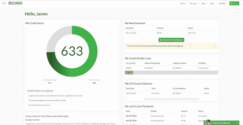

# Self Lender 如何利用微服务打入金融科技

> 原文：<https://thenewstack.io/new-stack-makers-sxsw-self-lender/>

金融科技初创公司 Self Lender 面临的现实是，银行软件非常昂贵，尤其是对于那些以较小贷款面值运营的银行。

Self Lender 没有支付过高的成本，而是构建了一个完整的金融解决方案后端，包括所有的客户管理软件、入职和文档创建。在这样做的同时，它还遵守了有关身份盗窃、恐怖主义保护和利息计算的严格法律。

在本月早些时候的 SXSW 会议上， [Self Lender](https://www.selflender.com/) 首席执行官兼联合创始人[詹姆斯·陈嘉炜](https://twitter.com/jkgarvey)向新的 Stack 讲述了该公司如何利用微服务和快速部署来改变人们获得和建立信贷的方式。点击这里收听播客:

[Self Lender 的詹姆斯·陈嘉炜对金融科技服务](https://thenewstack.simplecast.com/episodes/self-lenders-james-garvey-on-scaling-a-fintech-service)

Self Lender 允许那些对建立或建立信贷感兴趣的人获得 FDIC 支持的贷款，该贷款放在一年期 CD 中。CD 付清后，客户将提高他们的信用，并建立按时付款的历史。Self Lender 在 19 个月前建立了自己的平台，现在每周可以经纪超过 13 万美元的贷款。

支持这项服务并不容易。

在一些银行，每个客户的软件成本可能超过 75 美元。“实际情况是，有些软件提供商已经在遗留系统上为银行牵线搭桥数十年，但他们不想改变。即使很贵，他们也很开心，”陈嘉炜说。

因此，该公司构建自己的基础设施是有意义的。

为 Self Lender 提供动力的是 Python、Postgres 和 Redis。考虑到大规模增长的潜力，Self Lender 的开发团队在设计其流程时考虑到了可伸缩性。他们已经通过 AWS 实施了一个自动伸缩系统，以及一个强大的后端，以确保他们能够满足客户需求。

这些系统需要严格的安全措施，Self Lender 在 19 个月的全面上市过程中满足了这些要求。它现在是一个 [SSAE 16 兼容系统](http://www.ssae-16.com/ssae-16/the-ssae16-auditing-standard/)，允许其团队成员以传统银行使用传统软件完成相同任务的一小部分成本进行 API 驱动的银行业务。

也使用其他技术。“我们有几个关于 [Twilio](https://www.twilio.com/) 的应用。它支持我们所有的电话录音和短信。你确实需要有客户互动的成分，”陈嘉炜说。

self lender–信用生成器仪表板

通过将 Self Lender 分为五个独立的前端微服务，部署变得轻而易举。“它非常模块化。我们可以毫无问题地交换东西，”陈嘉炜说。监控由 AWS Cloud 管理，内部使用 [Docker](https://www.docker.com/) 在 Self Lender 的机器上进行测试和开发。通过使用 Docker 进行单元测试，Self Lender 能够节省成本，而不是在 AWS 上运行单独的服务器。

归根结底，技术是一个起点。我们正在见证人们不仅如何看待他们的钱，而且如何看待他们的银行的转变。消费者银行已经见证了在线储蓄应用、在线银行和完全在线银行的变化。Self Lender 希望成为做出更多改变的关键部分。

Capital One 和 Docker 是新堆栈的赞助商。

专题图片:德克萨斯州奥斯汀市 via Pixabay 的“在此付款”标志。

<svg xmlns:xlink="http://www.w3.org/1999/xlink" viewBox="0 0 68 31" version="1.1"><title>Group</title> <desc>Created with Sketch.</desc></svg>