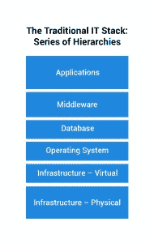
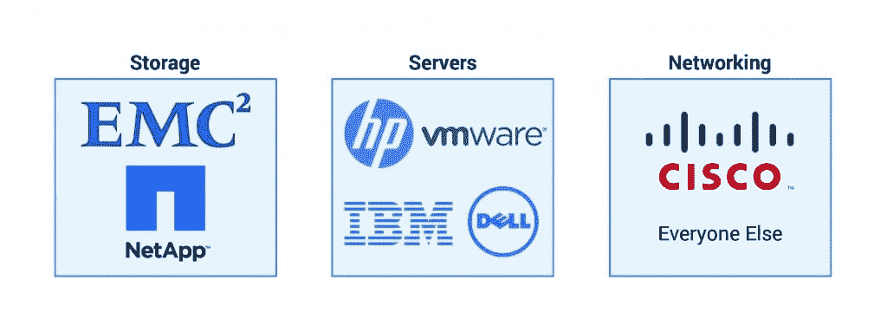
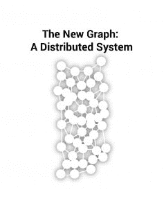

# 如果新的栈根本不是一个栈呢？

> 原文：<https://thenewstack.io/new-stack-not-stack/>

艾伦·科恩

艾伦·科恩是 Illumio 的首席商务官和董事会成员。Alan 之前的两家公司 Airespace(被 Cisco 收购)和 Nicira(被 VMware 收购)分别是集中式 WLAN 和网络虚拟化领域的市场领导者。他也是几家公司的顾问，包括 Netskope、Highfive 和 Vera。

自 20 世纪 80 年代和 90 年代客户机-服务器(即 PC、浏览器、web)取代大型机以来，技术世界正在经历最重大的革命。更重要的是，计算技术已经渗透到我们生活和商业的方方面面，正如马克·安德森用他的名言“软件正在吞噬世界”所纪念的那样

根据 Gartner 的数据，抛开技术对每个行业的影响，这是一个巨大的行业，每年的 IT 支出超过 3.5 万亿美元。这使得计算机成为世界第四大“GDP 经济体”，仅次于日本。

大型市场需要框架来让它们更容易理解，更容易消化。计算有自己的分层框架，称为“堆栈”，基础设施提供基础，各层软件和应用程序位于顶层。

各层按子类分类。作为一名基础设施极客，我将更深入地研究这一类别。

在整个 20 世纪 90 年代和 21 世纪初，堆栈的基础设施类别看起来像是由每个子类别中的硬件参与者定义的一系列政治系统。虽然每个部分都以一场包括数十名玩家的混乱开始，但每个硬件类别都变得更像当代政治系统，“政党”争夺控制权。随着客户机-服务器的成熟，这些类别逐渐形成小规模的竞争团体，其中创新和竞争的定义取决于新进入者如何与现有超级大国对该类别的控制相关联:

*   存储是一个两方系统；
*   服务器是一个多方系统；和
*   联网(嗯，IP 联网)变成了一党制。

在基础架构领域，全球听到的枪声是虚拟化。这一枪是由 VMware 射出的，它从改变服务器行业开始。虽然 VMware 不是一个硬件玩家，但它的技术推动了 Unix 的衰落，当与 Linux 操作系统合作时，它确保了 x86 英特尔架构在未来一段时间内的主导地位。在过去的五年里，VMware 也在存储和网络领域取得了巨大的进展。实际上，这已经改变了基础设施竞争的物理机制，使软件成为阿基米德杠杆。

亚马逊网络服务(Amazon Web Services)是最真实的例子，它在短短十年内将设备模式从“自有”转变为“租赁”，物理设备从“机架堆叠”转变为一系列 API。

## 新的堆栈很乱

软件主导的革命意味着一切都将改变。取决于你站在哪里，它要么是一个蝴蝶效应，将在未来几十年内席卷一切，要么是一个巨大的流星，就像在尤卡坦半岛坠毁并摧毁了恐龙，有趣的是，这个世界将由更小、大脑更大的哺乳动物主宰。

这种软件驱动的“新堆栈”的关键组织原则是，它在本质上不会是分层的，而是一系列互连的技术、业务关系、开源、自动化和分析。新的堆栈是通过高速网络互连的分布式图形。

高速互联网、移动计算和虚拟化基础设施模式的发展催生了支撑新的分布式体系的五种力量:

1.  **软件即服务**:让每一个主要企业和消费者软件应用程序按需可用的转变不仅改变了消费模式，还从根本上允许创新者改变业务流程(例如，消除人工中间件)和个人实践(通过智能手机实现“一切”)。SaaS 时代的进入壁垒与微软、甲骨文和 IBM 的霸王龙竞争时代有很大不同。
2.  **基础设施即服务**:“大铁”供应商的业务模式已经经历了消费和定价模式的变化。传统上只有最大的企业才有的巨大的、容易获得的计算能力现在可以通过信用卡按需获得。
3.  **开发者的崛起**:在各种规模的企业中，决策和购买力越来越受到开发者群体的影响。开发者更倾向于开源社区，共享代码(例如 GitHub 的发展)，并在丰富的 API 上构建新的应用程序。把这想象成软件的“脸书时刻”
4.  **协作的兴起和 ERP 的衰落**:Slack 和 Atlassian 等参与系统正在取代传统 ERP 系统等记录系统。这并不意味着大型金融或制造或业务流程软件将完全消失，但它看起来更像是最终用户之间的一系列持续互动。
5.  **IT 的消费化**:随着商业和消费计算之间的界限变得模糊，交付应用和服务的门槛正在消失。谷歌、易贝、优步、Pinterest 和 Airbnb 的发展为信息、产品和服务的买家和卖家提供了一个摩擦极低的爆炸式联系。智能手机作为关键计算平台的主导地位正在以超出任何人想象的速度推动这一趋势。

## 等级制度的终结和图表的兴起

最终，客户机-服务器技术的衰落导致了建立在分布式系统之上的计算的兴起。随着这一新体系的兴起，边界、联盟和类别将日益消失。新的领导将来自那些知道如何处理图表的玩家，而不仅仅是在堆栈中上下移动。控制点将转移到新供应商如何围绕堆栈集成和合作，以及战略控制点。

没有比我今天工作的地方更真实的了:安全。传统的安全方法，尤其是那些围绕网络构建的方法，假定了可信世界(您的数据中心)和不可信世界(互联网)之间的静态边界。随着在不同环境中运行的外围和多层应用程序的解体，安全性必须附加到计算上，并反映我们在云服务或新的临时格式(如 Linux 容器)中看到的计算的动态性质。

此外，与客户端-服务器堆栈的其他领域不同，从竞争角度来看，安全已经是一片混乱:今天有超过 1400 家网络安全公司在追逐 750 亿至 1000 亿美元的市场，没有一家公司拥有超过 5%的股份。

新的计算堆栈属于快速和敏捷，而不仅仅是强者。对于试图对新堆栈做出方向性决策的 IT 领导来说，以下五个问题代表了一种购买启发式方法:

1.  我的技术选择是否允许我从客户机-服务器发展到新的堆栈选择，还是会将我束缚在当今的技术中？
2.  我是不是在假设我今天买的东西明天可能会被出租？
3.  我是否充分考虑了开源技术的兴起以及它在我公司的业务目标中所扮演的角色？
4.  我的 IT 哲学和我公司的管理风格是否适应一种分布式的、汤姆·弗里德曼式的[世界是平的](https://en.wikipedia.org/wiki/The_World_Is_Flat)环境？
5.  我是否相信我的业务本质上是一种软件业务？我是为此而组织的吗？

您如何回答这五个问题将在您公司的技术发展中发挥关键作用，并决定它是您公司使命的推动者还是阻碍者。

[思科](https://blogs.cisco.com/tag/mantl)和 [IBM](https://www.ibm.com/cloud) 是新堆栈的赞助商。

Hoach Le Dinh [通过](https://unsplash.com/photos/c8TWWQ5ZnUw) Unsplash 拍摄的特征图像。

<svg xmlns:xlink="http://www.w3.org/1999/xlink" viewBox="0 0 68 31" version="1.1"><title>Group</title> <desc>Created with Sketch.</desc></svg>