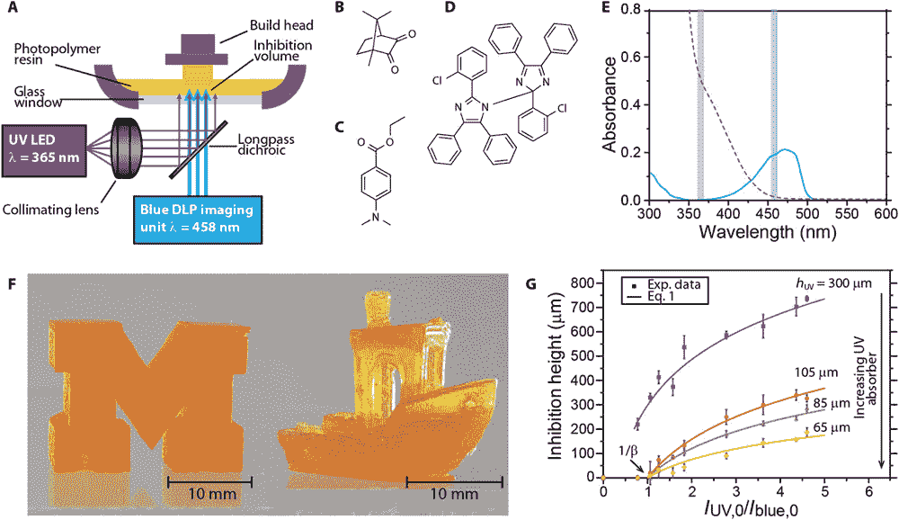

# 新技术利用光线以 100 倍的速度进行 3D 打印

> 原文：<https://thenewstack.io/new-technique-uses-light-to-3d-print-100-times-faster/>

增材制造彻底改变了我们制造复杂物品的方式，无论是[假肢](https://thenewstack.io/victoria-hand-project-applying-3d-printing-to-prosthetics/)、[房屋](https://thenewstack.io/emerging-objects-3d-printing-pioneers-will-build-houses-salt/)还是[火箭发动机](https://thenewstack.io/how-to-print-a-rocket-engine-and-make-business-in-space-affordable/)。但是仍然有创新的空间——毕竟，像 [3D 打印](https://thenewstack.io/printer-mit-can-see-print-views/)这样的流行添加制造技术实际上本身并不是三维的——大多数 3D 打印机实际上是一个接一个地铺设二维层，以便构建三维物体。根据打印机、使用的打印机材料和尺寸，该过程可能会非常缓慢，有时需要几个小时甚至几天才能缓慢打印一个复杂的对象。

但是，密歇根大学的研究人员开发了一种创新的替代方法，而不是用多层塑料细丝打印东西:从一桶液体中提升复杂的形式，这导致了一种比传统打印方法快 100 倍的技术。对于那些想生产少量产品的人来说，这种进步将被证明是有用的，而且更具成本效益。生产小批量产品不太适合传统的大规模制造系统，这种系统运行起来很昂贵，因此更适合大批量生产，以确保生产在商业上可行。近距离观察它的工作原理:

[https://www.youtube.com/embed/AUNWzHKRNoA?feature=oembed](https://www.youtube.com/embed/AUNWzHKRNoA?feature=oembed)

视频

## 多波长光 3D 打印

该小组发表在《科学进展》杂志上的论文描述了他们的新方法，其中包括使用一种专有的树脂混合物。当暴露在特定种类的蓝光下时，这种树脂在一个叫做[聚合](https://en.wikipedia.org/wiki/Polymerization)的过程中硬化——或者它可以在没有被蓝光接触的地方保持液态。此外，这种特殊树脂在特定波长的紫外线照射下也不会固化。

该团队的打印设置包括一个“构建头”，当打印对象从位于玻璃底大桶中的光敏树脂浴中拔出时，它会固定住打印对象。在它下面是一个来自改良的 PowerPoint 投影仪的光源，可以发出蓝光和紫外光，其强度都是可以控制的。更多的蓝光意味着更多的硬化，而更多的紫外光则意味着更少的硬化，消除了树脂增厚过快和造成混乱的问题。这种方法允许用户以每小时 2 米(6.5 英尺)的速度打印一个对象，并能够通过逐个像素地改变光源的强度来打印地形图案。

“我们使用[紫外线]波长来防止树脂在[玻璃]投影窗口上聚合，”论文合著者、密歇根大学化学工程副教授 Timothy Scott 解释道。“但我们可以改变抑制波长的强度，这反过来可以加厚…不会聚合的区域。我们可以轻松地达到数百微米，接近甚至超过一毫米，所以这已经相当厚了。我们不仅可以在浴室的整个区域这样做，还可以有选择地这样做。通过，再一次，将我们投射到缸中的强度模式化。”

团队立体平版 3D 打印机的设置；光波长如何影响树脂聚合(硬化)的比较；打印结果包括玩具船和大写字母 m。

使用这种方法，该团队能够相对快速地打印出像格子、微型船和大写字母 M 这样的物体。此外，与打印机连续沉积二维材料层以形成 3D 物体的凹凸不平的结果相比，这种新方法产生的表面更光滑。

正如论文所指出的，该团队的新方法受到了现有的[立体平版印刷](https://en.wikipedia.org/wiki/Stereolithography) 3D 打印技术的启发，该技术涉及使用激光从树脂缸中固化所需的物体。然而，这项新工作增加了一点额外的创新:紫外光有助于抑制特殊树脂完全固化，使连续打印更大更耐用的物体成为可能。这种动态控制的多波长光在立体平版印刷中的新用途可能会使具有“材料和化学性质的局部变化”的组件的大规模印刷成为可能，这是一种非常简洁的功能，目前用传统方法是不可能的。目前，该团队已经为他们的工作申请了三项专利，并正在完善新方法，不仅用于树脂，还用于陶瓷等其他材料。

图片:密歇根大学

<svg xmlns:xlink="http://www.w3.org/1999/xlink" viewBox="0 0 68 31" version="1.1"><title>Group</title> <desc>Created with Sketch.</desc></svg>