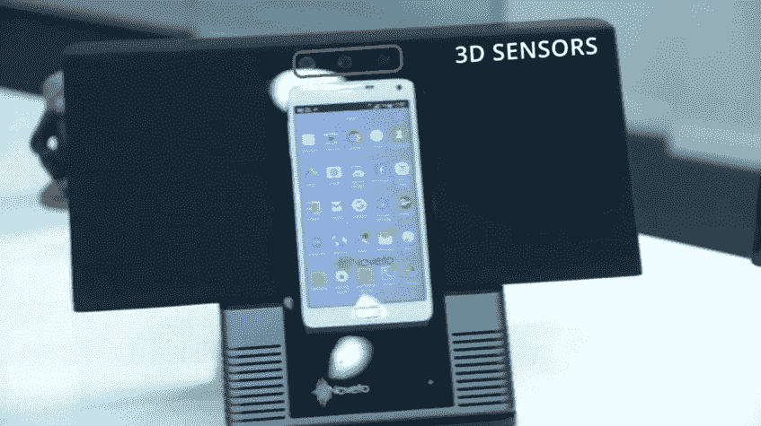
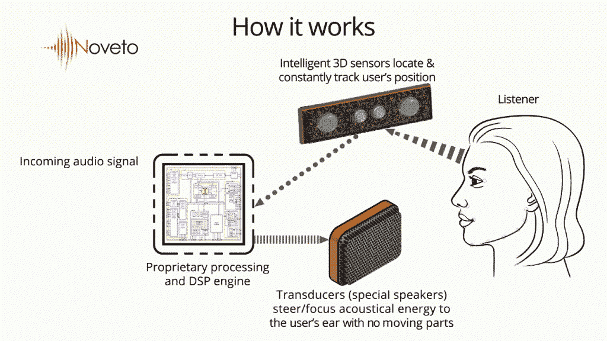
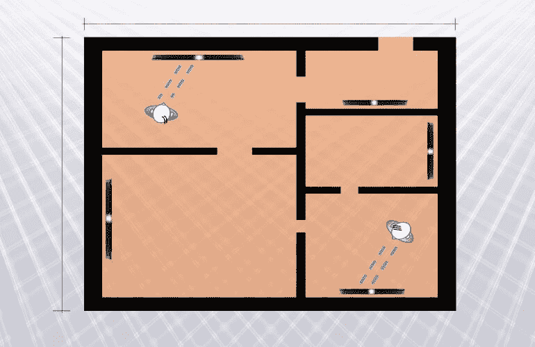

# 新技术针对个人听众的音频

> 原文：<https://thenewstack.io/new-technology-targets-audio-individual-listeners/>

一家初创公司正在展示一项技术，该技术可以传播只能由一个人听到的声音。即使听众没有戴耳机，房间里的其他人也听不到。

Noveto Systems 的使命是雄心勃勃的:改变我们消费声音的方式。该公司的技术包括一套传感器，可以识别用户的头部并跟踪其位置，因此音频可以有针对性，也就是说集中，直接到精确定位的耳朵上。该公司还制造了一种特殊的换能器，用于将声音转换成适当的电波成分。

“我们的目标是让私人声音技术成为每个发声设备的标准功能，”该公司的网站宣称。

Noveto 正在推广“智能声音”产品的概念，例如，可以包括电视、电脑和智能手机。除了一个用户，所有这些产品都可以静音。他们还可以为视频游戏创造增强的 3-D 身临其境的声音效果，这种效果只有玩游戏的人才能听到。

该网站甚至设想了一个智能家居，当听众从一个房间走到另一个房间时，声音可以直接传送给他们。

Noveto 系统公司已经展示了他们神奇的远程窃窃私语技术的可能场景。在一个有趣的视频中宣传这项技术，从消除嘈杂的铃声到老板用扬声器打电话的危险。(“史蒂夫，你在对我做什么？你知道那些是我们要解雇的人！”)

“你的音频内容公开过吗？”视频问道。“要是史蒂夫使用了新诺威的私人音响技术就好了……”

https://www.youtube.com/watch?v=NkrS4UxbmPs

这听起来很超前，但 Noveto Systems 已经在今年的巴塞罗那世界移动通信大会上展示了它的私人声音技术。 *TechSpot* [宣布它是今年最好的展品之一](http://www.techspot.com/article/1140-best-of-mwc-2016/#noveto-private-sound-technology)，而 ReadWrite.com*的一个标题[写道，这项技术“改变了我们所知道的声音”](http://readwrite.com/2016/03/04/new-sound-experience)*

 *不过，至少有一名记者有一些抱怨。 [*《今日美国》*的爱德华·c·贝格写道](http://www.usatoday.com/story/tech/columnist/baig/2016/03/03/startup-can-direct-sound-your-ears-only/81220008/)“我确实检测到相当大的静电干扰，而且音量很低。”但他称之为“音频骗局的非凡壮举”，并补充说“仅仅是 Noveto 可以做到这一点的事实就令人印象深刻。”

“所有这些在理论上听起来都很有希望，”贝格开玩笑说，“但我想看到，或者更确切地说，听到更多来自 Noveto 的消息，因为它的技术越来越接近任何类型的市场现实。我只想说，我洗耳恭听。”

<svg xmlns:xlink="http://www.w3.org/1999/xlink" viewBox="0 0 68 31" version="1.1"><title>Group</title> <desc>Created with Sketch.</desc></svg>*