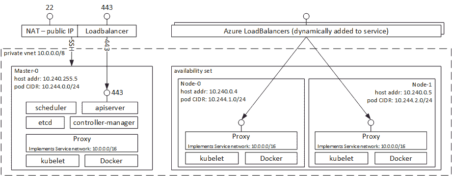

# 通过 Azure 容器服务，微软努力让容器管理变得乏味

> 原文：<https://thenewstack.io/new-updates-making-azure-container-service-applications-run-not-containers-run/>

本周早些时候，微软[在](https://azure.microsoft.com/en-us/blog/kubernetes-now-generally-available-on-azure-container-service/) [Azure Container Service](https://azure.microsoft.com/en-us/services/container-service/) 上推出了 Kubernetes 容器编排服务，以及其他主流容器编排引擎 Docker Swarm 和 Mesosphere 的数据中心操作系统(DC/OS)。Kubernetes 联合创始人 [Brendan Burns](https://github.com/brendandburns) 告诉 New Stack，此举是建立服务的又一步骤。

七个月前，伯恩斯从谷歌跳槽到微软，负责运营 ACS [,他的愿景是](http://blog.kubernetes.io/2017/02/caas-the-foundation-for-next-gen-paas.html)将 ACS 转变为“真正的托管服务”,不仅可以提供使用容器的工具，还可以作为一个完整的容器即服务(CaaS)平台。

## 专注于应用和平台即服务

他指出，随着技术的成熟，重点从你如何使用容器转移到你用它们做什么。“Kubernetes 社区和整个容器社区都在谈论容器和编排应该如何变得乏味。这是一个非常热门的话题，但在某种意义上，它只是一个基础设施。你在其上构建的应用才是真正令人兴奋和有趣的。”

准备好基础设施，以便您可以看到容器相对于熟悉但不完善的流程的优势，这需要很快。伯恩斯警告说:“如果要花六个月或一年的时间才能获得收益，没人会这么做。”“如果你能立即得到好处，我认为人们会欣然接受，这是 ACS 真正能提供帮助的地方之一。设置这些东西，弄清楚如何运行、管理和部署这些容器编排器可能是棘手的，找到关于如何部署它们的最佳实践。实际上，ACS 为您所做的就是解决您的问题。”

他解释说，作为一种“面向应用的抽象”，ACS 需要帮助人们过渡到使用容器。“在云中，我们正在从面向机器转向面向应用，这是一个巨大的发展，因为除了考虑机器的运营人员之外，其他人都希望考虑应用。”

在新的云世界中，这些不仅仅是单独的应用程序；它们也将是 PaaS 产品，因为容器服务使开发人员创建 PaaS 变得更加容易——这意味着我们将看到更多针对利基和垂直市场的 PaaS，而不仅仅是广泛的通用工具。

“构建 PaaS 的人不再必须是分布式系统专家。因为容器编排者已经接管了大量的分布式系统问题，你将看到真正有针对性的 PaaS，在特定的、有针对性的垂直领域提供真正令人难以置信的开发者体验，”Burns 说。

他认为这也将使技术选择更接近开发团队，而不是必须成为重大的战略决策。“您将看到这些体验被并排部署到一个容器编排器上。如果我需要一个用于我的移动应用和游戏，我会将它部署到我的容器服务中；如果我需要一个用于 web 应用程序的，我将它部署到我的容器服务上——它们使用相同的底层容器编排器。这意味着平台的选择并不多；个人开发团队可以做出选择，而不是由首席技术官为整个公司做出选择。”

## 容器的选择

这种选择就是 ACS 支持多容器编排器的原因。“我们发现大多数客户都有多种需求，无论是因为他们是拥有多个不同部门的大企业，还是因为他们是小公司，但仍然需要进行大数据分析。这是为了找到最适合每个用户的解决方案。”

Kubernetes 对 Windows 服务器容器的支持(相当于大家熟悉的 Linux Docker 容器的 Windows 版本)现在已经进入预览版，同时还有 Docker Swarm 支持。伯恩斯说:“当你运行 Kubernetes 和 Windows 服务器容器时，你正在构建 Windows 容器应用程序，并通过 Kubernetes API 和 Kubernetes 工具部署它们。

ACS 还允许您拥有同时使用 Windows Server 和 Linux 的混合集群。“在 ACS 的开源核心 [ACS 引擎](https://github.com/Azure/acs-engine)中，我们拥有混合集群，其中包含一些 Linux 节点和一些 Windows 节点。因此，您可以使用服务发现和命名来构建混合应用程序，这些应用程序使用一些 Windows 组件和一些 Linux 组件。”

接下来，ACS 很可能也支持 [Hyper-V 容器](https://thenewstack.io/microsoft-secures-the-windows-docker-container/)；一个 Docker 容器，运行在一个基于 [Windows Nano Server](https://blogs.technet.microsoft.com/windowsserver/2016/02/10/exploring-nano-server-for-windows-server-2016/) 的非常轻量级的虚拟机中，用于安全和内核隔离，但可以像其他任何容器一样管理。这将需要嵌套虚拟化，一旦 Azure 转移到 Windows Server 2016 上运行，这将成为可能，这将在 2017 年的某个时候发生。伯恩斯称 Hyper-V 容器是一个令人兴奋的选择，有很多商业用途。

“容器中最后一个未解决的问题是，如何确保这些东西的安全？因为每个人都喜欢您可以推动的部署模式和利用率，但在很多情况下，您真的希望确保恶意行为者无法从一个应用程序逃到另一个应用程序，我认为 Hyper-V 容器将是这方面的解决方案。因此，有能力协调这些将是重要的，”伯恩斯说。

因为 Hyper-V 容器仍然是 Docker 容器，并且当你部署它时，你可以选择将容器作为 Hyper-V 而不是 Windows Server 容器运行，“你可以根据具体情况做出决定，哪些是你需要保护的，哪些是你认为更可信的，”Burns 指出。

## 蔚蓝的优势

正如微软越来越多的情况一样，从事 ACS 的工程师也为他们集成的工具从事开源项目。伯恩斯说，这是顾客看重的东西。“我的一个工程师是下一个 Kubernetes 版本的发布经理；他将进行大量的测试，以确保升级工作正常进行，所以当你从一个版本的 Kubernetes 升级到下一个版本的 Kubernetes 时，它可以正常工作。这不仅仅会让 Azure 用户受益；这将使整个社区受益。”

ACS 与其他 Azure 服务很好地集成也很重要，比如 Azure 资源管理器(Burns 也有一个团队在运行)。他承认这很有挑战性。“我们在 ACS 中展示的 orchestrators 是开源 API，因此我们无法像传统的 Azure APIs 那样控制它们的形状和感觉。ARM [ [Azure 资源管理器](https://azure.microsoft.com/en-us/features/resource-manager/) ]对你进行 API 调用时会发生什么做了一些假设，特别是它做了这样的假设:你总是可以一遍又一遍地做同样的调用，它会有同样的效果；每个调用都是幂等的。并不是所有的 API 都这样做，有时它们需要特定的路径。”

他希望找到将 ARM 模型引入一些开源项目的方法，从身份开始——这对于微软商店来说意味着活动目录支持。“现在，当您在创建一个群集后对其进行身份验证时，您使用的是与 Active Directory 凭据不同的一组凭据。我们希望这样做，以便您可以使用您的 Active Directory 凭据向群集进行身份验证。”

身份对于容器越来越重要，不仅仅是对于需要管理数量不断增加的容器的生命周期的运营人员。“身份绝对是一个关键因素，不仅仅是退休和分组；这也是为了交流。我希望能够说，这类容器可以与另一类容器对话，但其他任何人都不能。”

没有这一点，身份的激增将难以管理。“如果每个应用程序都必须有自己的(身份系统)，那么就不只是一个全新的系统，而是五个或七个全新的系统。这是忘记在某人离开公司后将其从团队中移除的秘诀。”

他指出，容器编排工具需要成熟才能做到这一点。“他们还没有根深蒂固的身份观念。这是一个我们将不得不做大量工作的领域，随着我们的前进，以及上游项目。这不是 Azure 在真空中会做的事情；这是我们将与开源社区一起做的事情，这样它就可以在人们运行的任何地方工作，因为 [Active Directory](https://msdn.microsoft.com/en-us/library/bb742424.aspx) 和 [Azure Active Directory](https://azure.microsoft.com/en-us/services/active-directory/) 到处都在使用。”

不可变的基础设施容器比其他选择更可靠，但对于习惯于登录服务器并运行命令来安装软件的人来说，这也是一个巨大的变化。容器听起来似乎已经接管了世界，但是 Burns 将市场状况与 2002 年或 2003 年的虚拟化进行了比较:

“这不是‘那些疯狂的孩子在虚拟化东西’，但也不是每个人都完全接受。我们仍处于采用的早期阶段，但成功是实实在在的，对开发人员和运营人员来说都是如此。对于虚拟化，优势更多的是在运营方面，而不是在开发方面，但是对于容器来说，优势更加平衡。双方都是赢家，所以进展会更快。”

<svg xmlns:xlink="http://www.w3.org/1999/xlink" viewBox="0 0 68 31" version="1.1"><title>Group</title> <desc>Created with Sketch.</desc></svg>