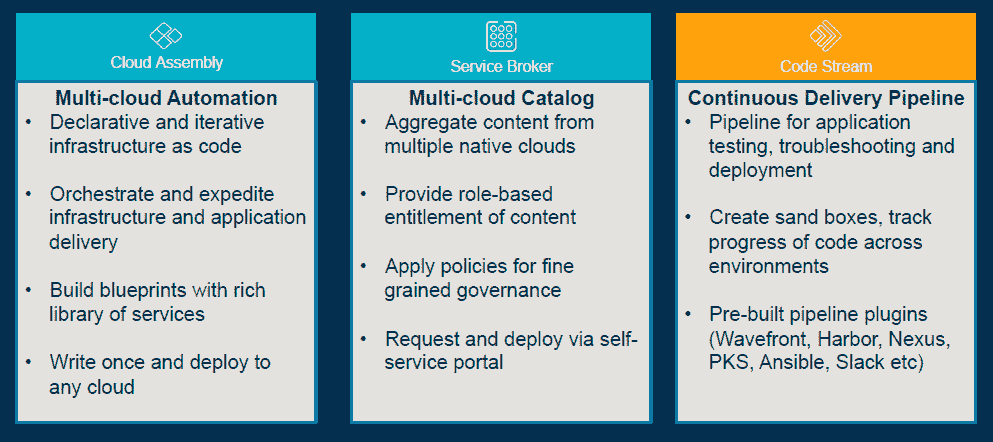
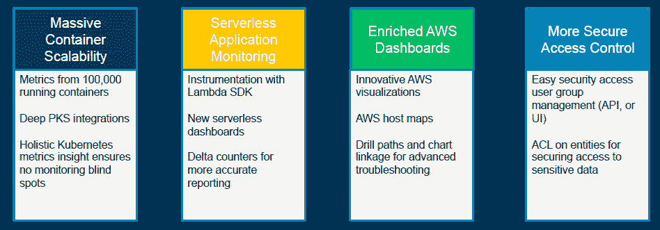

# 旨在管理多云运营的全新 VMware 服务

> 原文：<https://thenewstack.io/new-vmware-services-designed-to-manage-multicloud-ops/>

VMware 继续扩展其基于软件即服务(SaaS)的云操作平台，以帮助其企业用户群充分利用云计算服务，如亚马逊 Web 服务和微软 Azure。

该公司已经发布了三个新的云自动化服务:VMware Cloud Assembly、VMware Service Broker 和 VMware Code Stream，以及新的云配置安全性和合规性服务 VMware Secure State。它还更新了其波前云监控服务，以更好地管理容器和 Kubernetes。

VMware 副总裁兼云服务业务总经理[米林·德赛断言，采用这些工具可以为企业节省高达 60%的公共云服务成本。“我们可以帮助他们优化他们提供云服务的方式，比如 AWS 的关系数据库服务，”他说。](https://www.linkedin.com/in/milin-desai-464757/)

VMware 在公司的年度 [VMworld](https://www.vmworld.com/en/us/index.html) 用户会议上宣布了这些新服务，该会议于本周在拉斯韦加斯举行。

该公司正在响应企业使用多个云提供商的趋势，根据 Forrester 的调查，89%的企业使用至少两个云，74%的企业使用至少三个或更多公共云。

这些新服务基于该公司的 [vRealize cloud automation 软件](https://www.vmware.com/products/vrealize-automation.html)构建，旨在简化将新的或最新更新的应用程序迁移到云的过程。具体来说，每个新自动化组件的角色:

*   **VMware Cloud Assembly** 通过基础架构即代码风格的声明来调配云资源，并且可以与 AWS、Azure 和 AWS 上的 VMware Cloud 配合使用。
*   **VMware Service Broker p** 提供跨不同云提供商的企业级资源目录，并管理访问权限以实施安全、部署和业务策略。
*   **VMware 代码流**是一项持续集成和部署服务，它建立了从开发人员到云服务的工作流，包括测试和故障排除的路径。它包括与 Jenkins 等其他 CI/CD 工具的轻松集成点，并可与基于 VMware 的私有云、基于 AWS 的 VMware 云和本机公共云配合使用。

此外，VMware 安全状态(目前处于测试阶段)实时监控云资产，[检查](https://cloud.vmware.com/community/2018/08/27/vmware-secure-state-public-beta-announcement/)云原生漏洞，并根据批准的配置检查系统设置。例如，当 AWS S3 存储桶在使用它的应用程序关闭后仍保持打开状态时，它可以提醒操作员。

此外，VMware 、对**、 [Wavefront 进行了更新，为分布式云原生应用提供监控和分析，现已升级为能够管理 100，000 个容器。它还提供了对 Kubernetes 以及监控 Amazon Lambda 无服务器部署的全面支持。](https://go.wavefront.com/cloud-monitoring/?utm_campaign=GS_Wavefront_AMS_US_EN_BMM_Brand&utm_adgroup=Core&kw=%2Bvmware%20%2Bwavefront&mt=b&k_clickid=92642b13-601e-44db-ae6b-c2cf4a54a481&utm_source=google&utm_medium=cpc&gclid=EAIaIQobChMI4a3o84SO3QIVB5-fCh1hJQ_gEAAYASAAEgKNnPD_BwE)**

VMWare 对 Wavefront 的更新。

VMware 是新体系的赞助商。

<svg xmlns:xlink="http://www.w3.org/1999/xlink" viewBox="0 0 68 31" version="1.1"><title>Group</title> <desc>Created with Sketch.</desc></svg>