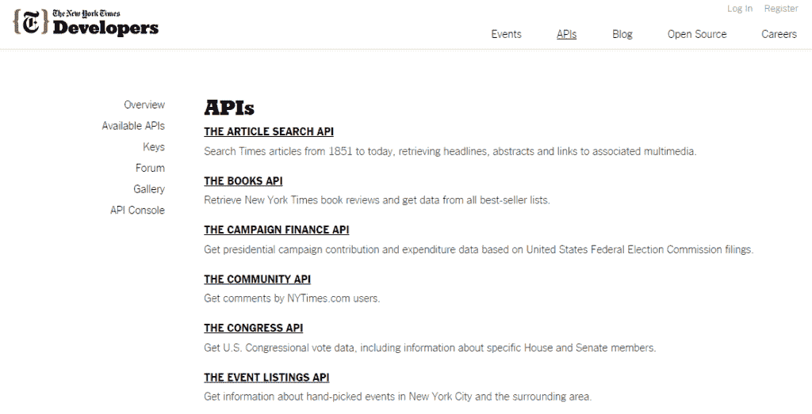

# 为什么《纽约时报》如此依赖外部 API

> 原文：<https://thenewstack.io/new-york-times-dogfooding-external-apis/>

印刷已死，印刷永远不会消亡。毫无疑问，自由开放的媒体是民主最重要的支柱之一。但是由于言论自由的最大象征——互联网——媒体经历了大规模裁员和停刊。这是因为这些最先写下变化和最新闪亮事物的人往往是最后使用它的人。即使是最早创建网站和利用社交媒体的获奖新闻业的中坚力量，也发现自己因技术债务而停滞不前。

但不一定要这样。只是，到目前为止，还没有人谈论它。这就是为什么我们很高兴能与《纽约时报》的 API 架构师 T2 分享这份有着 164 年历史的报纸如何改进其应用编程接口程序，从外到内提高生产率、清晰度和逻辑组织。

在这个由两部分组成的系列文章中，我们今天将谈论《纽约时报》在哪里，以及它计划如何使用[的外部 API](http://developer.nytimes.com/docs)来喂养它的内部 API，明天我们将探讨 API 如何反映报纸的版面以及由此产生的所有文化。

“《纽约时报》的使命是创造、收集和传播高质量的新闻和信息。API 在很大程度上是分发部分，”Feinberg 说。

《纽约时报》在使用同样的不太好的 API 工作了大约六年之后，正处于结构变革的风口浪尖。

“这还不是当务之急。范伯格说:“我们没有花费太多资源来让我们的 API 变得更好，它足够好，我们的数据足够有价值，人们可以绕过这些东西。”“我们不一定有构建这些(内部 API)的标准或单一方式，也不一定有团队的 API 如何相互交流。"

Feinberg 是去年五月引进的，目的是提高内部和外部 API 的质量并制定标准。“现在我们已经认识到 API 标准，API 的使用不仅对外部用户和内部用户很重要，我们正在重新评估我们如何做到这一点，”他说。

他们聘用了范伯格，当时他在一家基于 API 的外部公司众筹支付提供商 WePay 担任开发顾问。“我的工作是让我们外部 API 的消费者的生活变得更好——我们如何处理文档、API 工具，让我们的 API 体验变得非常干净、非常好。”

他被雇来做与《纽约时报》150 多个内部 API 相反的事情——但方式相同。

“纽约时报希望采取这种方法，将每个团队视为外部 API 提供商，解决外部和内部 API 问题，基本上说我们将完全一样地对待这些问题，”Feinberg 说。它计划使用其外部 API 作为一种试验场，以实现快速改进。

这可能看起来是一个不寻常的计划，因为公司通常在向公众公开之前先在内部使用其 API，但有时这种方式会更好，因为它有很多免费的外部 API，并且外部 API 的流量远远低于内部 API。

费恩伯格承认，目前《纽约时报》外部 API 的质量不够理想。“在《纽约时报》,我们对我们公开做的事情有很高的标准，我们并不总是对我们的 API 有这种感觉。我们不一定有相同的要求。我们会犯错，当你免费赠送东西时，人们会相对宽容。”

另一方面，范伯格不想亏待其外部 API 合作伙伴，如 IFTTT、LinkedIn、Flipboard、谷歌和苹果，他表示，这让每个人都更加致力于提升外部 API 的质量，“然后将相同的工具和技术引入内部。”通过与这些外部利益相关者合作，Feinberg 和他的团队可以更快地发现他们实际需要的数据以及他们期望的回报是什么样的体验。

《纽约时报》也有一个付费 API 关系的联合机构，但范伯格认为这些 API“更像是一个提要，而不是传统意义上的 API，但我们正在寻找更好的方式与我们的合作伙伴分享，特别是当更精明的合作伙伴希望更多地访问我们的数据和情报时”，包括视频等各种格式。他说，甚至在两年前，类似 RSS 的简单性还是可以接受的，但它的合作伙伴正变得越来越复杂，对 API 消费者的要求也越来越高。

范伯格说:“我们看到出版领域在这些事情上确实落后了，脸书、谷歌和苹果创造了自己的方式来做这些事情，[而且]这个领域在分享数据方面越来越成熟。”。

目前，《纽约时报》有 13 个外部 API，每天服务数千万个电话，所有这些 API 都属于范伯格的团队。“因此，我们可以对他们做任何我们想做的事情，并迅速做出这些改变。”在内部，他们必须说服各自的团队做出改变。

“我认为我们的外部 API 是一种寻找新方法来试验和分发我们内容的方式。如果 API 是好的，我们的信息是强大和容易的，我们可以快速测试新的分销平台，”范伯格说。例如，《纽约时报》拥有苹果手表上最早的应用程序之一，甚至在可穿戴设备推出之前就有了。

API 团队专注于读者关注的地方。“会有人被介绍给时报，因为他们在美国国家铁路客运公司的火车上或脸书或苹果新闻应用程序上看到了我们的内容，这就是我们如何向时报介绍新一代人”。

《纽约时报》的外部 API 是其内部 API 的副本，但是范伯格说他们需要大量的清理工作。“有些信息对想要使用它们的人来说毫无用处。]我们希望确保我们的 API 接口是一致的，但对使用它的人来说是最有用的接口。”

问题变成了:内部 API 如何对外公开并适应不同的用例？

他说，仅仅因为一个 API 对你内部有用，并不意味着它对其他人也有用。“这些 API 对你很有用，它们可能会提供类似的概念，但它不属于有人会使用你的数据的同一领域。”它的目标是，一旦他们用外部有价值的数据构建了一个内部 API，他们就可以修改 API 接口并迭代 n 个 API 版本以适应不同的需求。

*明天，我们将继续与《纽约时报》谈论其 API，深入探讨为什么其内部 API 的改变如此必要，以及这种演变将如何影响整个新闻行业以及大多数其他行业。*

通过 Pixabay 的特征图像。

<svg xmlns:xlink="http://www.w3.org/1999/xlink" viewBox="0 0 68 31" version="1.1"><title>Group</title> <desc>Created with Sketch.</desc></svg>