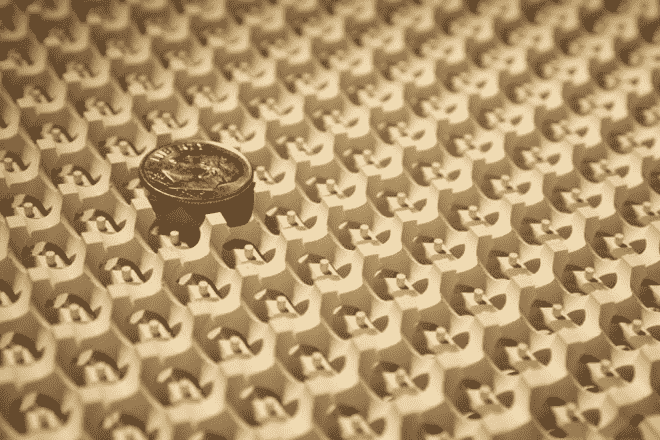

# 新发现的粒子可以进一步推动量子计算

> 原文：<https://thenewstack.io/newly-discovered-particles-could-push-quantum-computing-further/>

紧随[五夸克](https://thenewstack.io/distributed-computing-at-work-600-million-collisions-to-make-a-pentaquark-discovery-in-particle-physics/)的发现，科学家又发现了另一种[奇异粒子](https://en.wikipedia.org/wiki/Exotic_particle)。这些研究人员认为，这些无质量的 [Weyl 费米子](https://en.wikipedia.org/wiki/Weyl_semimetal)可以用来创造更快更有效的电子设备，并有可能进一步推动量子计算的发展。

那么这个奇怪的 Weyl 费米子是什么？费米子是一类粒子，包括所有的基本粒子，如电子、质子和中子，以及夸克和轻子。数学家和物理学家赫尔曼·威尔在 1929 年首次从理论上证明了一种可以携带电荷的无质量粒子的存在。

除了无质量之外，Weyl 费米子还可以同时表现为物质和反物质，并且是其他费米子的基本组成部分，包括电子本身。但真正将 Weyl 费米子与电子区分开来的是，它们缺乏质量，这使得它们在遇到障碍时可以向前移动，而不会发生“反向散射”。然而，电子确实倾向于反向散射，导致效率较低的电子设备过热。普林斯顿大学的扎希德·哈桑教授是发表在《科学》杂志上的[研究](http://www.sciencemag.org/content/early/2015/07/15/science.aaa9297)的合著者之一，[解释了](http://phys.org/news/2015-07-year-massless-particle-next-generation-electronics.html):

> 这就像 Weyl 费米子]有他们自己的全球定位系统，并指导自己没有散射。它们只会朝一个方向移动，因为它们不是右撇子就是左撇子，而且永远不会结束，因为它们只是在隧道中穿行。这些是非常快的电子，行为类似单向光束，可用于新型量子计算。Weyl 费米子可以用来解决电子学中电子遇到的交通堵塞——它们可以比电子以更有效、更有序的方式移动。它们可能会导致一种我们称之为“Weyltronics”的新型电子学

为了发现这种长期预测的粒子，科学家没有使用粒子加速器；相反，他们必须与北京量子物质协同创新中心和国立台湾大学的其他科学家合作，创造一种合成的不对称金属晶体，称为砷化钽(TaAs)。这种所谓的“Weyl 半金属”的内部可以将电子分离成向相反方向运动的 Weyl 费米子对。为了证实 Weyl 费米子的存在，用基于高能加速器的光子束对晶体进行了拍摄。通过分析光束的形式、大小和方向，科学家们能够确定 Weyl 费米子的存在。

顶部有一角硬币的回转曲面。

除了普林斯顿大学研究人员的发现，来自麻省理工学院和浙江大学的科学家团队同时和独立地工作，在同一期《科学》杂志上发表了另一项[研究](http://www.sciencemag.org/content/early/2015/07/15/science.aaa9273)，证实了 [Weyl 点](https://newsoffice.mit.edu/2015/Weyl-points-detected-0716)的存在，这些点被描述为“[Weyl 费米子]能谱中的奇点”

通过让光线穿过双回转体光子晶体([回转体](https://en.wikipedia.org/wiki/Gyroid)听起来很酷:一种“无限连接、三倍周期的最小表面”)，该团队能够通过实验证明 Weyl 点的存在。这些光子晶体可能是革新技术的下一代材料；Weyl 材料可能是石墨烯的三维类似物，[麻省理工学院物理学教授和研究合著者 Marin Soljač解释道:](http://www.eurekalert.org/pub_releases/2015-07/miot-wpw071515.php)

> Weyl 点的发现不仅仅是科学之谜的确凿证据，它为全新的光子现象和应用铺平了道路。想想石墨烯革命:石墨烯是一种 2D 结构，它的电子性质在很大程度上是其动量空间中线性简并点(称为狄拉克点)存在的结果。包含 Weyl 点的材质在 3D 中也是如此。它们实际上增加了一个自由度，一个维度。

这些 Weyl 费米子可能会给技术世界带来惊人的变化。专家预测，在后摩尔定律时代，半导体发展的速度将在未来几年放缓，Weyl 费米子和 Weyl 材料可能是开发能够解析多态[叠加](https://en.wikipedia.org/wiki/Quantum_superposition)甚至[量子 AI](https://medium.com/the-physics-arxiv-blog/first-demonstration-of-artificial-intelligence-on-a-quantum-computer-17a6b9d1c5fb) 的超高速量子计算机的突破性关键(如下面的视频所述)。其他可能性包括开发超精确的单频激光或稳定的 3D 材料，可以在特定角度选择性地阻挡光线。甚至我们的日常生活也可能被一个更高效的电网所改变，这个电网携带着带电的 Weyl 费米子。但是接下来将会是一个惊喜，哈桑说:“Weyl 费米子的物理学是如此奇怪，可能会有许多事情从这种粒子中产生，只是我们现在无法想象。”

[https://www.youtube.com/embed/CMdHDHEuOUE?feature=oembed](https://www.youtube.com/embed/CMdHDHEuOUE?feature=oembed)

视频

图片:普林斯顿大学，麻省理工学院，[和颜清辉](https://newsoffice.mit.edu/2015/Weyl-points-detected-0716)。

<svg xmlns:xlink="http://www.w3.org/1999/xlink" viewBox="0 0 68 31" version="1.1"><title>Group</title> <desc>Created with Sketch.</desc></svg>