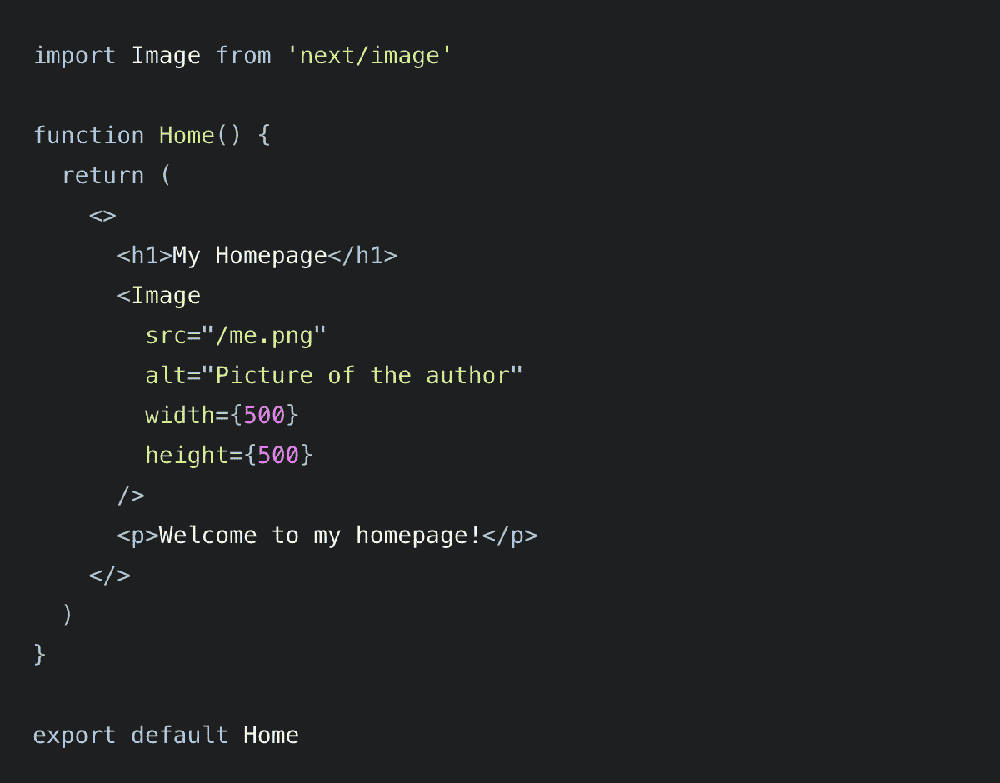

# Next.js 和 Google 图像最佳实践:它与 Web 标准的关系

> 原文：<https://thenewstack.io/next-js-and-google-best-practices-bad-news-for-web-standards/>

在其最近的[虚拟活动](https://nextjs.org/conf/)上，next . js——一个基于 React 库构建的领先开源 JavaScript 框架——宣布它将[改进](https://nextjs.org/blog/next-10)next . js 创建者 [Guillermo Rauch](https://twitter.com/rauchg) ，在他的[主题演讲](https://www.youtube.com/watch?v=1-NzQ9ObsfM&t=6s)中称之为“网络最重要的原语之一:图像”

基本上，web 默认标记语言 HTML 的核心标签，在 Next.js 中被一个新的“基于 React 的图像组件”所补充。请注意，这个组件不是浏览器级别的的直接替代，而是开发人员库级别的。事实上，Next.js 项目团队告诉我,是一个可选的替代品，可以“产生更好的性能”,事实上你可以在同一个页面中使用和。

正如 Rauch 在推文中指出的那样，新组件“……使用了非常强大的底层网络标准，并将其自动化。React 不需要编写和记住几个不同的标签和属性，而是将它们抽象出来。

Next.js 与谷歌合作创建了一个新的组件。

“谷歌 Chrome 团队帮助我们创建了这个 React 组件，通过将最佳实践作为默认设置来提高页面性能，”Tim Neutkens 在活动的开幕式上说。Neutkens 是 Vercel 公司 Next.js 的负责人，该公司是 Rauch 在 2015 年创办的，次年发布了 Next.js。

“在最基本的情况下，Next.js 图像组件只是 HTML 图像元素的替代物，但它是为现代网络而发展的，”Neutkins 解释道。

下面是代码更改后的样子([通过](https://nextjs.org/docs/basic-features/image-optimization) Next.js 文档):

应该强调的是，在制作这个组件的过程中，没有任何 web 标准受到损害(正如我在本文的原始版本中错误地断言的那样)。Google 的开发者代言人 Houssein Djirdeh，[在 Twitter 上提到](https://twitter.com/hdjirdeh/status/1325926170442010625)说< Image >组件“建立在 Image 标准之上”,目标是“在 HTML < img >标签之上建立一个包装器”,以“改善开发者和用户的体验”

所以总而言之，这个新组件是在 web 标准之上构建便利库的一个例子，以使开发者的生活变得更容易([脸书的高级工程师欧文·坎贝尔-摩尔](https://twitter.com/owencm/status/1325918305572417537))。

## **最佳实践和网络标准**

 [理查德·麦克马努斯

Richard 是 New Stack 的高级编辑，每周撰写一篇专栏文章，探讨云计算原生互联网的未来。此前，他在 2003 年创立了读写网，并将其打造为全球最具影响力的科技新闻和分析网站之一。](https://twitter.com/ricmac) 

新的组件将仅由使用 Next.js 的开发人员使用，因此这并不意味着其他开发人员不会继续直接使用 HTML 标签及其所有属性。

实际上，它还可以提高老式网络浏览器的性能。Vercel 的高级软件工程师 Joe Haddad 解释说:“组件正在为老版本的浏览器实现 web 标准，它是唯一准备好这样做的，因为我们是一个 JavaScript 框架。"如果没有 JavaScript，你将不得不等待所有的访问者升级他们的浏览器版本."

尽管有技术上的好处，但还是有必要提出几个问题。首先，web 开发人员是否变得过于依赖 Next.js 等相对庞大的 JavaScript 框架，而忽略了普通的 HTML？其次，即使 Next.js 和其他流行的框架仍然依赖于 web 标准，我们是否应该关注 Google 的角色呢？毕竟，谷歌是世界上最强大的科技公司之一，因此，不管是好是坏，它都有能力对未来的网络标准产生重大影响。

让我们首先看看 Next.js 和 Google 在开发组件时的“最佳实践”方法实际上产生了什么。

“当使用 Next.js 图像组件时，图像会自动延迟加载，”Neutkens 在 Next.js 虚拟事件中解释道，“这意味着它们只有在用户接近看到图像时才会被渲染。通过强制实施图像尺寸，浏览器会立即呈现图像所需的空间，而不是在加载时让它跳进去——这可以防止布局偏移。”

从技术角度来看，这听起来确实不错。但是网络的管理机构，世界网络联盟(T2)(W3C)在这种最佳实践的发展中应该扮演什么角色(如果有的话)？虽然，Vercel 的 Joe Haddad 指出 Next.js 图像组件惰性加载图像的能力“实际上是 HTML 标准中的[，通过`loading=lazy`属性。”所以在某种意义上，W3C 已经是这些创新的一部分。哈达德还指出，W3C 不再是 HTML 规范的唯一管理机构——它现在由 WHATWG](https://html.spec.whatwg.org/multipage/urls-and-fetching.html#lazy-loading-attribute) (网络超文本应用技术工作组)领导，该工作组由苹果、Mozilla、谷歌和微软组成。

我提到 W3C 主要是因为谷歌拥有这个时代的主流浏览器 Chrome。因此，这与微软在 20 世纪 90 年代末的情况类似，当时它的 ie 浏览器主宰了浏览器市场。也许将谷歌 Chrome 与 IE 进行比较是不公平的，但在这两种情况下，你都有一家公司创造了最佳实践，而大多数网页设计师不得不遵循这些实践(仅仅是因为市场主导地位)。

事实上，20 世纪 90 年代微软与网景浏览器的战争最终导致了 W3C 启动其网络标准项目。正如 W3C 所说的:

*“1998 年，浏览器市场由 Internet Explorer 4 和 Netscape Navigator 4 主导。Internet Explorer 5 的测试版随后发布，它实现了一个新的专有动态 HTML，这意味着专业的 web 开发人员需要知道五种不同的编写 JavaScript 的方式。*

结果，一群专业的网页开发者和设计者联合起来。这个组织称自己为网络标准项目(WaSP)。这个想法是通过调用 W3C 文档标准而不是推荐标准，他们可能能够说服微软和 Netscape 支持他们。”

20 世纪 90 年代的微软和 2020 年的谷歌有一个很大的区别，那就是后者是开源软件的支持者。举个例子，它开源了浏览器软件 Chromium。

我当然不怀疑谷歌的意图。谷歌工程总监 Dion Almaer 在 Twitter 上写了一篇关于谷歌为什么选择帮助 Next.js 创建其<图片>组件的精彩帖子。“我们注意到大多数开发人员使用框架、CMSes 和工具，”他写道。“我们希望了解开发者的需求并提供帮助。它的精神是与生态系统合作。"

有人认为谷歌是在与网络标准合作，而不是反对它们。也就是说，谷歌和 Next.js 的主要驱动力是另一种标准:性能。劳赫在他的主旨演讲中也表明了这一点。

“图像元素早在 1995 年就被引入，但自那以后几乎没有什么变化，”劳奇说。“然而，平均而言，图片将占平均网页大小的 50%。如果不进行优化，图片会影响你网站的性能，从而影响你的用户体验和转化率。Next.js 10 解决了这个问题。”

## **WebP**

新的 Next.js 图像组件的另一个有趣的方面是它支持不太为人所知的图像格式 WebP (Web 图片格式)。虽然 JPEG、GIF 和 PNG(后者由 W3C 创建)等格式已经有几十年的历史，并被广泛接受为 web 上的图像标准，但 Next.js 和 Google 希望 WebP 得到更多的喜爱。

WebP 实际上来自谷歌的[，谷歌在 2010 年宣布了新的格式。虽然它是开源的，但迄今为止还没有在 W3C 的长期运行的页面上得到认可，该页面名为](https://developers.google.com/speed/webp)[网页上的图形](https://www.w3.org/Graphics/)(事实上，该页面自 2003 年以来就没有更新过——这可能部分解释了为什么谷歌走开源路线，而不是网络标准路线)。然而，WebP [在 WHATWG HTML 标准(取代了 W3C 的 HTML 标准)中被提到](https://html.spec.whatwg.org/multipage/images.html#image-format-based-selection)，并且也在 Mozilla 的图片格式列表中。

WebP 的主要技术优势是文件大小低于 JPEG 和 PNG。在 FAQ 的[中，谷歌声明“WebP 通常比 JPEG 和 JPEG 2000 平均多实现 30%的压缩，而不会损失图像质量。”](https://developers.google.com/speed/webp/faq)

然而，目前并不是所有的浏览器都完全支持 WebP。苹果的 Safari 最近才增加支持，[截至 2020 年 9 月](https://caniuse.com/webp)(而且只在最新版本的 MacOS 中)。微软的 Internet Explorer 不支持 WebP，尽管其新的 Edge 浏览器支持——主要是因为 Edge [运行在](https://www.theregister.com/2020/01/15/microsofts_edge_chromium/)谷歌的开源 Chromium 软件上。

谷歌另一个广为人知的东西是什么…没错，搜索！虽然没有任何迹象表明谷歌偏向于在搜索结果中使用 WebP 的网站，但早在 2018 年它确实推出了“移动优先索引”——除其他外，它支持“快速加载内容”。因此，无论是否明确声明，使用 WebP 都有明显的 SEO 好处。

不过还是回到下一个. js 公告吧。除了新的图像组件，Next.js 还宣布了一个叫做“自动图像优化”的东西。这种[包括](https://nextjs.org/docs/basic-features/image-optimization)自动“在浏览器支持的情况下，以 WebP 等现代格式调整、优化和提供图像”然而，对于不支持 WebP 的浏览器，Next.js 将总是退回到提供 JPG 或 PNG。

这表明，如果你正在使用 Chrome 浏览器——正如大多数网络用户现在所做的那样——那么如果你正在使用一个用 Next.js 构建的网站，你看到的图像很可能是 WebP。值得重复的是，*不是 W3C 的网络标准。反正还没有。*

## **结论**

如果你是一名开发人员，你很难反对谷歌和 Next.js 都支持的 web 技术的“最佳实践”方法。使用 Next.js 的新图像组件有明显的技术优势。同样，使用 WebP 图像格式似乎也有坚实的技术理由——特别是如果越来越多的浏览器产品基于谷歌的 Chromium 技术(微软 Edge、Opera 和 Brave 只是少数几个当前的例子)。

但是对于我们这些在使用 W3C web 标准定义的网络中长大的人来说，至少有理由问一些关于日益依赖 JavaScript 框架将如何影响 web 开发的问题——特别是如果 Google 正在大力支持这些创新的话。是的，对于开发者来说，抽象出 HTML 标签并用技术上更好的功能代替它有明显的好处。但是我们不要忘记谁也从中受益:某个大型互联网公司，碰巧拥有这个星球上占主导地位的浏览器和搜索引擎。

<svg xmlns:xlink="http://www.w3.org/1999/xlink" viewBox="0 0 68 31" version="1.1"><title>Group</title> <desc>Created with Sketch.</desc></svg>