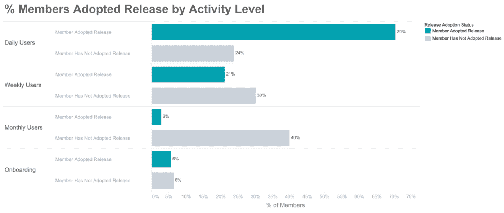
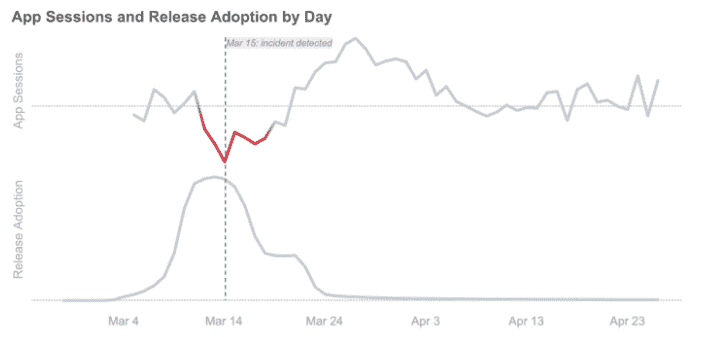
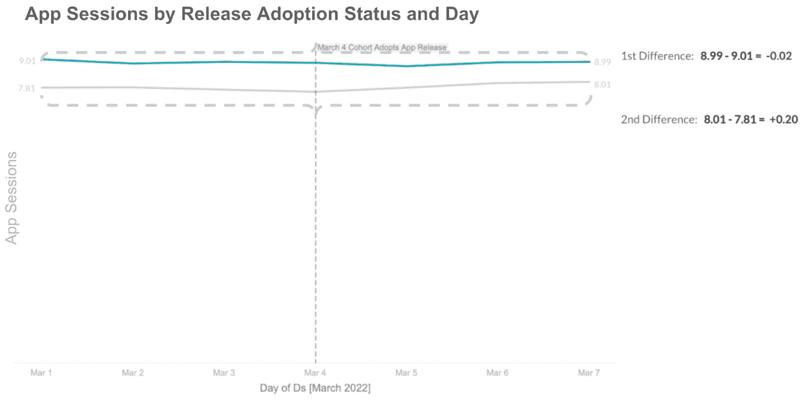
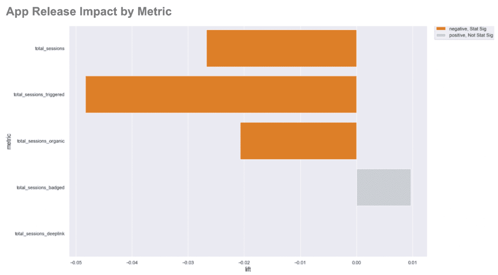
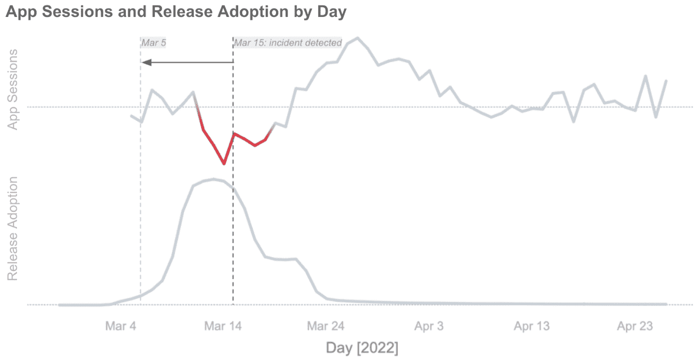

# Nextdoor 早期捕捉新发布问题的计划

> 原文：<https://thenewstack.io/nextdoors-plan-for-catching-new-release-troubles-early-on/>

超本地社交网络服务 [Nextdoor](https://about.nextdoor.com/) 使用老派的统计数据在新的移动应用更新早期隔离问题。

Nextdoor 的移动 Android 和 iOS 应用程序每周有数千万活跃用户。为了跟上每周定期发布的步伐，Nextdoor 建立了一个应用程序发布异常检测工具，在客户端回归对应用程序产生严重影响之前阻止它们。由 Nextdoor 软件工程师 [Walt Leung](https://www.linkedin.com/in/waltleungwbl/) 和 Nextdoor 数据科学家 [Shane Butler](https://www.linkedin.com/in/shaneausleybutler/) 撰写的[博客文章](https://engblog.nextdoor.com/catching-anomalies-early-in-mobile-app-releases-ac95adf9da81)对这个话题进行了详细描述。

Nextdoor 对其每周发布的移动产品采用了分阶段推出的策略。初始用户只能使用新版本，以确保安全和可扩展的部署。但是，由于总用户群中非常小且特定的子集首先使用最新版本，传统的可观察性方法在早期阶段并不有效。Nextdoor 开始使用“差异中的差异”分析来确定应用程序会话下降，比周环比数据早 10 天。

## **问题**

分阶段推出不是问题，观察它们才是问题。开箱即用的方法在早期阶段表现不佳，原因有两个——早期数据对早期用户来说非常具体，而且非常小。第一批采用新版本的用户往往比中位数更活跃，使整个数据样本向一个方向倾斜。

小通常与样本量有关。考虑一个假设的新版本，3 月 4 日发布的 v.1.234.5。如果引入一个回归，其中一个应用会话没有被计算在 5%的时间内，在 1%的部署中，总影响大约是所有 iOS 应用会话的 0.05%。这是一个无法用总体水平的可观测性来检测的数字。高活动水平因素—可能有 0.06%或 0.07%或所有会话受到影响。很难看到或者得出清晰的分析。

…直到 5%的回归“对业务至关重要”时全面推出。

顶部趋势线显示应用程序会话。底部的趋势线显示了由于分阶段推出而导致的版本采用情况。

Nextdoor 需要从分阶段推出的早期采用者那里获得的信息是，“如果他们一开始就没有采用该版本，那么他们在采用后的实际应用会话与他们假设的应用会话之间有什么区别？”这是统计学中未被观察到的反事实。差异中的差异分析测量它。

## **解决方案—应用差异中的差异分析**

Nextdoor 无法直接比较采用新版本的用户和没有采用新版本的用户——他们的底层行为差异太大。但他们可以观察整体趋势，并将所有指标转化为相对指标。

Nextdoor 对这种影响进行了差异中的差异分析，将已经采用和尚未采用某个版本的用户的不同时变影响考虑在内。对于 v1.234.5，这意味着计算早期采用者和非采用者在发布期前三天和发布期后三天的应用会话差异。Nextdoor 观察到早期采用者下降了 0.02%，非采用者上升了 0.20%。

关键是要确保两个群体在采用之前表现出相似的行为。如果趋势在采用之前是相似的，这意味着如果趋势继续(趋势前假设)，结果将是匹配的。

在 v1.234.5 中没有出现这种情况，因为采纳者减少了-0.02，采纳者增加了+0.20。计算差异中的差异是为了估计与未观察到的反事实的比较。

**-0.02–0.20 =-0.22 由于 iOS 版本 1.234.5** 应用会话减少

差异中的差异分析及其超过数十万用户的样本量给了 Nextdoor 在类似趋势前行为方面的高度信心，其标准偏差限于采用前几天。如果行为保持不变，它们就符合一个线性回归模型，该模型可以估计某个特定指标的平均发布效果。

**y = β0 + β1*时间段+ β2*已处理+ β3*(时间段*已处理)+ e**

## **结果**

现在，统计上显著的负面影响可以通过多个应用程序会话指标来衡量。

上图显示了 1.234.5 版 Nextdoor 应用程序发布异常检测指标的平均提升百分比。

由于存在差异，首次展示的第一阶段信息非常丰富。Nextdoor 可以提前 10 天标记应用会话下降，诊断特定版本的下降，并将回归隔离到不到 1%的用户。工程团队也不再需要考虑外部变量，如季节性或星期几。

Nextdoor 的工程师写道，Nextdoor 认为应用程序版本异常检测是允许工程团队通过防止“几乎所有严重的关键客户端回归”来快速有效地迭代的基础元素之一。他们也把这个工具归功于  “它让我们安心，以更快的速度发布更大的变化。”

<svg xmlns:xlink="http://www.w3.org/1999/xlink" viewBox="0 0 68 31" version="1.1"><title>Group</title> <desc>Created with Sketch.</desc></svg>