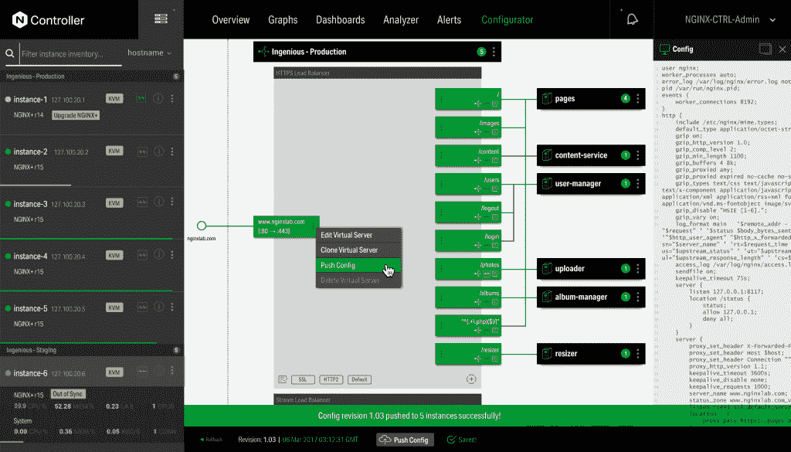

# Nginx 为微服务铺平了道路

> 原文：<https://thenewstack.io/nginx-smoothes-the-path-to-microservices/>

开源 [Nginx](https://nginx.org/en/) 网络服务器软件背后的 [Nginx Inc.](https://www.nginx.com/) 公司将自己定位为帮助客户过渡的一站式商店，在微服务上加倍努力。

该公司引入了新的功能，以进一步扩展 Nginx 作为 API 网关、Kubernetes 入口控制器和服务网格。

“当人们考虑如何交付他们的应用时，有许多工具和供应商，它们变化非常快，其中许多甚至不受支持。对于企业客户来说，这是一个有风险的提议，所以简单是他们寻求的一件重要的事情，”产品管理副总裁 [Sidney Rabsatt](https://www.linkedin.com/in/sidney-rabsatt-a48a1/) 说。

他说，该公司专注于帮助人们设计他们的应用程序，无论它是否在容器中，尽管他指出 Docker 商店中 10 亿次的软件下载证明了容器仍然是一个受欢迎的选择。

在[的](https://thenewstack.io/podcasts/) [2016 集](https://thenewstack.io/exploring-bright-future-of-nginx-plus/)中，新堆栈制造商播客、Nginx 首席执行官 [Gus Robertson](https://www.linkedin.com/in/gusrobertson) 和其他高管解释了为什么该公司的商业产品非常适合微服务。

其核心软件 Nginx Plus R15 的新版本将于周二推出。他说，它将提供更智能的集群能力，因此实例可以更清楚它们的对等实例正在做的事情。

它为特定于服务器推送的 [HTTP2](https://http2.github.io/) 和谷歌的微服务网络协议 [gRPC](https://grpc.io/) 提供了增强的支持。它在 OAuth 2.0 授权协议和 OpenID Connect 之上提供了一个身份层，用于改进服务之间的身份验证和通信。据该公司称，这些技术提高了性能，简化了微服务堆栈，Nginx 可以作为 web 服务器、负载平衡器、API 网关、Kubernetes 入口控制器或 sidecar 代理运行。

“在数据层面，我们已经确保我们有更多的钩子，可以作为一个结缔组织取得成功，”拉布萨特说。

虽然 Nginx 一直以网络服务器闻名——根据 Netcraft 2018 年 3 月的报告，3 月份有近 180 万台面向网络的计算机运行 Nginx，占市场的 24.5%——但它增加了一个应用服务器。

多级开源应用服务器 Nginx Unit 1.0 也将于本周晚些时候推出。它将代理到应用服务器的网络功能合并，为不同的组件提供一致的连接方式。它可以运行微服务中常见的代码，并支持应用程序级逻辑。它最初将支持五种语言——Go、Perl、Python、PHP 和 Ruby——并正在支持 Java 和 JavaScript。据 Rabsatt 称，它的运行速度比其他应用服务器至少快 30%。

NGINX 控制器将于第二季度上市，它增加了新的监控仪表板、警报和管理功能。它位于 NGINX Plus 和 Unit 之上，简化了用户部署解决方案和构建应用网络的方式。除了使用户能够看到他们的配置如何工作，它还将包括一个分析器功能，该功能将推荐一些方法来对其进行微调，以获得更好的性能、更好的合规性和安全性。

去年秋天，该公司宣布与 [Istio](https://istio.io/) 项目合作，[提供 Nginx](https://thenewstack.io/nginx-pairs-istio-simplify-service-mesh/) 作为入口控制器。可扩展控制器架构旨在集成 Istio 等控制平面解决方案，消除企业部署多个框架来管理服务网格的需求。

Rabsatt 说，虽然客户越来越多地考虑微服务，但现实是，并非所有的应用程序最终都将过渡到这种类型的架构，组织将在很长一段时间内保持某种中间状态。

“所有这一切的主题是提供一个单一、一致的功能集，而不是将多个工具缝合在一起，总是不断变化，必须保持同步。我们有一个简单的单一界面和一套功能，涵盖所有这一切。我们允许人们沿着这条道路起步，并在途中的每一步都支持他们，”拉布萨特说。

通过 Pixabay 的特征图像。

<svg xmlns:xlink="http://www.w3.org/1999/xlink" viewBox="0 0 68 31" version="1.1"><title>Group</title> <desc>Created with Sketch.</desc></svg>